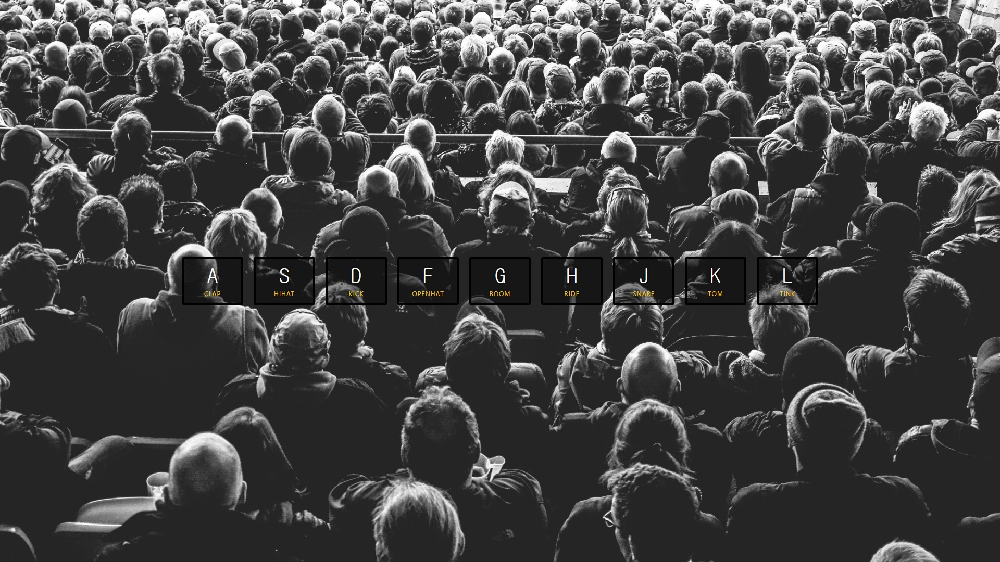
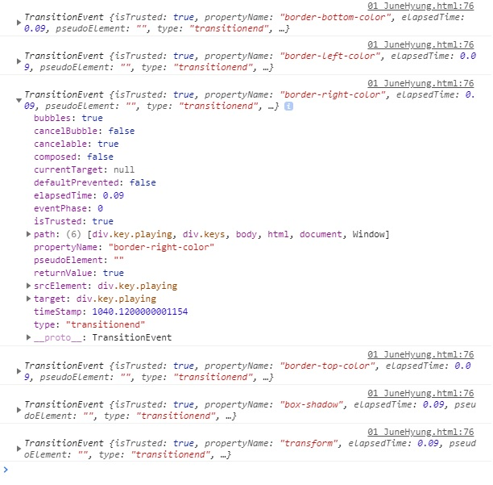

# 01. Drum Kit

A, S, D, F, G, H, J, K ,L 의 키입력을 받아 맞는 애니메이션효과와 드럼 소리를 출력하는 Drum Kit


**초기 html : index-START.html 참고.**

```html
<!DOCTYPE html>
<html lang="en">
<head>
  <meta charset="UTF-8">
  <title>JS Drum Kit</title>
  <link rel="stylesheet" href="style.css">
</head>
<body>


  <div class="keys">
    <div data-key="65" class="key">
      <kbd>A</kbd>
      <span class="sound">clap</span>
    </div>
    <div data-key="83" class="key">
      <kbd>S</kbd>
      <span class="sound">hihat</span>
    </div>
    <div data-key="68" class="key">
      <kbd>D</kbd>
      <span class="sound">kick</span>
    </div>
    <div data-key="70" class="key">
      <kbd>F</kbd>
      <span class="sound">openhat</span>
    </div>
    <div data-key="71" class="key">
      <kbd>G</kbd>
      <span class="sound">boom</span>
    </div>
    <div data-key="72" class="key">
      <kbd>H</kbd>
      <span class="sound">ride</span>
    </div>
    <div data-key="74" class="key">
      <kbd>J</kbd>
      <span class="sound">snare</span>
    </div>
    <div data-key="75" class="key">
      <kbd>K</kbd>
      <span class="sound">tom</span>
    </div>
    <div data-key="76" class="key">
      <kbd>L</kbd>
      <span class="sound">tink</span>
    </div>
  </div>

  <audio data-key="65" src="sounds/clap.wav"></audio>
  <audio data-key="83" src="sounds/hihat.wav"></audio>
  <audio data-key="68" src="sounds/kick.wav"></audio>
  <audio data-key="70" src="sounds/openhat.wav"></audio>
  <audio data-key="71" src="sounds/boom.wav"></audio>
  <audio data-key="72" src="sounds/ride.wav"></audio>
  <audio data-key="74" src="sounds/snare.wav"></audio>
  <audio data-key="75" src="sounds/tom.wav"></audio>
  <audio data-key="76" src="sounds/tink.wav"></audio>

<script>
// add Answer

</script>


</body>
</html>

```


**초기화면**




## 새로 알게 된 것.

### kbd Tag

kbd 태그는키보드 입력, 음성 입력 등 임의의 장치를 사용한 사용자의 입력을 나타냅니다.

참고 : https://developer.mozilla.org/ko/docs/Web/HTML/Element/kbd


### data-* 속성

data-로 시작하는 속성은 무엇이든 사용할 수 있습니다.

data-colums , data-index-number, data-parent 등등...

이번예제에서 사용한 data-key속성은 위의 div와 아래 audio를 하나로 묶는 속성이고,

key값을 우리가 누를 키보드키 ASCII-Code값으로 연결해놓았다.

참고 : https://developer.mozilla.org/ko/docs/Learn/HTML/Howto/Use_data_attributes


## 과정

**1.해당 키 입력 시 효과음을 추가.**

```javascript
// add Answer
window.addEventListener('keydown', function(e){
    // console.log(e);
    // console.log(e.keyCode);
    const audio = document.querySelector(`audio[data-key="${e.keyCode}"]`);
    // console.log(audio);
    if(!audio) return; // stop the function from running all togethers
    audio.currentTime = 0; // rewind to the start, 키의 재입력시간 설정.
    audio.play();

});
```

```javascript
const audio = document.querySelector(`audio[data-key="${e.keyCode}"]`);
```

일일이 keyCode를 입력하지 않고, ES6문법 활용해 백틱(`)과 ${e.keycode}로 값을 받음.

**keyCode는 console.log(e.keyCode)로 확인.**


**2. 키의 재입력 시간 설정**

```javascript
audio.currentTime = 0; // rewind to the start, 키의 재입력시간 설정.
```


**3. 효과 종료시 변화하는 함수 생성**

```javascript
function removeTransition(e){
 	// console.log(e);
    if(e.propertyName !== 'transform') return; // skip if is it's not a transform
    // console.log(e.prototypeName);
    // console.log(this);
    this.classList.remove('playing');
}
```

removeTransition에서 console.log(e) 결과



누른 키의 속성명 중 transform이 없으면 다음 코드를 실행하지않고, 존재하면 playing클래스를 지운다.

**4. 효과음 출력 및 종료 설정**

```javascript
const keys = document.querySelectorAll('.key');
keys.forEach(key => key.addEventListener('transitionend', removeTransition));
window.addEventListener('keydown', playSound);
```


```javascript
const keys = document.querySelectorAll('.key');
```

key클래스를 가진 모든 요소를 keys에 배열로 담고,


```javascript
keys.forEach(key => key.addEventListener('transitionend', removeTransition));
```

 forEach()를 통해 각 요소에 변화가 끝나면, removeTransition함수를 실행함.

```javascript
keys.forEach(key => key.addEventListener('transitionend', removeTransition));
```

ES6문법의 화살표함수를 이용.


위에서 만든 효과음을 추가하는 function을 playSound()로 따로 만들고, 

keydown event를 script가장 아래 추가.