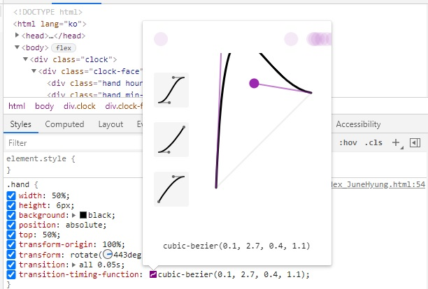

# 02 JS and CSS Clock

아날로그 시계 구현하기.


초기코드

```html
<!DOCTYPE html>
<html lang="ko">
<head>
    <meta charset="UTF-8">
    <title>JS + CSS Clock</title>
</head>
<body>
    <div class="clock">
        <div class="clock-face">
            <div class="hand hour-hand"></div>
            <div class="hand min-hand"></div>
            <div class="hand second-hand"></div>
        </div>
    </div>
</body>

<style>
    html{
        background: #018DED url(https://unsplash.it/1500/1000?image=881&blur=5);
        background-size: cover;
        font-family: 'helvetica neue';
        text-align: center;
        font-size: 10px;
    }
    body{
        margin: 0;
        font-size: 2rem;
        display: flex;
        flex: 1;
        min-height: 100vh;
        align-items: center;
    }
    .clock{
        width: 30rem;
        height: 30rem;
        border: 20px solid #fff;
        border-radius: 50%;
        margin: 50px auto;
        position: relative;
        padding: 2rem;
        box-shadow:
            0 0 0 4px rgba(0,0,0,0.1),
            inset 0 0 0 3px #efefef,
            inset 0 0 10px #000,
            0 0 10px rgba(0,0,0,0.2);
    }
    .clock-face {
      position: relative;
      width: 100%;
      height: 100%;
      transform: translateY(-3px); /* account for the height of the clock hands */
    }

    .hand {
      width: 50%;
      height: 6px;
      background: black;
      position: absolute;
      top: 50%;
    }
</style>
<script>
    // add answer
</script>
</html>
```

초기화면


## 새로 알게 된 것

**transform-origin :**

변환에 대한 원점을 설정함.

참고 : https://developer.mozilla.org/en-US/docs/Web/CSS/transform-origin


**transition-timing-function:**

transition 적용 효과.

transition으로 한 줄로 쓸 때 

transition : transition-propery / transition-duration / transition-timing-function / transition-delay순서로 한줄로 쓸 수 있다.

```
cubic-bezier(p1, p2, p3, p4)
```

작성자가 정의한 3 차 베 지어 곡선, 여기서 p1 및 p3 값은 0에서 1 사이의 범위에 있어야합니다.

## 과정

<strong>1. 시계바늘 조정.</strong>

```css
transform-origin: 100%;
transform: rotate(90deg);
```

시계바늘을 90도 돌려 모두 12를 가리키게 함.


<strong>2. 효과적용</strong>

```css
transition: all 0.05s;
transition-timing-function: cubic-bezier(0.1, 2.7, 0.4, 1.1);
```



위 사진처럼 개발자모드에서 조절 후 cubic-bezier값을 그대로 쓸 수 있다.


**3. 움직이는 함수 적용**

```javascript
const secondHand = document.querySelector('.second-hand');
const minsHand = document.querySelector('.min-hand');
const hourHand = document.querySelector('.hour-hand');

    function setDate(){
        const now = new Date();

        const seconds = now.getSeconds();
        const secondsDegrees = ((seconds/60) * 360) + 90;
        // console.log(seconds);
        secondHand.style.transform = `rotate(${secondsDegrees}deg)`;

        const mins = now.getMinutes();
        const minDegrees = ((seconds / 60) * 6) + 90;
        minsHand.style.transform = `rotate(${minDegrees}deg)`;

        const hour = now.getHours();
        const hourDegrees = ((mins / 60) * 360) + 90;
        hourHand.style.transform = `rotate(${hourDegrees}deg)`;

        console.log(hour + "시 " + mins + "분 " + seconds + "초")
    }

    setInterval(setDate, 1000);
```

getSeconds(), getMinutes(), getHours()를 통해 초, 분, 시간을 얻어

각도를 계산 후  해당 div의 각도를 조절한다.

```javascript
secondHand.style.transform = `rotate(${secondsDegrees}deg)`;

minsHand.style.transform = `rotate(${minDegrees}deg)`;

hourHand.style.transform = `rotate(${hourDegrees}deg)`;
```


