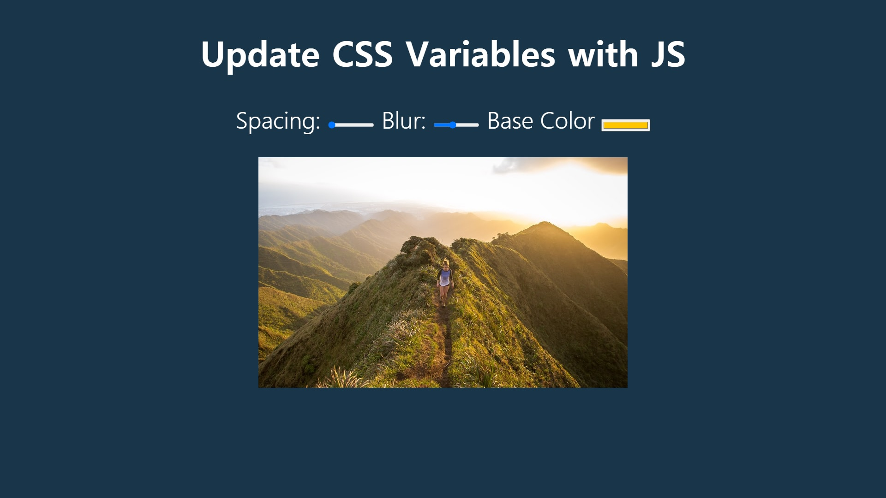

# 03. CSS Variable

spacing과 blur, base color를 조절하여 이미지를 변화시키기.


초기코드

```html
<!DOCTYPE html>
<html lang="en">
<head>
  <meta charset="UTF-8">
  <title>Scoped CSS Variables and JS</title>
</head>
<body>
  <h2>Update CSS Variables with <span class='hl'>JS</span></h2>

  <div class="controls">
    <label for="spacing">Spacing:</label>
    <input id="spacing" type="range" name="spacing" min="10" max="200" value="10" data-sizing="px">

    <label for="blur">Blur:</label>
    <input id="blur" type="range" name="blur" min="0" max="25" value="10" data-sizing="px">

    <label for="base">Base Color</label>
    <input id="base" type="color" name="base" value="#ffc600">
  </div>

  

  <style>

    /*
      misc styles, nothing to do with CSS variables
    */

    body {
      text-align: center;
      background: #193549;
      color: white;
      font-family: 'helvetica neue', sans-serif;
      font-weight: 100;
      font-size: 50px;
    }

    .controls {
      margin-bottom: 50px;
    }

    input {
      width: 100px;
    }
  </style>

  <script>
  </script>

</body>
</html>

```


초기화면




# 새로 알게 된 것

### data-name

data-sizing으로 sizing이란 변수에 px을 저장함.

참고 : https://developer.mozilla.org/en-US/docs/Web/HTML/Global_attributes/data-*

### :root

문서 트리의 루트요소를 선택한다.

참고 : https://developer.mozilla.org/en-US/docs/Web/CSS/:root

### input type="range"

어느정도 범위의 range bar가 생긴다.

참고 : https://developer.mozilla.org/en-US/docs/Web/HTML/Element/input/range


# 과정


<strong>1. CSS변수 만들기.</strong>

base색상, 기본 여백, blur정도.

```
:root{
	--base: #ffc600;
	--spacing: 10px;
	--blur: 10px;
}
```


<strong>2. 변수 지정</strong>

img와 class "h1"에 변수사용.

```css
img{
    padding: var(--spacing);
    background: var(--base);
    filter: blur(var(--blur));
}
.h1{
    color: var(--base);
}
```


<strong>3. javaScript로 값이 변할 때 변수 동작하게 작성</strong>

```javascript
<script>
    // .controls의 모든 input 선택.
    const inputs = document.querySelectorAll('.controls input')
    function handleUpdate(){
        // console.log(this.value);
        // console.log(this.dataset);
        const suffix = this.dataset.sizing || '';
        // console.log(suffix);

        //update variable
        document.documentElement.style.setProperty(`--${this.name}`, this.value + suffix);
    }
    // use arrow function
    inputs.forEach(input => input.addEventListener('change', handleUpdate));
    inputs.forEach(input => input.addEventListener('mousemove', handleUpdate));
</script>
```


```javascript
const inputs = document.querySelectorAll('.controls input')
```

.controls에 있는 모든 input태그를 선택함.


```javascript
inputs.forEach(input => input.addEventListener('change', handleUpdate));
inputs.forEach(input => input.addEventListener('mousemove', handleUpdate));
```

값이 변하거나, 마우스가 움직일 때 handleUpdate메서드가 동작.


```javascript
 function handleUpdate(){
        const suffix = this.dataset.sizing || '';

        //update variable
        document.documentElement.style.setProperty(`--${this.name}`, this.value + suffix);
    }
```

this.dataset.sizing은 `<input id="blur" type="range" name="blur" min="0" max="25" value="10" data-sizing="px">`에서 `data-sizing="px"`로 지정해 놓음.

색을 정하는 곳에서는 data-sizing이 없기 때문에 `''`가 들어가게된다.

값을 변경함. 변경되는 값은 '바뀐 값 + suffix'로 변경됨.