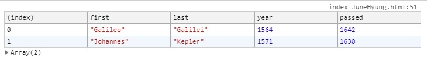
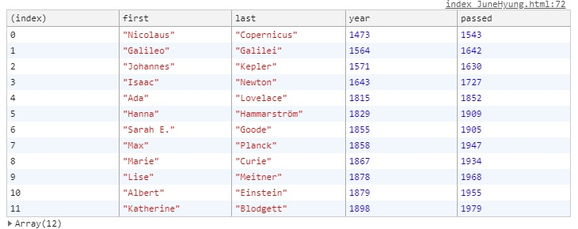
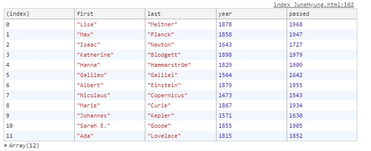

# 04. Array Cardio Day1

 배열과 배열제어에 대해 공부.

초기코드

```html
<!DOCTYPE html>
<html lang="en">
<head>
  <meta charset="UTF-8">
  <title>Array Cardio 💪</title>
</head>
<body>
  <p><em>Psst: have a look at the JavaScript Console</em> 💁</p>
  <script>
    // Get your shorts on - this is an array workout!
    // ## Array Cardio Day 1

    // Some data we can work with

    const inventors = [
      { first: 'Albert', last: 'Einstein', year: 1879, passed: 1955 },
      { first: 'Isaac', last: 'Newton', year: 1643, passed: 1727 },
      { first: 'Galileo', last: 'Galilei', year: 1564, passed: 1642 },
      { first: 'Marie', last: 'Curie', year: 1867, passed: 1934 },
      { first: 'Johannes', last: 'Kepler', year: 1571, passed: 1630 },
      { first: 'Nicolaus', last: 'Copernicus', year: 1473, passed: 1543 },
      { first: 'Max', last: 'Planck', year: 1858, passed: 1947 },
      { first: 'Katherine', last: 'Blodgett', year: 1898, passed: 1979 },
      { first: 'Ada', last: 'Lovelace', year: 1815, passed: 1852 },
      { first: 'Sarah E.', last: 'Goode', year: 1855, passed: 1905 },
      { first: 'Lise', last: 'Meitner', year: 1878, passed: 1968 },
      { first: 'Hanna', last: 'Hammarström', year: 1829, passed: 1909 }
    ];

    const people = [
      'Bernhard, Sandra', 'Bethea, Erin', 'Becker, Carl', 'Bentsen, Lloyd', 'Beckett, Samuel', 'Blake, William', 'Berger, Ric', 'Beddoes, Mick', 'Beethoven, Ludwig',
      'Belloc, Hilaire', 'Begin, Menachem', 'Bellow, Saul', 'Benchley, Robert', 'Blair, Robert', 'Benenson, Peter', 'Benjamin, Walter', 'Berlin, Irving',
      'Benn, Tony', 'Benson, Leana', 'Bent, Silas', 'Berle, Milton', 'Berry, Halle', 'Biko, Steve', 'Beck, Glenn', 'Bergman, Ingmar', 'Black, Elk', 'Berio, Luciano',
      'Berne, Eric', 'Berra, Yogi', 'Berry, Wendell', 'Bevan, Aneurin', 'Ben-Gurion, David', 'Bevel, Ken', 'Biden, Joseph', 'Bennington, Chester', 'Bierce, Ambrose',
      'Billings, Josh', 'Birrell, Augustine', 'Blair, Tony', 'Beecher, Henry', 'Biondo, Frank'
    ];
    
    // Array.prototype.filter()
    // 1. Filter the list of inventors for those who were born in the 1500's
    // 1. 1500 년대에 태어난 발명가 목록을 필터링합니다.

    // Array.prototype.map()
    // 2. Give us an array of the inventors first and last names
	// 2.발명가의 이름과 성의 배열을 제공합니다.
      
    // Array.prototype.sort()
    // 3. Sort the inventors by birthdate, oldest to youngest
	// 3. 발명가를 생년월일 순으로 정렬합니다.
      
    // Array.prototype.reduce()
    // 4. How many years did all the inventors live all together?
	// 4. 모든 발명가가 함께 살았던 지 얼마나 되었습니까?
      
    // 5. Sort the inventors by years lived
	// 5. 발명가를 살았던 연도별로 정렬
      
    // 6. create a list of Boulevards in Paris that contain 'de' anywhere in the name
    // https://en.wikipedia.org/wiki/Category:Boulevards_in_Paris
	// 6. 이름에 'de'가 포함 된 파리의 Boulevards의 목록을 만듭니다.

    // 7. sort Exercise
    // Sort the people alphabetically by last name
	// 7. 사람들을 성을 기준으로 알파벳순으로 정렬
      
    // 8. Reduce Exercise
    // Sum up the instances of each of these
	// 8. 이들 각각의 인스턴스를 요약
    const data = ['car', 'car', 'truck', 'truck', 'bike', 'walk', 'car', 'van', 'bike', 'walk', 'car', 'van', 'car', 'truck' ];

  </script>
</body>
</html>

```


# 새로 알게된 것 및 정리

### filter()

대입된 함수를 통해 배열 내부를 순환하면서, 요소마다 조건을 만족하는 지확인함.

```javascript
const fifteen = inventors.filter(function(inventor){
    if(inventor.year >= 1500 && inventor.year <= 1599){
    	return true; // keep it!
    }else{
    	return false;
   }
});
```

1번문제인데, 이경우 inventors배열 내부를 돌면서 inventor의 year이 1500 ~ 1600인 아이들을 찾아 리턴함.

### map()

배열의 요소를 일괄 변경해야 하는 경우

callback함수를 인자로 받아, callback함수의 return으로 반환되는 값들을 재조합하여 새로운 배열에 만듬.

```javascript
const fullNames = inventors.map(inventor => inventor.first + " " + inventor.last);
```

inventors배열을 새로 만들어 fullNames에 저장.


### sort()

메서드 인자로 비교함수를 대입하여 배열 요소들을 정렬합니다.

sort는 새로운 배열을 반환하지않고 원본 배열 자체를 변경시키니까 주의!

```
배열.sort(function(a,b)){
	return 비교값;
}
```

비교값에 따라 순서가 정해집니다.

- **비교값 > 0** : a가 b보다 작은 숫자의 인덱스를 가집니다.

   배열의 작은 인덱스라는 뜻은 배열에서 앞부분에 위치하는 것을 의미함.

   즉, a가 b보다 앞에 위치함.

- **비교값 < 0** : b가 a보다 작은 숫자의 인덱스를 가집니다. b가 a보다 앞에 위치.

- **비교값 = 0** : a와 b의 위치를 변경하지 않음.

a-b가 오름차순, b-a가 내림차순


### reduce()

배열요소를 순환하면서 정의된 callback함수에 의해 단일 값으로 누적 시킬 수 있다.

```
배열.reduce(누적된 값, 현재 요소 값, 현재 인덱스, 원본 배열) => {
return 누적값으로 변환되는 값
}, 초기값);
```

```javascript
const totalYears = inventors.reduce((total, inventor)=>{
        return total + (inventor.passed - inventor.year);
    }, 0);
```


# 풀이

### 1. 1500년대에 태어난 발명가 목록을 필터링합니다.

```javascript
const fifteen = inventors.filter(function(inventor){
    if(inventor.year >= 1500 && inventor.year <= 1599){
    	return true; // keep it!
    }else{
    	return false;
   }
});
```

**filter()를 이용** 하여 1500~1599 사이의 발명가들을 필터링함.


**Arrow Function**

```javascript
const fifteen = inventors.filter((inventor=> inventor.year >= 1500 && inventor.year <1600));
```

화살표함수를 이용해 한줄로 줄일 수 있다.


**결과**




### 2.발명가의 이름과 성의 배열을 제공합니다.

```javascript
const fullNames = inventors.map(inventor => inventor.first + " " + inventor.last);
```

map을 이용하여 보여줄 수 있다.


표시할 때 **백틱(`)을 이용**해 중간에 " " 부분없이 한번에 출력할 수 있다.

```javascript
const fullNames = inventors.map(inventor => `${inventor.first} ${inventor.last}`);
```


### 3. 발명가를 생년월일 순으로 정렬합니다.

```javascript
const ordered = inventors.sort(function(a, b){
        if(a.year > a.year){
            return 1;
        }else{
            return -1;
        }
    })
```

sort를 이용하여 정렬 할 수 있다.


**Arrow Function**

```javascript
const ordered = inventors.sort((a,b)=>a.year>b.year ? 1 : -1);
```


**결과**




### 4. 모든 발명가가 함께 살았던 지 얼마나 되었습니까?

```javascript
var totalYears = 0;
    for(var i=0;i<inventors.length; i++){
        totalYears += inventors[i].year
    }
```

반복문 돌려서 출력할 수도 있지만, reduce를 이용할 수 있다.


**reduce**

```javascript
const totalYears = inventors.reduce((total, inventor)=>{
        return total + (inventor.passed - inventor.year);
    }, 0);
```


### 5. 발명가를 살았던 연도별로 정렬

```javascript
const oldest = inventors.sort(function(a,b){
        const lastGuy = a.passed - a.year;
        const nextGuy = b.passed - b.year;
        // if(lastGuy > nextGuy){
        //     return -1;
        // }else{
        //     return 1;
        // }
        return lastGuy > nextGuy ? -1 : 1;
    })
```

sort를 이용해 정렬하는데, 

주석 처리된 부분을 3항연산자를 이용하여 return 부분처럼 쓸 수 있다.




### 6. 이름에 'de'가 포함 된 파리의 Boulevards의 목록을 만듭니다.

```javascript
const category = document.querySelector('.mw-category');
    const links = Array.from(category.querySelectorAll('a'));

    const de = links
    		    .map(link =>link.textContent)
    			.filter(streetName => streetName.includes('de'));
```


### 7. 사람들을 성을 기준으로 알파벳순으로 정렬

```javascript
const alpha = people.sort(function(lastOne, nextOne){
        const [aLast, aFirst] = lastOne.split(', ');
        const [bLast, bFirst] = nextOne.split(', ');
        return aLast > bLast ? 1 : -1;
    });
```

lastOne과 nextOne에서 split을 이용하여 ,를 기준으로 나눈다.

`[last, Frist]`

그 후 정렬함.


### 8. 이들 각각의 인스턴스를 요약

```javascript
const data = ['car', 'car', 'truck', 'truck', 'bike', 'walk', 'car', 'van', 'bike', 'walk', 'car', 'van', 'car', 'truck' ];
```

```javascript
const transportation = data.reduce(function(obj, item){
        // console.log(item);
        if(!obj[item]){
            obj[item] = 0;
        }
        obj[item]++;
        return obj;
    },{});
```

obj[item]이 빈값이면 0, 아니면 item의 값을 1증가.

item이 키값이된다.

```
{car: 5, truck: 3, bike: 2, walk: 2, van: 2}
bike: 2
car: 5
truck: 3
van: 2
walk: 2
```

