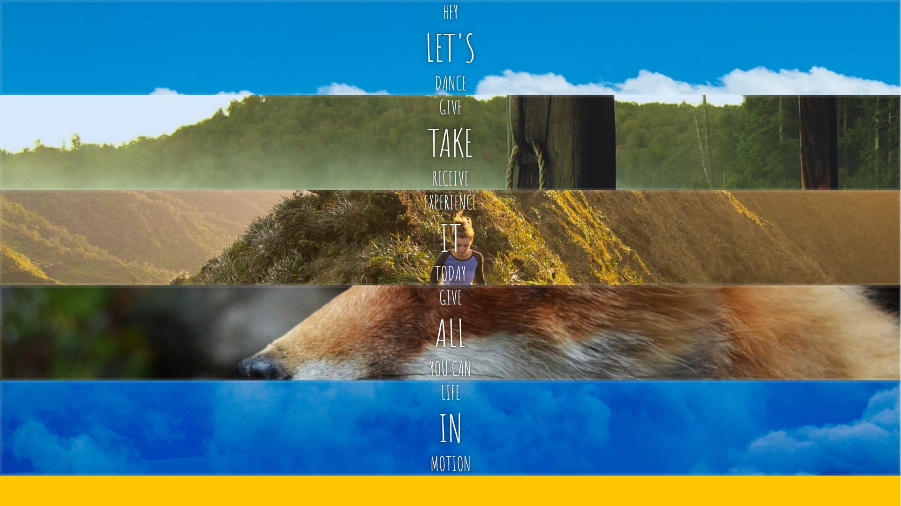
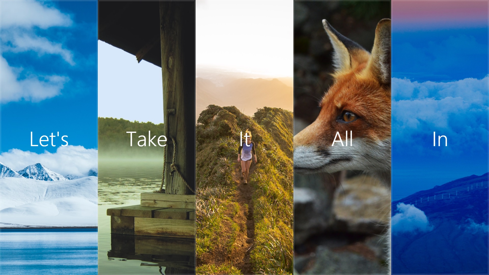
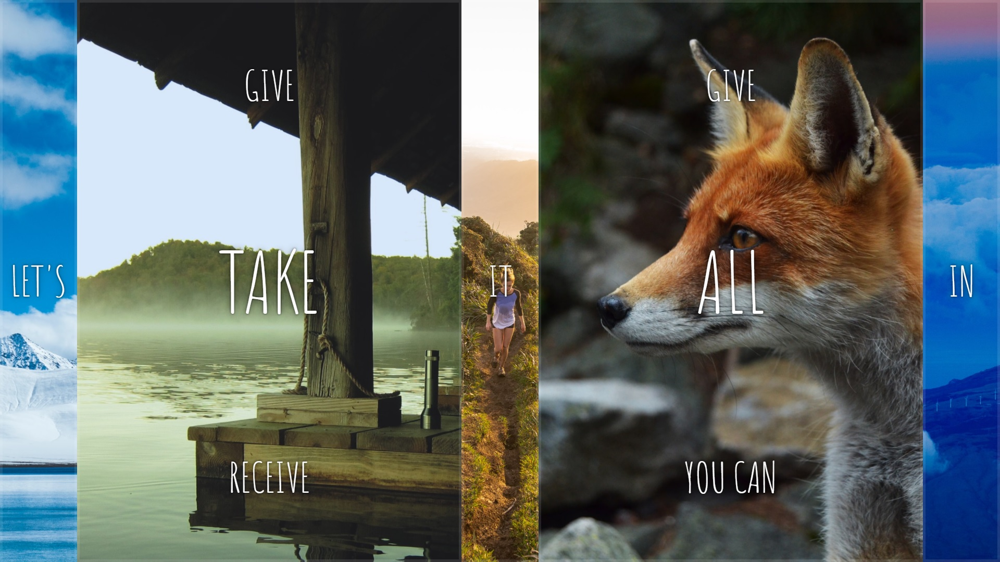
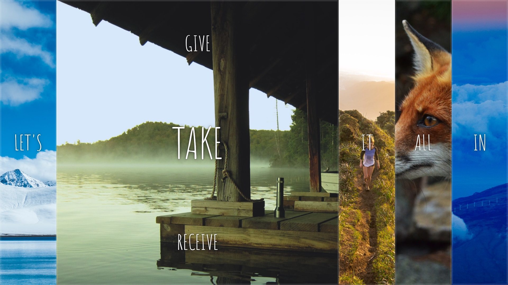

# 05 - FLEX PANEL GALLERY

flex-box를 이용한 레이아웃 및 효과를 공부.

이미지를 클릭하면 이미지와 글자가 커지고, 첫번째와 마지막 글자가 각각 위아래에서 등장함.

초기코드

```html
<!DOCTYPE html>
<html lang="ko">
<head>
    <meta charset="UTF-8">
    <title>Flex Panels 💪</title>
    <link href='https://fonts.googleapis.com/css?family=Amatic+SC' rel='stylesheet' type='text/css'>
</head>
<body>
    <style>
        html{
            box-sizing: border-box;
            background:#ffc600;
            font-family: 'helvetica neue';
            font-size:20px;
            font-weight: 200;
        }
        body{
            margin:0;
        }
        *,*:befor, *:after{
            box-sizing:inherit;
        }.panels{
            min-height:100vh;
            overflow:hidden;
        }.panel{
            background:#6B0F9C;
            box-shadow: inset 0 0 0 5px rgba(255,255,255,0.1);
            color:#fff;
            text-align:center;
            align-items:center;
            /* Safari transitionend event.propertyName === flex */
            /* Chrome + FF transitionend event.propertyName === flex-grow */
            transition:
            font-size 0.7s cubic-bezier(0.61,-0.19, 0.7,-0.11),
                flex 0.7s cubic-bezier(0.61,-0.19, 0.7,-0.11),
                background 0.2s;
            font-size: 20px;
            background-size: cover;
            background-position: center;
        }
        .panel1 { background-image:url(https://source.unsplash.com/gYl-UtwNg_I/1500x1500); }
        .panel2 { background-image:url(https://source.unsplash.com/rFKUFzjPYiQ/1500x1500); }
        .panel3 { background-image:url(https://images.unsplash.com/photo-1465188162913-8fb5709d6d57?ixlib=rb-0.3.5&q=80&fm=jpg&crop=faces&cs=tinysrgb&w=1500&h=1500&fit=crop&s=967e8a713a4e395260793fc8c802901d); }
        .panel4 { background-image:url(https://source.unsplash.com/ITjiVXcwVng/1500x1500); }
        .panel5 { background-image:url(https://source.unsplash.com/3MNzGlQM7qs/1500x1500); }
        .panel > * {
        margin: 0;
        width: 100%;
        transition: transform 0.5s;
        }

        .panel p {
        text-transform: uppercase;
        font-family: 'Amatic SC', cursive;
        text-shadow: 0 0 4px rgba(0, 0, 0, 0.72), 0 0 14px rgba(0, 0, 0, 0.45);
        font-size: 2em;
        }
        
        .panel p:nth-child(2) {
        font-size: 4em;
        }

        .panel.open {
        font-size: 40px;
        }
    </style>
    <div class="panels">
        <div class="panel panel1">
            <p>Hey</p>
            <p>Let's</p>
            <p>Dance</p>
        </div>
        <div class="panel panel2">
            <p>Give</p>
            <p>Take</p>
            <p>Receive</p>
        </div>
        <div class="panel panel3">
            <p>Experience</p>
            <p>It</p>
            <p>Today</p>
        </div>
        <div class="panel panel4">
            <p>Give</p>
            <p>All</p>
            <p>You can</p>
        </div>
        <div class="panel panel5">
            <p>Life</p>
            <p>In</p>
            <p>Motion</p>
        </div>
        </div>
    <script>

    </script>
</body>
</html>
```

초기화면




# 새로 알게 된 것

### display: flex;

기존 방식

```html
<div class="clearFix">
    <div class="box"></div>
    <div class="box"></div>
    <div class="box"></div>
</div>

<style>
    .box{ float:left; }
    .clearFix::after{
		display:block;
        content:"";
        clear:both;
    }
</style>
```


flex 방식

```html
<div class="box-container">
    <div class="box"></div>
    <div class="box"></div>
    <div class="box"></div>
</div>

<style>
    .box-container{
        display:flex;
    }
</style>
```

수평이 될 요소에 flex적용.

Flex는 요소의 크기가 불분명하거나 동적인 경우에도, 각 요소를 정렬 할 수 있는 효율적인 방법을 제공함.

| 속성            | 의미                                                  |
| --------------- | ----------------------------------------------------- |
| display         | Flex Container를 정의                                 |
| flex-flow       | `flex-direction`와 `flex-wrap`의 단축 속성            |
| flex-direction  | Flex Items의 주 축(main-axis)을 설정                  |
| flex-wrap       | Flex Items의 여러 줄 묶음(줄 바꿈) 설정               |
| justify-content | 주 축(main-axis)의 정렬 방법을 설정                   |
| align-content   | 교차 축(cross-axis)의 정렬 방법을 설정(2줄 이상)      |
| align-items     | 교차 축(cross-axis)에서 Items의 정렬 방법을 설정(1줄) |


**flex-direction**

| 값             | 의미                                         | 기본값 |
| -------------- | -------------------------------------------- | ------ |
| row            | Itmes를 수평축(왼쪽에서 오른쪽으로)으로 표시 | `row`  |
| row-reverse    | Items를 `row`의 반대 축으로 표시             |        |
| column         | Items를 수직축(위에서 아래로)으로 표시       |        |
| column-reverse | Items를 `column`의 반대 축으로 표시          |        |


**justify-content**

| 의미          | 기본값                                                       |              |
| ------------- | ------------------------------------------------------------ | ------------ |
| flex-start    | Items를 시작점(flex-start)으로 정렬                          | `flex-start` |
| flex-end      | Items를 끝점(flex-end)으로 정렬                              |              |
| center        | Items를 가운데 정렬                                          |              |
| space-between | 시작 Item은 시작점에, 마지막 Item은 끝점에 정렬되고 나머지 Items는 사이에 고르게 정렬됨 |              |
| space-around  | Items를 균등한 여백을 포함하여 정렬                          |              |


**flex**

Item의 너비(증가, 감소, 기본)을 설정하는 단축 속성.

| 값          | 의미                                 | 기본값 |
| ----------- | ------------------------------------ | ------ |
| flex-grow   | Item의 증가 너비 비율을 설정         | `0`    |
| flex-shrink | Item의 감소 너비 비율을 설정         | `1`    |
| flex-basis  | Item의 (공간 배분 전) 기본 너비 설정 | `auto` |

```
flex: 증가너비 감소너비 기본너비
.item{
	flex: 1 1 20px; /* 증가너비 감소너비 기본너비
	flex: 1 1; /* 증가너비 감소너비 */
	flex: 1 20px; /* 증가너비 기본너비 (단위를 사용하면 flex-basis가 적용됨.) */
}

flex:1 => flex-grow: 1과 동일.
```

참고 : 

* https://heropy.blog/2018/11/24/css-flexible-box/
* https://developer.mozilla.org/ko/docs/Web/CSS/CSS_Flexible_Box_Layout/Basic_Concepts_of_Flexbox


# 과정

### 1. display:flex;

코드구조를 분석하고, display:flex적용.

```css
.panels{
    min-height:100vh;
    overflow:hidden;
}
```


적용 후 화면


### 2.  각 요소들의 크기및 내용의 위치 조정

```css
.panel{
   	~~~ 기본코드 ~~~
    display:flex;
    flex:1;
    justify-content: center;
    align-items:center;
    flex-direction: column;
}
```

`display: flex`  : display속성을 flex로 설정

`flex: 1` : 브라우저 크기에 맞춰 모든 패널 크기가 동일하게 설정됨.

` justify-content: center` : 수평 정렬

`align-items: center;` : 수직 정렬

`flex-direction: column `: 정렬 축을 세로로 바꿈. 기본값은 row


### 패널 안의 구성요소도 정렬

```css
 .panel > * {
    ~~~ 기본코드 ~~~
    /* border:1px solid red; */
    display:flex;
    flex:1 0 auto;
    justify-content: center;
    align-items:center;
}
```




### 3. 효과 적용

```css
 .panel > *:first-child {transform: translateY(-100%);}
 .panel.open-active > *:first-child {transform: translateY(0);}
 .panel > *:last-child {transform: translateY(100%);}
 .panel.open-active > *:last-child {transform: translateY(0);}
```

panel의 첫번째 요소의 수직 위치를 위로 -100%해서 옮겨 숨기고,

마지막 요소를 아래로 +100%해서 옮겨 숨기게 설정 후 

open-activce클래스가 생기게 되면 제자리로 돌아오게 코드를 작성.


### 4. 자바스크립트 작성

```javascript
<script>
    const panels = document.querySelectorAll('.panel'); 
    function toggleOpen(){
        this.classList.toggle('open');
    }

    function toggleActive(e){
        console.log(e.propertyName); // flex-grow, font-size
        if (e.propertyName.includes('flex')) {
            this.classList.toggle('open-active');
        }
    }
    panels.forEach(panel => panel.addEventListener('click', toggleOpen));
    panels.forEach(panel => panel.addEventListener('transitionend', toggleActive));
</script>
```

`const panels`에 `.panel`의 모든요소를 다 담는다.

panel각각마다 click이벤트로 toggleOpen을 동작. 변화가끝날때 toggleActive를 동작시키게 함.

그러나 아래 사진처럼 단순히 토글시키기때문에 둘다 커지게 된다.




### 5. 추가 작업

```javascript
 function toggleOpen(){
     panels.forEach(panel => panel.classList.remove('open'));
     this.classList.toggle('open');
 }
```

toggleOpen에서 toggle이 되기전, 모든 panel들에 openclass를 지우고, open을 추가하게 하면 됨.




