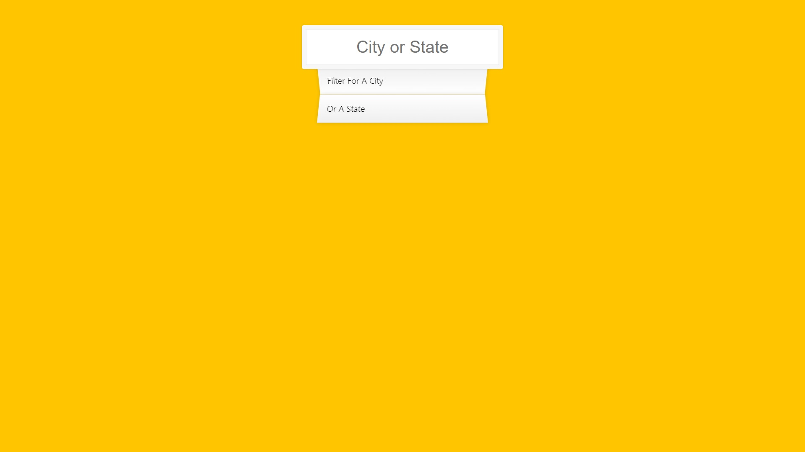
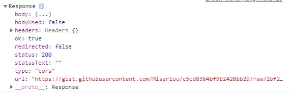

# 06 TYPE AHEAD

웹에서 정보를 받아와 Live Search기능을 구현


```html
<!DOCTYPE html>
<html lang="ko">
<head>
    <meta charset="UTF-8">
    <title>Type Ahead 👀</title>
    <link rel="stylesheet" href="style_JuneHyung.css">
</head>
<body>
    
  <form class="search-form">
    <input type="text" class="search" placeholder="City or State">
    <ul class="suggestions">
      <li>Filter for a city</li>
      <li>or a state</li>
    </ul>
  </form>
  <script>
    const endpoint = 'https://gist.githubusercontent.com/Miserlou/c5cd8364bf9b2420bb29/raw/2bf258763cdddd704f8ffd3ea9a3e81d25e2c6f6/cities.json';
    
    </script>
</body>
</html>
```

```css
html {
    box-sizing: border-box;
    background: #ffc600;
    font-family: 'helvetica neue';
    font-size: 20px;
    font-weight: 200;
}

*,
*:before,
*:after {
    box-sizing: inherit;
}

input {
    width: 100%;
    padding: 20px;
}

.search-form {
    max-width: 400px;
    margin: 50px auto;
}

input.search {
    margin: 0;
    text-align: center;
    outline: 0;
    border: 10px solid #f7f7f7;
    width: 120%;
    left: -10%;
    position: relative;
    top: 10px;
    z-index: 2;
    border-radius: 5px;
    font-size: 40px;
    box-shadow: 0 0 5px rgba(0, 0, 0, 0.12), inset 0 0 2px rgba(0, 0, 0, 0.19);
}

.suggestions {
    margin: 0;
    padding: 0;
    position: relative;
    /*perspective: 20px;*/
}

.suggestions li {
    background: white;
    list-style: none;
    border-bottom: 1px solid #d8d8d8;
    box-shadow: 0 0 10px rgba(0, 0, 0, 0.14);
    margin: 0;
    padding: 20px;
    transition: background 0.2s;
    display: flex;
    justify-content: space-between;
    text-transform: capitalize;
}

.suggestions li:nth-child(even) {
    transform: perspective(100px) rotateX(3deg) translateY(2px) scale(1.001);
    background: linear-gradient(to bottom, #ffffff 0%, #efefef 100%);
}

.suggestions li:nth-child(odd) {
    transform: perspective(100px) rotateX(-3deg) translateY(3px);
    background: linear-gradient(to top, #ffffff 0%, #efefef 100%);
}

span.population {
    font-size: 15px;
}

.hl {
    background: #ffc600;
}

```




# 새로알게된것들

### text-transform : capitalize

대문자 또는 소문자로 바꾸는 속성으로, uppercase, lowercase를 자주썻는데,

capitalize는 처음 봤다.

**capitalize : **단어의 첫번째 글자를 대무낮로 바꿉니다.


### transform: perspective()

perspective를 사용하지 않으면 translateZ의 변화를 느낄 수 없다.

perspective를 사용해 원금감을 주면 차이를 느낄 수 있다.


참고 : 

https://gahyun-web-diary.tistory.com/80

https://developer.mozilla.org/ko/docs/Web/CSS/CSS_Transforms/Using_CSS_transforms


### ...

전개구문 (Spread syntax)

나열형 자료를 추출하거나 연결할 때 사용.

사용 방법은 배열이나 객체, 변수명 **앞에 마침표 3개(...)**를 입력합니다.

! 배열,객체, 함수 인자 표현식([],{},()) 안에서만 사용.


### RegExp

패턴을 사용해 텍스트를 판별할 때 사용.

`RegExp` 객체는 리터럴 표기법과 생성자로써 생성할 수 있습니다.

- **리터럴 표기법**의 매개변수는 두 빗금으로 감싸야 하며 따옴표를 사용하지 않습니다.
- **생성자 함수**의 매개변수는 빗금으로 감싸지 않으나 따옴표를 사용합니다.

```
/ab+c/i
new RegExp(/ab+c/, 'i') // 리터럴
new RegExp('ab+c', 'i') // 생성자
```


## 문법(Syntax)

```
new` `RegExp(pattern [,flags]) ``// 생성자 방식``/pattern/flags ``// 정규표현식 리터럴 
```

## 인자(Parameters)

| 인자명  | 데이터형 | 필수/옵션 | 설명                                                         |
| ------- | -------- | --------- | ------------------------------------------------------------ |
| pattern | string   | 필수      | 정규표현식                                                   |
| flags   |          | 옵션      | g : 텍스트 전체에서 일치하는 문자를 찾을 때, 지정하지 않으면 첫번째 일치하는 문자만 검색<br />i : 대소문자를 구분하지 않는다.<br />m :^(첫번째 문자)와 $(마지막 문자)가 (\n, \r로 구분되는) 행단위로 일치 |

## 설명(Description)

정규표현식은 다음과 같은 경우 사용한다.

- 문자열에서 특정 문자열이 존재하는지 확인
- 문자열의 특정 부분을 다른 문자열로 변경

| Character | Meaning                                                   |
| --------- | --------------------------------------------------------- |
| `\`       | 이스케이핑(escaping)                                      |
| `^`       | 범위, 시작 지점,                                          |
| `$`       | 범위, 끝나는 지점                                         |
| *         | 수량, 없거나 더 많다 == {0,}                              |
| `+`       | 수량, 1보다 많다. == {1,}                                 |
| `?`       | 수량, 없거나 하나이다.                                    |
| `.`       | 일치, 문자 하나와 일치                                    |
| `(*x*)`   | 일치, x와 일치하는 것을 찾은 후에 이에 접근할수 있도록 함 |
| x\|y      | 일치. x나 y와 일치                                        |
| t{n}      | 수량. t와 n번 일치하는 문자열과 일치                      |
| t{n,}     | 수량, t와 n번 이상 일치하는 문자열과 일치                 |
| t{n,m}    | 수량. t와 n번 이상 m번 이하로 일치하는 문자열과 일치      |
| [xyz]     | 일치. xyz중에 하나라도 일치하는 문자열과 일치             |


### NumberWithCommas()

```javascript
function numberWithCommas(x) {
        return x.toString().replace(/\B(?=(\d{3})+(?!\d))/g, ',');
    }
```

정규식을 이용하여 숫자를 1000단위로 끊어 콤마 삽입.

정규표현식에대해 공부필요.

```
/\B(?=(\d{3})+(?!\d))/g
```

`\b` : 단어의 경계(시작과 끝)가 아닌부분

`(\d{3})` :

- `\d` : 숫자 문자 대응
- `{n}` : 앞 표현식이 n번 나오는 부분에 대응.

=> 즉, 숫자가 3번

`+(?!\d)` :

* `+`  : 앞의 표현식이 1회 이상 연속으로 반복되는 부분과 대응
* `x(?!y)` : x뒤에 y가 없는 경우에만 x에 일치

=> 즉, `(?!\d)`는 뒤에 더이상 숫자가 없는 경우를 의미.

`(?=` ~~~ `)` : 앞 뒤 조건 모두 만족.


# 과정

### 1.도시와 주의 이름과 인구수를 받아옴.

```javascript
const endpoint = 'https://gist.githubusercontent.com/Miserlou/c5cd8364bf9b2420bb29/raw/2bf258763cdddd704f8ffd3ea9a3e81d25e2c6f6/cities.json';

    const cities =[];

    // const porm = fetch(endpoint);
    // console.log(porm);
    
    // fetch(endpoint).then(blob => console.log(blob));
    fetch(endpoint)
    .then(blob => blob.json())
    .then(data=> cities.push(...data));
```

blob 결과화면




그냥 data를 cities에 넣으려할때 error발생

타입이 안맞아서 발생하는거 같았음.

```javascript
fetch(endpoint)
    .then(blob => blob.json())
    .then(data=> cities = data);
```

```
Uncaught (in promise) TypeError: Assignment to constant variable. 발생
```


### 2. 검색 시 일치하는 값을 찾아내는 함수

```javascript
function findMatches(wordToMatch, cities){
        return cities.filter(place => {
            // here we need to figure out if the city on state matches what was searched
            // 여기서 우리는 주의 도시가 검색되는 것과 일치하는 지 알아 내야합니다.

            const regex = new RegExp(wordToMatch, 'gi');
            return place.city.match(regex) || place.state.match(regex);
        })
    }
```

단어가 일치하는 도시 or 주를 반환하는 변수 regex를 만들고, 필터를 적용해 반환하도록하는 findMatches함수를 만듬.

RegExp는 검색할때 패턴을 설정해 줄 수 있는 생성자이고, gi는 전체에서 대소문자를 구분하지않고 검색한다는 의미.

g i m 붙여쓸 수 있나봄!


### 3. 화면에 보여지게 하는 함수.

``` javascript
function displayMatches(){
        // console.log(this.value);
        const matchArray = findMatches(this.value, cities);
        // console.log(matchArray);
        const html = matchArray.map(place => {
            
            const regex = new RegExp(this.value, 'gi');
            const cityName = place.city.replace(regex, `<span classs="h1"> ${this.value}</span>`);
            const stateName = place.state.replace(regex, `<span classs="h1"> ${this.value}</span>`);
            return `
                <li>
                    <span class="name">${cityName}, ${stateName}</span>
                    <span class="population">${numberWithCommas(place.population)}</span>
                </li>`
        }).join('');
        suggestions.innerHTML = html;
    }
```

입력한 값(`this.value`)과 받아온 도시(`cities`)를 매치해서 matchArray에 저장.

```javascript
const matchArray = findMatches(this.value, cities);
```

html에 검색 후에 배열에서 일치하는 내용을 찾아 cityName과 stateName에 새로운 검색값이 들어간 html태그로 대체하도록하고, 새로운 리스트 태그를 반환.


suggenstions에 html내용을 스크립트로 삽입하는 모든과정을 displayMatches에 담는다.

### 4. 숫자에 3자리 단위마다 콤마(,)

```javascript
 function numberWithCommas(x) {
        return x.toString().replace(/\B(?=(\d{3})+(?!\d))/g, ',');
    }
```

정규표현식을 이용해 만듬.


### 5. 실시간으로 출력.

input에 값이 변할때와 keyup event가 발생할때마다 displayMatches를 동작시킴.

```javascript
searchInput.addEventListener('change', displayMatches);
searchInput.addEventListener('keyup', displayMatches);
```

