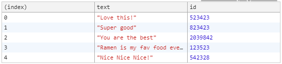
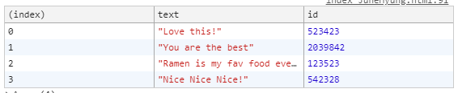

# 07 ARRAY CARDIO DAY2

자바스크립트의 메소드 익히기.

* some()
* every()
* find()
* findIndex(), slice()

초기코드

```html
<!DOCTYPE html>
<html lang="ko">
<head>
    <meta charset="UTF-8">
    <title>Array Cardio 💪💪</title>
</head>
<body>
    <p><em>Psst: have a look at the JavaScript Console</em> 💁</p>
    <script>
    // ## Array Cardio Day 2


    const people = [
      { name: 'Wes', year: 1988 },
      { name: 'Kait', year: 1986 },
      { name: 'Irv', year: 1970 },
      { name: 'Lux', year: 2015 }
    ];

    const comments = [
      { text: 'Love this!', id: 523423 },
      { text: 'Super good', id: 823423 },
      { text: 'You are the best', id: 2039842 },
      { text: 'Ramen is my fav food ever', id: 123523 },
      { text: 'Nice Nice Nice!', id: 542328 }
    ];

    // Some and Every Checks
    // Array.prototype.some() // is at least one person 19 or older?
    // Array.prototype.soem() // 19세 이상의 사람이 1명이상.

    // Array.prototype.every() // is everyone 19 or older?
    //  Array.prototype.every() // 모두 19세 이상인가/.


    // Array.prototype.find()
    // Find is like filter, but instead returns just the one you are looking for
    // Find는 필터같습니다, 그러나 대신 찾고있는 항목만 반환합니다.
    // find the comment with the ID of 823423
    // ID가 823423인 comment 찾기.

    // Array.prototype.findIndex()
    // Find the comment with this ID
    // 이 ID로 comment 찾기

    // delete the comment with the ID of 823423
    // ID가 823423인 comment를 지우기
    </script>
</body>
</html>
```


# 문제

<strong>1. Some and Every Check</strong>

- 19세이상의 사람을 출력. (some, every이용)

**some**

```javascript
 const isAdult = people.some(function(person) {
        const currentYear = (new Date()).getFullYear();
        if(currentYear - person.year >= 19){
            return true;
        }
    });
```

 

ES6 Arrow Function

```javascript
const isAdult = people.some(person=>{
    const currentYear = (new Date()).getFullYear();
    return currentYear - person.year >= 19;
})
```


최종

```javascript
const isAdult = people.some(person => ((new Date()).getFullYear()) - person.year >= 19);
```


**every**

```javascript
const allAdults = people.every(person => ((new Date()).getFullYear()) - person.year >= 19);
```


<strong>2.  Array.prototype.find()</strong>

* ID가 823423인 comment 찾기.

```javascript
const comment = comments.find(function(comment){
        if(comment.id === 823423){
            return true;
        }
    });
```


ES6 Arrow Function

```javascript
const comment = comment.find(comment => comment.id === 823423);
```


<strong>3. Array.prototype.findIndex()</strong>

* findIndex로 id가 823423인 comment찾아서 지우기.

```javascript
const index = comments.findIndex(comment => comment.id === 823423);
    console.log(index);

    // comments.slice(index, 1);

    const newComments=[
        ...comments.splice(0,index),
        ...comments.splice(index+1),
    ];
```

[comments]



[newComments]



... 을 사용해 newComments에 id가 823423인 값을 뺀 나머지를 넣는 코드.


`slice()` : 시작과 끝을 지정하여 배열요소를 추출

`splice()` : 특정 위치의 요소를 삭제하거나 수정할 수 있습니다.

배열.splice(4,1) >> 4번 인덱스부터 1개 삭제