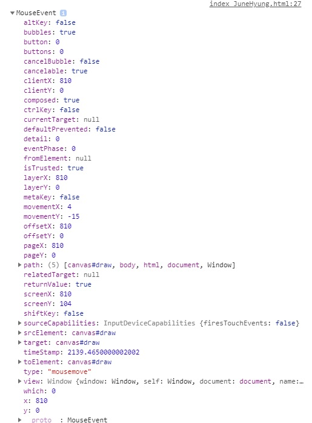
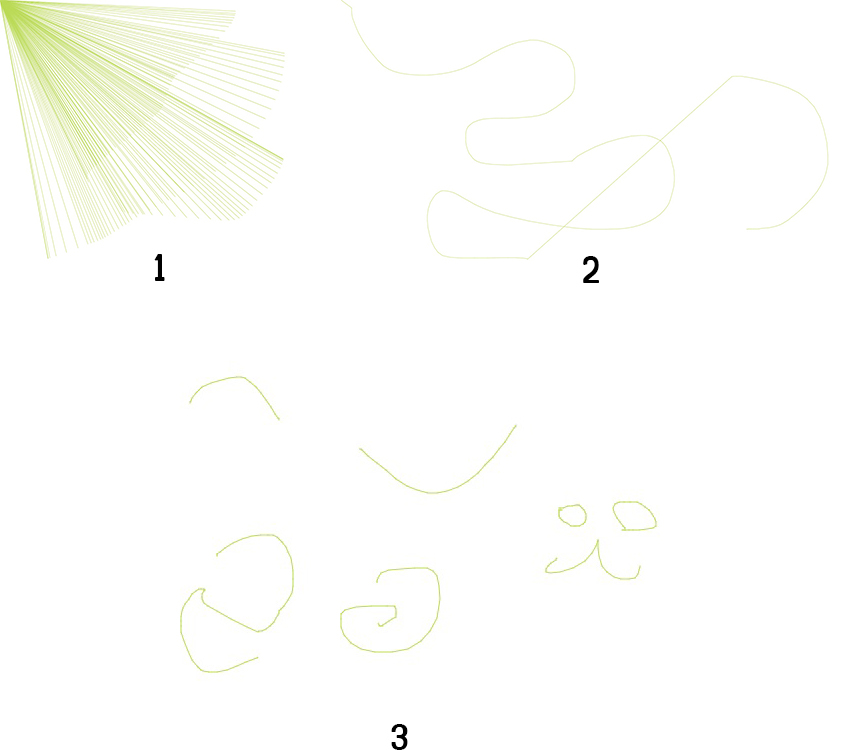
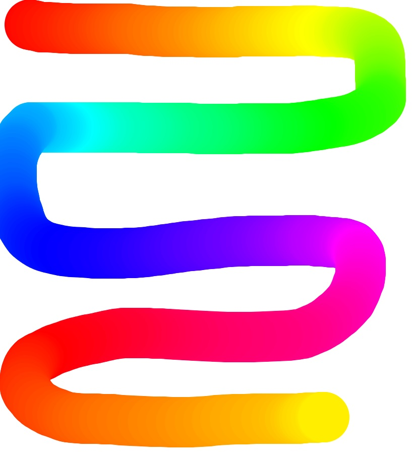
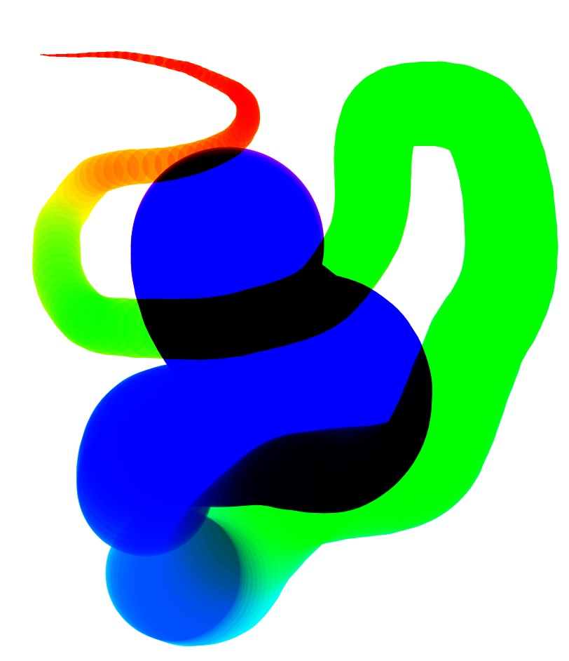

# 08 FUN WITH HTML5 CANVAS

HTML에 canvas를 이용해 각종 효과를 넣어봄.


초기코드

```html
<!DOCTYPE html>
<html lang="ko">
<head>
    <meta charset="UTF-8">
    <title>HTML5 Canvas</title>
</head>
<body>
    <canvas id="draw" width="800" height="800"></canvas>
</body>
<style>
    html, body{
        margin: 0;
    }
</style>
</html>
```


# 알게된 것

### canvas

* **const ctx = canvas.getContext('2d');**

  * 캔버스의 드로잉 컨텍스트를 반환함. 2d인경우 2d를 작성.
  * `webgl` | `experimental-webgl`: 3차원 렌더링 컨텍스트
  * `webg2` : 3차원 렌더링 컨텍스트를 나타내는 `WebGLRenderingContext객체를 생성
  * `bitmaprenderer` : 캔버스의 컨텐츠를 주어진 [`ImageBitmap` (en-US)](https://developer.mozilla.org/en-US/docs/Web/API/ImageBitmap)으로 대체하기위한 기능만을 제공하는 [`ImageBitmapRenderingContext` (en-US)](https://developer.mozilla.org/en-US/docs/Web/API/ImageBitmapRenderingContext)를 생성

* 2d에서 직사각형 , 텍스트, 선을 그릴 수 있고, 아래 링크를 참고.

  https://developer.mozilla.org/en-US/docs/Web/API/CanvasRenderingContext2D

**채우기 및 획 스타일**

* `ctx.strokeStyle` :  도형 주위의 선에 사용할 색상 또는 스타일. 기본값 #000

**선 스타일**

* `ctx.lineJoin` : 두 선이 만나는 모서리 유형을 정의
  * round, bavel, miter(기본값)
* `ctx.lineCap` : 줄 끝의 엔딩 유형.
  * butt(기본값), round, square
* `ctx.lineWidth` : 선의 너비, 기본값 1.0

**경로**

개체의 경로를 조작 가능.

* `beginPath()` : 하위 경로 목록을 비워 새 경로를 시작. 
* `moveTo()` : 새 하위 경로의 시작점을 (x, y)좌표로 이동함.
* `lineTo()` : 현재 하위 경로의 마지막 점을 지정된 (x, y)좌표에 직선으로 연결함.
* `stroke` : 현재 획 스타일로 현재 하위 경로를 획을 그음.


# 과정

<strong>1. 그리기 효과를 사용하기 위한 기본 설정.</strong>

```javascript
 const canvas = document.querySelector("#draw");
const ctx = canvas.getContext('2d');

// canvas resize
canvas.width = window.innerWidth;
canvas.height = window.innerHeight;

ctx.strokeStyle = '#BADA55';
ctx.lineJoin = 'round';
ctx.lineCap = 'round'
ctx.lineWidth = 0;
```

그릴 캔버스(#draw)를 canvas에 저장하고 ctx에 canvas의 그리기 대상이 되는 context를 얻음.

width와 height의를 설정하고,

선의 색(strokeStyle), 선의 끝모양(lineCap), 두개 선이 만나는 지점의 모양(lineJoin)과 선의 두꼐(lineWidth)지정.


<strong>2. 그리기 효과를 실시간으로 변경하기 위한 변수 설정</strong>

```javascript
let isDrawing = false;
let lastX = 0;
let lastY = 0;

let hue = 0;
let direction = true;
```

isDrawing은 현재 그리고 있는지 아닌지 check

lastX와 lastY를 이용해 시작지점좌표를 지정.

hue를 통해 선의 색을 변경.

direction으로 굵기를 정하는 방향을 설정.


<strong>3. 그리기 효과를 실시간으로 바꾸는 함수 작성</strong>

```javascript
// 마우스를 클릭할 때 시작지점 재설정.
canvas.addEventListener('mousedown', (e)=>{
    isDrawing = true;
    [lastX, lastY] = [e.offsetX, e.offsetY];
});


canvas.addEventListener('mousemove', draw);
canvas.addEventListener('mouseup', ()=>isDrawing = false);
canvas.addEventListener('mouseout', ()=>isDrawing = false);
```

mouse event확인.




<strong>4. 그리기 효과를 실시간으로 변경하기 위한 함수 작성.</strong>

```javascript
function draw(e){
    // stop the function from running when they are not moused down
    // 마우스를 누르지 않을 때 기능 실행 중지

    if(!isDrawing) return;
    console.log(e);

    ctx.strokeStyle = `hsl(${hue}, 100%, 50%)`;
    // ctx.lineWidth = hue;

    ctx.beginPath();
    // start from
    ctx.moveTo(lastX, lastY);
    // goto
    ctx.lineTo(e.offsetX, e.offsetY);
    ctx.stroke();

    // 마지막 지점을 끝지점으로 지정.
    // 다음에 그릴 때 시작지점이 이전 작업의 끝지점.
    // lastX = e.offsetX;
    // lastY = e.offsetY;
    [lastX, lastY] = [e.offsetX, e.offsetY];

    hue++;
    // reset
    if(hue >=360){
        hue = 0;
    }

    // ctx.lineWidth++;
    if(ctx.lineWidth >= 100 || ctx.lineWidth <= 1){
        direction = !direction;
    }

    if(direction){
        ctx.lineWidth++;
    }else{
        ctx.lineWidth--;
    }


}
```

lastX와 lastY를 설정해줌에 따라 변화.




hue값 변화.




그 후 direction에 따라 굵기조절.


<strong>5. multiply </strong>

```javascript
ctx.globalCompositeOperation = 'multiply';
```

색이 겹치게 보이게 됨.




## 더 많은 속성이 공식 문서에 있으니 참고하자!

