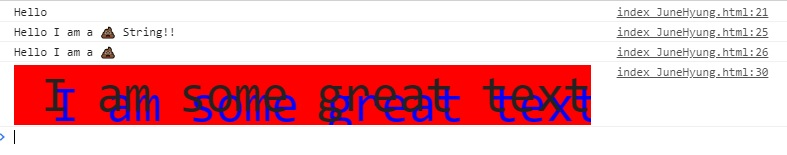
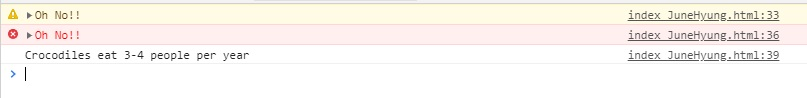
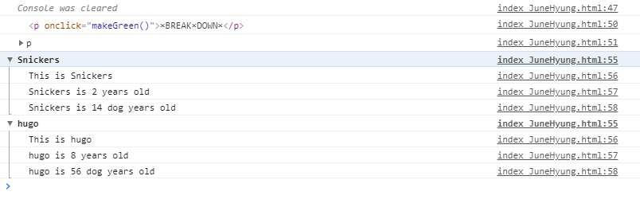
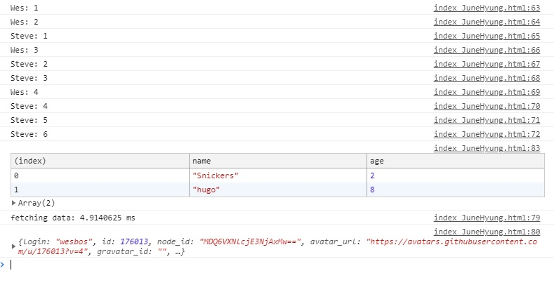

# 09 14 Must Know Dev Tools Tricks

콘솔창에 각종 연산 및 효과를 넣는 방법들


초기코드

```html
<!DOCTYPE html>
<html lang="ko">
<head>
  <meta charset="UTF-8">
  <title>Console Tricks!</title>
</head>
<body>

  <p onClick="makeGreen()">×BREAK×DOWN×</p>

  <script>
    const dogs = [{ name: 'Snickers', age: 2 }, { name: 'hugo', age: 8 }];

    function makeGreen() {
      const p = document.querySelector('p');
      p.style.color = '#BADA55';
      p.style.fontSize = '50px';
    }

    // Regular

    // Interpolated

    // Styled

    // warning!

    // Error :|

    // Info

    // Testing

    // clearing

    // Viewing DOM Elements

    // Grouping together

    // counting

    // timing

  </script>
</body>
</html>

```


과정

<strong>1. Regular, Interpolated, Styled</strong>

```javascript
 // Regular
console.log('Hello');

// Interpolated
let value= '💩';
console.log('Hello I am a %s String!!', '💩');
console.log(`Hello I am a ${value}`);

// Styled
// %c 는 style을 먹일수 있다.
console.log('%c I am some great text', 'font-size:50px; background:red; text-shadow: 10px 10px 0 blue');
```



* %s로 문자열을 넣을 수 있다.
* %c로 스타일을 적용해서 출력할 수 있다.


<strong>2. Warning, Error, Info</strong>

```javascript
// warning!
console.warn('Oh No!!');

// Error :|
console.error('Oh No!!');

// Info
console.info('Crocodiles eat 3-4 people per year');
```



* warn은 노란색 결과
* error는 빨간색.


<strong>3. Testing, clearing, Viewing Dom Elements, Grouping together,</strong>

```javascript
// Testing
// 틀리면 출력되고 아니면 출력안됨.
const p = document.querySelector('p');
console.assert(p.classList.contains('ouch'), 'That is wrong!');

// clearing
console.clear();

// Viewing DOM Elements
console.log(p);
console.dir(p);

// Grouping together
dogs.forEach(dog => {
    console.groupCollapsed(`${dog.name}`);
    console.log(`This is ${dog.name}`);
    console.log(`${dog.name} is ${dog.age} years old`);
    console.log(`${dog.name} is ${dog.age * 7} dog years old`);
    console.groupEnd(`${dog.name}`);
});
```



* assert는 ()안의 내용이 false면, error창으로 표시한다.
* clear은 콘솔창을 꺠끗이 지움.
* dir은 태그이름만 가져옴.
* groupCollapse와 groupEnd안에 새로운 로깅을 작성함.


<strong>4.  counting, timing </strong>

```javascript
// counting
console.count('Wes');
console.count('Wes');
console.count('Steve');
console.count('Wes');
console.count('Steve');
console.count('Steve');
console.count('Wes');
console.count('Steve');
console.count('Steve');
console.count('Steve');

// timing
console.time('fetching data');
fetch('https://api.github.com/users/wesbos')
    .then(data => data.json())
    .then(data => {
    console.timeEnd('fetching data');
    console.log(data);
})

console.table(dogs);
```


