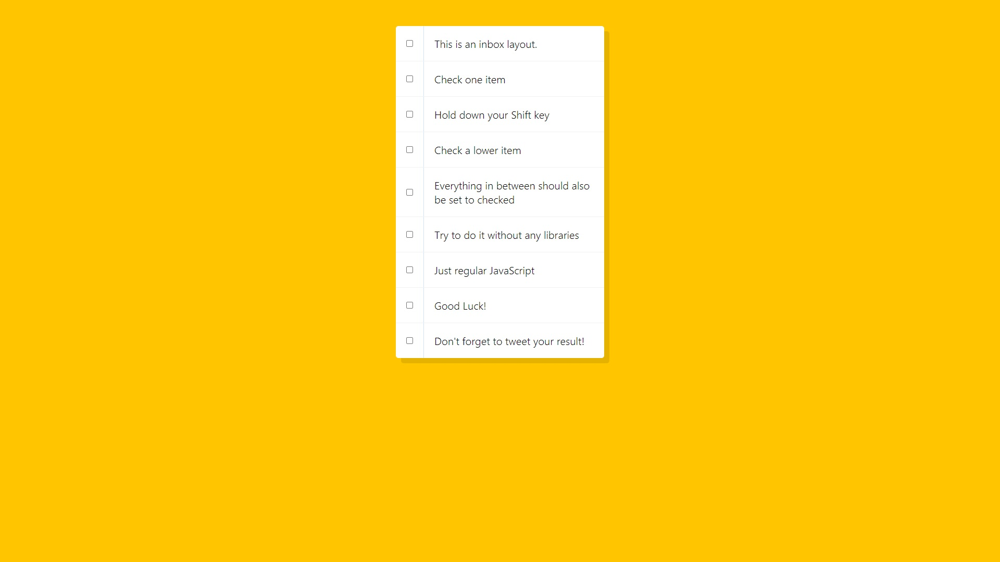
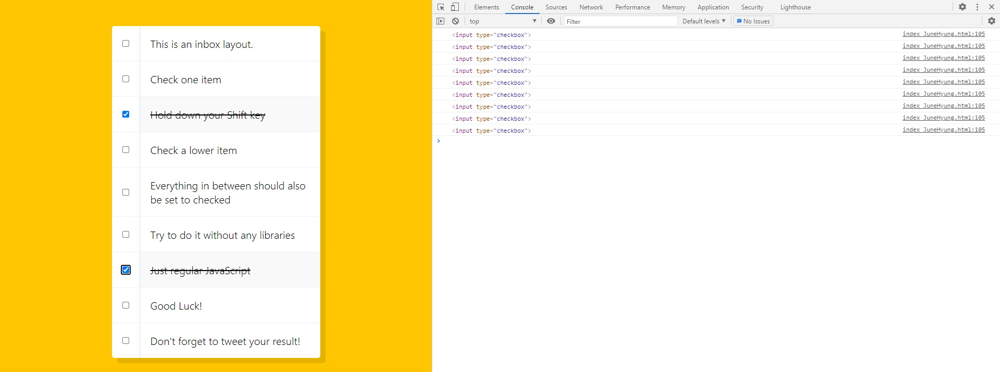

# 10. Hold Shift to Check Multiple Checkboxes

shift키로 체크박스를 동시에 체크 할 수 있는 기능을 추가하는 것


초기 코드

```html
<!DOCTYPE html>
<html lang="ko">
<head>
    <meta charset="UTF-8">
    <title>Hold Shift to Check Multiple Checkboxes</title>
</head>
<div>
    <style>
        html {
      font-family: sans-serif;
      background: #ffc600;
    }

    .inbox {
        max-width: 400px;
        margin: 50px auto;
        background: white;
        border-radius: 5px;
        box-shadow: 10px 10px 0 rgba(0,0,0,0.1);
    }

    .item {
        display: flex;
        align-items: center;
        border-bottom: 1px solid #F1F1F1;
    }

    .item:last-child {
        border-bottom: 0;
    }

    input:checked + p {
        background: #F9F9F9;
        text-decoration: line-through;
    }

    input[type="checkbox"] {
        margin: 20px;
    }

    p {
        margin: 0;
        padding: 20px;
        transition: background 0.2s;
        flex: 1;
        font-family:'helvetica neue';
        font-size: 20px;
        font-weight: 200;
        border-left: 1px solid #D1E2FF;
    }
    </style>
    <div class="inbox">
        <div class="item">
            <input type="checkbox">
            <p>This is an inbox layout.</p>
        </div>
        <div class="item">
            <input type="checkbox">
            <p>Check one item</p>
        </div>
        <div class="item">
            <input type="checkbox">
            <p>Hold down your Shift key</p>
        </div>
        <div class="item">
            <input type="checkbox">
            <p>Check a lower item</p>
        </div>
        <div class="item">
            <input type="checkbox">
            <p>Everything in between should also be set to checked</p>
        </div>
        <div class="item">
            <input type="checkbox">
            <p>Try to do it without any libraries</p>
        </div>
        <div class="item">
            <input type="checkbox">
            <p>Just regular JavaScript</p>
        </div>
        <div class="item">
            <input type="checkbox">
            <p>Good Luck!</p>
        </div>
        <div class="item">
            <input type="checkbox">
            <p>Don't forget to tweet your result!</p>
        </div>
        </div>
    </div>
</body>
</html>
```


초기화면




# 과정

<strong>1. checkbox들을 모두 찾음.</strong>

```javascript
document.querySelectorAll('.inbox input[type="checkbox"]');
```

input type이 checkbox인 모든 태그를 찾음.


<strong>2. 함수 생성</strong>

```javascript
let lastChecked;

function handleCheck(e){
    // Check if they had the shift key down
    // AND check that they are checking it
    let inBetween = false;
    if(e.shiftKey && this.checked) {
        // go ahead and do what we please
        // loop over every single checkbox
        checkboxes.forEach(checkbox =>{
            console.log(checkbox);
            if(checkbox === this || checkbox === lastChecked){
                inBetween = !inBetween;
                console.log('Starting to check them inbetween');
            }

            if(inBetween){
                checkbox.checked = true;
            }
        })
    }

    lastChecked = this;
}
```

shiftkey를 누르는 이벤트가 발생하고, checked상태면 checkbox들을 돌면서 처음 클릭한 것과 마지막 클릭한것사이의 모든 체크박스들을 체크함.


inBetween에 false를 할당하고, 만약 shift키를 누르고,  누른것이 체크되있다면 조건문을 실행한다.

처음 버튼을 누를 때 inBetween이 true가 되고,  하위 내용들을 체크한다.

① 

```javascript
if(e.shiftKey && this.checked) { ~~~ }
```

②

```javascript
if(checkbox === this || checkbox === lastChecked){
    inBetween = !inBetween;
}
```


③

```javascript
if(inBetween){
	checkbox.checked = true;
}
```


처음 shift event발생 시




<strong>3. click이벤트를 추가하며 함수 호출.</strong>

```javascript
checkboxes.forEach(checkbox => checkbox.addEventListener('click' , handleCheck));
```

+

css줄효과 준것.

```css
input:checked + p {
    background: #F9F9F9;
    text-decoration: line-through;
}
```

checked된 p에 line-through를 줘서 줄긋는 효과가 생김.