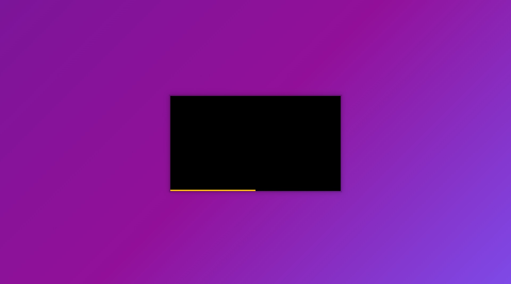
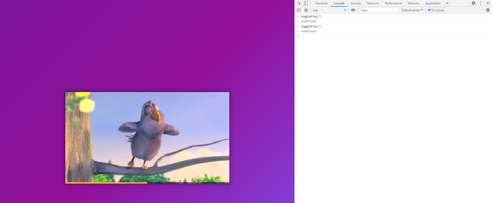
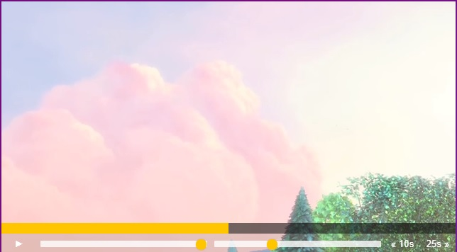

# 11. Custom Video Player

동영상 플레이어의 다양한 기능을 자바스크립트로 구현.


초기화면




초기코드

```html
<!DOCTYPE html>
<html lang="ko">
<head>
    <meta charset="UTF-8">
    <meta http-equiv="X-UA-Compatible" content="IE=edge">
    <meta name="viewport" content="width=device-width, initial-scale=1.0">
    <title>HTML Video Player</title>
    <link rel="stylesheet" href="style_JuneHyung.css">
</head>
<body>
    <div class="player">
        <video class="player__video viewer" src="652333414.mp4"></video>
        <div class="player__controls">
            <div class="progress">
                <div class="progress__filled"></div>
            </div>
            <button class="player__button toggle" title="Toggle Play">►</button>
            <input type="range" name="volume" class="player__slider" min="0" max="1" step="0.05" value="1">
            <input type="range" name="playbackRate" class="player__slider" min="0.5" max="2" step="0.1" value="1">
            <button data-skip="-10" class="player__button">« 10s</button>
            <button data-skip="25" class="player__button">25s »</button>
        </div>
    </div>    
    <script src="scripts_JuneHyung.js"></script>
</body>
</html>
```

```css
@charset "utf-8";
html {
    box-sizing: border-box;
}

*,
*:before,
*:after {
    box-sizing: inherit;
}

body {
    margin: 0;
    padding: 0;
    display: flex;
    background: #7a419b;
    min-height: 100vh;
    background: linear-gradient(135deg, #7c1599 0%, #921099 48%, #7e4ae8 100%);
    background-size: cover;
    align-items: center;
    justify-content: center;
}

.player {
    max-width: 750px;
    border: 5px solid rgba(0, 0, 0, 0.2);
    box-shadow: 0 0 20px rgba(0, 0, 0, 0.2);
    position: relative;
    font-size: 0;
    overflow: hidden;
}

/* This css is only applied when fullscreen is active. */
.player:fullscreen {
    max-width: none;
    width: 100%;
}

.player:-webkit-full-screen {
    max-width: none;
    width: 100%;
}

.player__video {
    width: 100%;
}

.player__button {
    background: none;
    border: 0;
    line-height: 1;
    color: white;
    text-align: center;
    outline: 0;
    padding: 0;
    cursor: pointer;
    max-width: 50px;
}

.player__button:focus {
    border-color: #ffc600;
}

.player__slider {
    width: 10px;
    height: 30px;
}

.player__controls {
    display: flex;
    position: absolute;
    bottom: 0;
    width: 100%;
    transform: translateY(100%) translateY(-5px);
    transition: all 0.3s;
    flex-wrap: wrap;
    background: rgba(0, 0, 0, 0.1);
}

.player:hover .player__controls {
    transform: translateY(0);
}

.player:hover .progress {
    height: 15px;
}

.player__controls > * {
    flex: 1;
}

.progress {
    flex: 10;
    position: relative;
    display: flex;
    flex-basis: 100%;
    height: 5px;
    transition: height 0.3s;
    background: rgba(0, 0, 0, 0.5);
    cursor: ew-resize;
}

.progress__filled {
    width: 50%;
    background: #ffc600;
    flex: 0;
    flex-basis: 50%;
}

/* unholy css to style input type="range" */

input[type='range'] {
    -webkit-appearance: none;
    background: transparent;
    width: 100%;
    margin: 0 5px;
}

input[type='range']:focus {
    outline: none;
}

input[type='range']::-webkit-slider-runnable-track {
    width: 100%;
    height: 8.4px;
    cursor: pointer;
    box-shadow: 1px 1px 1px rgba(0, 0, 0, 0), 0 0 1px rgba(13, 13, 13, 0);
    background: rgba(255, 255, 255, 0.8);
    border-radius: 1.3px;
    border: 0.2px solid rgba(1, 1, 1, 0);
}

input[type='range']::-webkit-slider-thumb {
    height: 15px;
    width: 15px;
    border-radius: 50px;
    background: #ffc600;
    cursor: pointer;
    -webkit-appearance: none;
    margin-top: -3.5px;
    box-shadow: 0 0 2px rgba(0, 0, 0, 0.2);
}

input[type='range']:focus::-webkit-slider-runnable-track {
    background: #bada55;
}

input[type='range']::-moz-range-track {
    width: 100%;
    height: 8.4px;
    cursor: pointer;
    box-shadow: 1px 1px 1px rgba(0, 0, 0, 0), 0 0 1px rgba(13, 13, 13, 0);
    background: #ffffff;
    border-radius: 1.3px;
    border: 0.2px solid rgba(1, 1, 1, 0);
}

input[type='range']::-moz-range-thumb {
    box-shadow: 0 0 0 rgba(0, 0, 0, 0), 0 0 0 rgba(13, 13, 13, 0);
    height: 15px;
    width: 15px;
    border-radius: 50px;
    background: #ffc600;
    cursor: pointer;
}
```


## 새로 알게 된 것

**video태그의 play, puase이벤트.**

각각 재생하고, 일시정지하는 이벤트로, 이벤트를 직접 건드릴 수 있는 지 알게됨.

참고 : https://developer.mozilla.org/en-US/docs/Web/API/HTMLMediaElement/play_event


**style.flexBasis**

플렉스 아이템의 초기 크기를 지정함.

 box-sizing을 따로 지정하지 않는다면 콘텐츠 박스의 크기를 변경함.

이번 예제에서는 flexBasis를 계산한 %로 지정하면서 동영상이 진행된 정도를 나타내는데 사용.

참고 : https://developer.mozilla.org/ko/docs/Web/CSS/flex-basis


## 과정

1. 사용할 엘리먼트들을 가져오기.

``` javascript
const player = document.querySelector('.player');
const video = player.querySelector('.viewer'); // player안에 있는 viewer를 찾기때문에 player.querySelector
const progress = player.querySelector('.progress');
const progressBar = player.querySelector('.progress__filled');

const toggle = player.querySelector('.toggle');
const skipButtons = player.querySelectorAll('[data-skip]');
const ranges = player.querySelectorAll('.player__slider');
```


**메소드 작성**

<strong>1. togglePlay()</strong>

```javascript
function togglePlay() {
    // .play() or .pause()
    const method = video.paused ? 'play' : 'pause';
    video[method]();
    // if (video.paused) {
    //     video.play();
    // } else {
    //     video.pause();
    // }
}

video.addEventListener('click', togglePlay); // video화면 클릭
```

video를 클릭했을 때 play면 pause, pause면 play로 변경

```javascript
if (video.paused) {
	video.play();
} else {
    video.pause();
}
```

를 삼항연산자를 사용하여 한줄로 작성.

```javascript
video.paused ? 'play' : 'pause';
```




<strong>2. updateButton()</strong>

```javascript
function updateButton() {
    const icon = this.paused ? '►' : '❚ ❚';
    toggle.textContent = icon; // 토글 버튼
    // console.log('Update the button');
}

video.addEventListener('play', updateButton);
video.addEventListener('pause', updateButton);
```

비디오의 재생상태에 따라 아이콘 변경. 
정지 상태면 '►', 재생상태면 '❚ ❚'




<strong>3.  skip()</strong>

```javascript
<button data-skip="-10" class="player__button">« 10s</button>
<button data-skip="25" class="player__button">25s »</button>

function skip() {
    // console.log('skipping!');
    console.timeLog(this.dataset.skip);
    video.currentTime += parseFloat(this.dataset.skip); // 현재시간을 추가하거나 뺌. 
}

skipButtons.forEach(button => button.addEventListener('click', skip));
```

skipButtons들에 click했을 때 현재시간에서 지정해놓은 skip값을 더해준다.


<strong>4. handleRangeUpdate</strong>()

```javascript
function handleRangeUpdate() {
    video[this.name] = this.value;
}

ranges.forEach(range => range.addEventListener('change', handleRangeUpdate));
ranges.forEach(range => range.addEventListener('mousemove', handleRangeUpdate));
```

볼륨과 재생속도를 조절함.


<strong>5. handleProgress() </strong>

```javascript
function handleProgress() {
    const percent = (video.currentTime / video.duration) * 100;
    progressBar.style.flexBasis = `${percent}%`;
}

video.addEventListener('timeupdate', handleProgress); 
```

현재 재생 시간에 따라 재생바의 위치를 설정해 주는 함수.

video의 현재진행된 시간을 전체시간에 나누고 *100을 하여 퍼센테이지를 구함.


<strong>6. scrub() </strong>

```javascript
function scrub(e) {
    const scrubTime = (e.offsetX / progress.offsetWidth) * video.duration;
    video.currentTime = scrubTime;
}

let mousedown = false;
progress.addEventListener('click', scrub);
// progress.addEventListener('mousemove', scrub);
// true면 scrub false면 scurb X
progress.addEventListener('mousemove', (e)=>mousedown && scrub(e));
progress.addEventListener('mousedown', () => mousedown = true);
progress.addEventListener('mouseup', () => mousedown = false);
```

동영상에서 드래그하는 동안 바로바로 해당 장면으로 이동하게됨.

