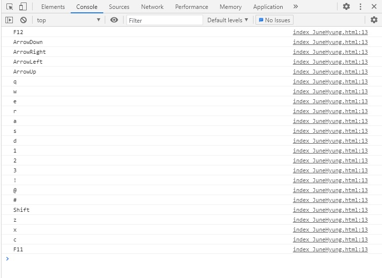
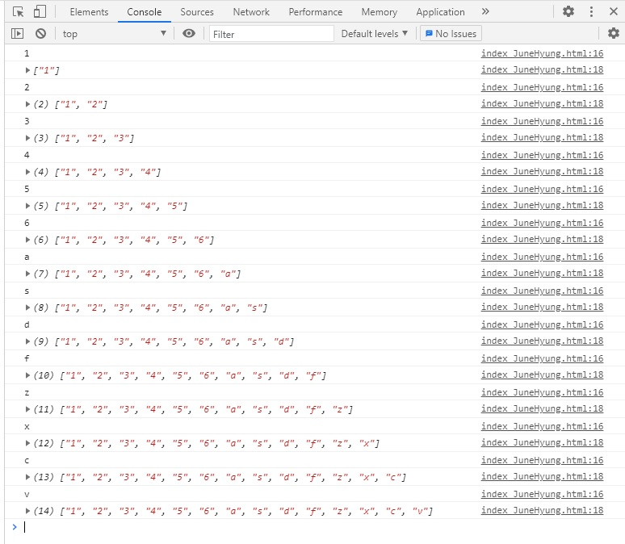
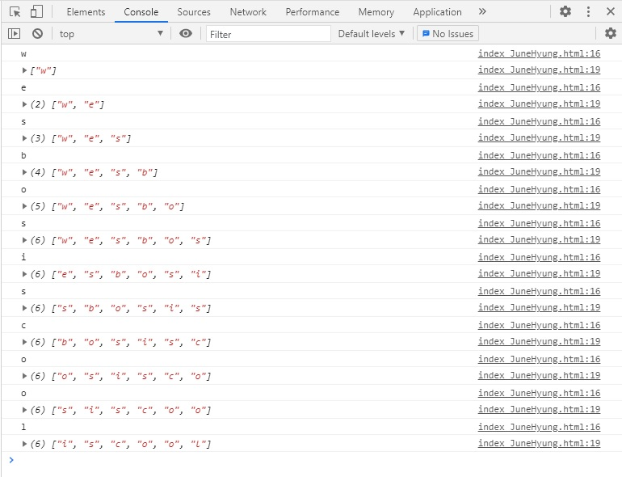
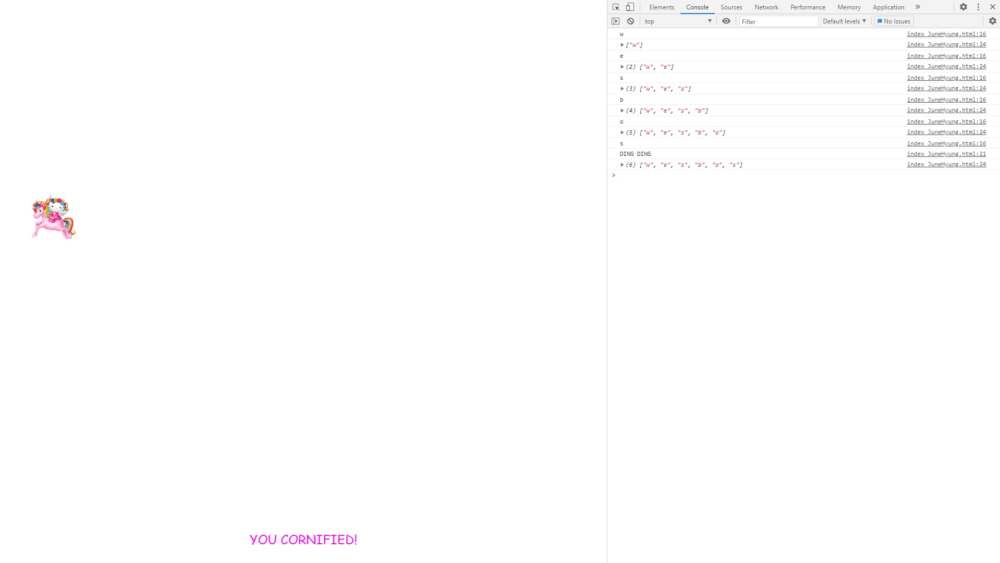
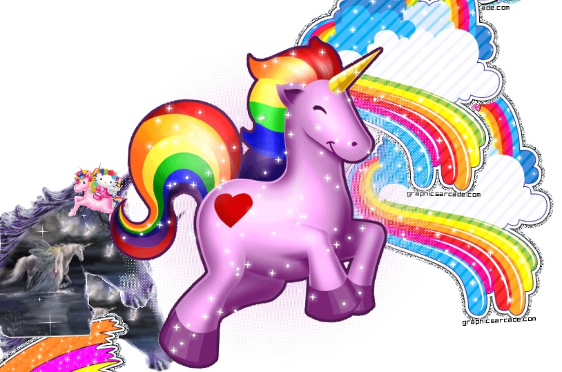

# 12. Key Sequence Detection (KONAMI CODE)

키 입력을 받아 콘솔창에 배열로 뜨게 하고, secretCode를 입력하면 유니콘이 나오게 설정

초기코드

```html
<!DOCTYPE html>
<html lang="en">
<head>
  <meta charset="UTF-8">
  <title>Key Detection</title>
  <script type="text/javascript" src="https://www.cornify.com/js/cornify.js"></script>
</head>
<body>
<script>
</script>
</body>
</html>
```

## 새로 알게 된 것

**cornify.js**

우선 Cornify는 전 세계 1위의 유니콘 및 무지개 서비스(?)라고 한다.

여기서 사용한 cornify_add()를 살펴보면 랜덤한 위치에 이미지를 fixed시키고, 생성된 이미지를 클릭하면 다시 cornify_add를 동작시키는거 같다.

```javascript
var cornify_count = 0;
var cornify_add = function() {
	cornify_count += 1;
	var cornify_url = 'http://www.cornify.com/';
	var div = document.createElement('div');
	div.style.position = 'fixed';
	
	var numType = 'px';
	var heightRandom = Math.random()*.75;
	var windowHeight = 768;
	var windowWidth = 1024;
	var height = 0;
	var width = 0;
	var de = document.documentElement;
	if (typeof(window.innerHeight) == 'number') {
		windowHeight = window.innerHeight;
		windowWidth = window.innerWidth;
	} else if(de && de.clientHeight) {
		windowHeight = de.clientHeight;
		windowWidth = de.clientWidth;
	} else {
		numType = '%';
		height = Math.round( height*100 )+'%';
	}
	
	div.onclick = cornify_add;
	div.style.zIndex = 10;
	div.style.outline = 0;
	~~~~~
```

참고 :

**Cornify사이트** : https://www.cornify.com/

**Cornify.js** : https://gist.github.com/philwinkle/9916577


## 과정

<strong>1.  key event 확인</strong>

```javascript
window.addEventListener('keyup', (e)=> {
    console.log(e.key);
})
```

어떤 키가 눌렸는지 확인함.



<strong> 2. 배열에 저장하기 </strong>

```javascript
const pressed = [];
const secretCode = 'wesbos'

window.addEventListener('keyup', (e)=> {
    console.log(e.key);
    pressed.push(e.key);
    console.log(pressed);
})
```

키 이벤트가 발쌩할 때 마다 pressed배열에 저장.




<strong>3. splice() </strong>

```javascript
 window.addEventListener('keyup', (e)=>{
     console.log(e.key);
     pressed.push(e.key);
     pressed.splice(-secretCode.length - 1, pressed.length - secretCode.length);
     console.log(pressed);
 })
```

 splice를 이용하여 배열의 가장뒤에 추가하고, 가장앞의 글자를 지운다.

위의 코드대로 실행하게되면 가장 첫번째거를 1글자 지우게됨.





<strong>4. add cornify</strong>

```javascript
if(pressed.join('').includes(secretCode)){
    console.log('DING DING');
    cornify_add();
}
```

배열안의 요소를 join으로 연결하여 문자열로 만든다.

그 문자열이 secretCode를 포함하면 콘솔에 DING DING을 출력하고, 유니콘 하나를 출력함.





