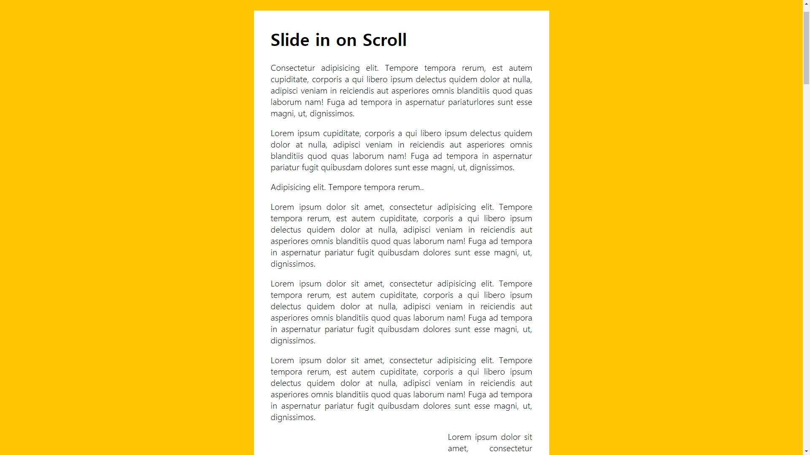

# 13. Slide In on Scroll

debounce를 활용해 스크롤 이미지 자리의 중간까지오면 이미지가 양 옆에서 날아오는 효과를 적용.

**실행화면**


**초기코드**

```html
<!DOCTYPE html>
<html lang="ko">
<head>
  <meta charset="UTF-8">
  <title>Document</title>
</head>
<body>

  <div class="site-wrap">

    <h1>Slide in on Scroll</h1>

    <p>Consectetur adipisicing elit. Tempore tempora rerum, est autem cupiditate, corporis a qui libero ipsum delectus quidem dolor at nulla, adipisci veniam in reiciendis aut asperiores omnis blanditiis quod quas laborum nam! Fuga ad tempora in aspernatur pariaturlores sunt esse magni, ut, dignissimos.</p>
    <p>Lorem ipsum cupiditate, corporis a qui libero ipsum delectus quidem dolor at nulla, adipisci veniam in reiciendis aut asperiores omnis blanditiis quod quas laborum nam! Fuga ad tempora in aspernatur pariatur fugit quibusdam dolores sunt esse magni, ut, dignissimos.</p>
    <p>Adipisicing elit. Tempore tempora rerum..</p>
    <p>Lorem ipsum dolor sit amet, consectetur adipisicing elit. Tempore tempora rerum, est autem cupiditate, corporis a qui libero ipsum delectus quidem dolor at nulla, adipisci veniam in reiciendis aut asperiores omnis blanditiis quod quas laborum nam! Fuga ad tempora in aspernatur pariatur fugit quibusdam dolores sunt esse magni, ut, dignissimos.</p>
    <p>Lorem ipsum dolor sit amet, consectetur adipisicing elit. Tempore tempora rerum, est autem cupiditate, corporis a qui libero ipsum delectus quidem dolor at nulla, adipisci veniam in reiciendis aut asperiores omnis blanditiis quod quas laborum nam! Fuga ad tempora in aspernatur pariatur fugit quibusdam dolores sunt esse magni, ut, dignissimos.</p>
    <p>Lorem ipsum dolor sit amet, consectetur adipisicing elit. Tempore tempora rerum, est autem cupiditate, corporis a qui libero ipsum delectus quidem dolor at nulla, adipisci veniam in reiciendis aut asperiores omnis blanditiis quod quas laborum nam! Fuga ad tempora in aspernatur pariatur fugit quibusdam dolores sunt esse magni, ut, dignissimos.</p>

    

    <p>Lorem ipsum dolor sit amet, consectetur adipisicing elit. Voluptates, deserunt facilis et iste corrupti omnis tenetur est. Iste ut est dicta dolor itaque adipisci, dolorum minima, veritatis earum provident error molestias. Ratione magni illo sint vel velit ut excepturi consectetur suscipit, ea~~~~~ dummy data ~~~~~t</p>

    

    <p> at provident praesentium atque quas rerum optio dignissimos repudiandae ullam illum quibusdam. Vel ad error quibusdam, illo ex totam placeat. Quos excepturi fuga, molestiae ea quisquam minus, ratione dicta consectetur officia omnis, doloribus voluptatibus? Veniam ipsum veritatis architecto, provident quas consequatur doloremque quam quidem earum expedita, ad delectus voluptatum, omnis praesentium nostrum qui aspernatur ea eaque adipisci et cumque ab? Ea voluptatum dolore itaque odio. Eius minima distinctio harum, officia ab nihil exercitationem. Tempora rem nemo nam temporibus molestias facilis minus ipsam quam doloribus consequatur debitis nesciunt tempore officiis aperiam quisquam, molestiae voluptates cum, fuga culpa. Distinctio accusamus quibusdam, tempore perspiciatis dolorum optio facere consequatur quidem ullam beatae architecto, ipsam sequi officiis dignissimos amet impedit natus necessitatibus tenetur repellendus dolor rem! Dicta dolorem, iure, facilis ill~~~~~ dummy data ~~~~~.</p>

    

    <p>Lorem ipsum dolor sit amet, consectetur adipisicing elit. Distinctio maiores adipisci quibusdam repudiandae dolor vero placeat esse sit! Quibusdam saepe aperiam explicabo placeat optio, consequuntur nihil voluptatibus expedita quia vero perferendis, deserunt et incidunt eveniet  temporibus doloremque possimus facilis. Possimus labore, officia dolore! Eaque ratione saepe, alias harum laboriosam deserunt laudantium blanditiis eum explicabo placeat reiciendis ~~~~~ dummy data ~~~~~</p>


    <p>laborum neque repudiandae quam, cumque, voluptate veritatis itaque, placeat veniam ad nisi. Expedita, laborum reprehenderit ratione soluta velit natus, odit mollitia. Corporis rerum minima fugiat in nostrum. ~~~~~ dummy data ~~~~~ </p>

    

    <p>Lorem ipsum dolor sit amet, consectetur adipisicing elit. Distinctio maiores adipisc ~~~~~ dummy data ~~~~~</p>


  </div>

  <script>
    function debounce(func, wait = 20, immediate = true) {
      var timeout;
      return function() {
        var context = this, args = arguments;
        var later = function() {
          timeout = null;
          if (!immediate) func.apply(context, args);
        };
        var callNow = immediate && !timeout;
        clearTimeout(timeout);
        timeout = setTimeout(later, wait);
        if (callNow) func.apply(context, args);
      };
    }

  </script>

  <style>
    html {
      box-sizing: border-box;
      background: #ffc600;
      font-family: 'helvetica neue';
      font-size: 20px;
      font-weight: 200;
    }
    
    body {
      margin: 0;
    }
    
    *, *:before, *:after {
      box-sizing: inherit;
    }

    h1 {
      margin-top: 0;
    }

    .site-wrap {
      max-width: 700px;
      margin: 100px auto;
      background: white;
      padding: 40px;
      text-align: justify;
    }

    .align-left {
      float: left;
      margin-right: 20px;
    }

    .align-right {
      float: right;
      margin-left: 20px;
    }

    .slide-in {
      opacity: 0;
      transition: all .5s;
    }

    .align-left.slide-in {
      transform: translateX(-30%) scale(0.95);
    }
    
    .align-right.slide-in {
      transform: translateX(30%) scale(0.95);
    }

    .slide-in.active {
      opacity: 1;
      transform: translateX(0%) scale(1);
    }

  </style>

</body>
</html>

```


초기 화면




## 새로 알게 된 것

**Debounce와 Throttle**

두 방법 모두 DOM이벤트를 기반으로 실행하는 이벤트를 제어하는 방법.

이벤트 핸들러가 많은 연산을 수행(이벤트 핸들러의 과도한 횟수가 발생하는 것)하는 경우에 대해 제약을 걸어 제어할 수 있는 수준으로 이벤트를 발생시키는 것을 목표로 하는 기술.

[ex] : 

* 사용자가 창 크기 조정을 멈출 때 까지 기다렸다가 `resizing event`를 사용하기 위해
* 연관 검색어 출력 시 사용자가 키보드 입력을 중지 할 때 까지 제어.
* 무한스크롤


#### Debounce

이벤트를 그룹화 하여 특정 시간이 지난 후 하나의 이벤트만 발생하도록 하는 기술.
즉, 순차적 호출을 하나의 그룹으로 "그룹화" 할 수 있습니다.

**연이어 호출되는 함수 들 중 마지막 함수(or 제일 처음)만 호출 하도록 하는 것**

만약 브라우저 사이즈에 따라 어떤 이벤트가 발생한다 했을 때 사이즈가 계속 바뀔때 마다 이벤트가 발생하게 하지않고, 사이즈의 변화가 멈추는 경우만 이벤트를 발생시킴.


#### Throttle

이벤트를 주기마다 발생하도록 발생하도록 하는 기술
만약 1ms로 주게 되면 해당 이벤트는 1ms동안 최대 한번만 발생하게 됨.

**마지막 함수가 호출된 후 일정 시간이 지나기 전에 다시 호출되지 않도록 하는 것**

특성 자체가 실행 횟수에 제한을 거는 것이기 때문에 일반적으로 성능 문제떄문에 많이 사용함.

대표적인 예로 무한스크롤링 페이지가 있음.


참고 : https://webclub.tistory.com/607


## 과정

<strong>1. 이미지 태그들 가져오기 </strong>

```javascript
const sliderImages = document.querySelectorAll('.slide-in');
```


<strong>2. 함수와 scroll이벤트 추가</strong>

```javascript
function checkSlide(e){
	console.log(e);
}

window.addEventListener('scroll', debounce(checkslide));
```

debounce로 감싸서 스크롤이 멈출떄 한번 발생


<strong>3. 함수 작성 </strong>

```javascript
function checkSlide(e) {
    // console.count(e);
    // console.log(window.scrollY);
    sliderImages.forEach(sliderImage => {
        // half way through the image
        const slideInAt = (window.scrollY + window.innerHeight) - sliderImage.height / 2;
        // console.log(slideInAt);

        // bottom of the image
        const imageBottom = sliderImage.offsetTop + sliderImage.height;
        const isHalfShown = slideInAt > sliderImage.offsetTop;
        const isNotScrolledPast = window.scrollY < imageBottom;
        if (isHalfShown && isNotScrolledPast) {
            sliderImage.classList.add('active');
        } else {
            sliderImage.classList.remove('active');
        }
    });
}
```

* slideInAt은 현재 화면의 세로길이와 스크롤한 길이의 합에서 이미지길이의 절반을 뺀값.
* imageBottom은 이미지의 최하단 값.
* isHalfShown은 slideInAt이 이미지의 최상단 좌표보다 클 때 참이된다.
* isNotScrolledPast는 스크롤한게 imageBottom보다 작을때 참이됨.
* isHalfShown과 isNotScrolledPast면 `active`클래스를 추가하여 이미지가 나오게하고,
  거짓 이면 active클래스를 삭제한다.

==> 이미지 중간부터 맨 아랫부분 사이에 스크롤을 할 때 이미지가 나오고, 사라진다.

