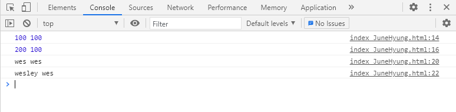
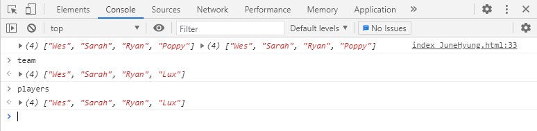
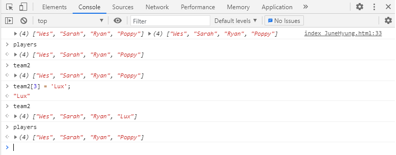
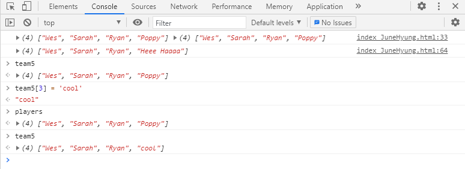
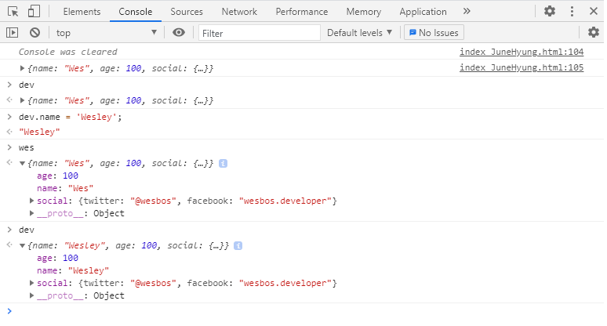
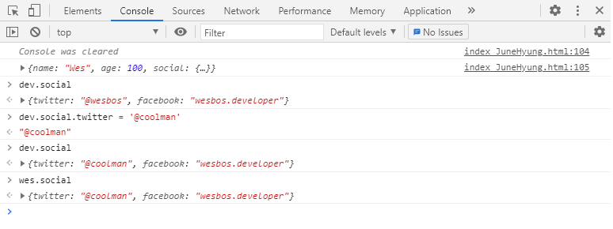
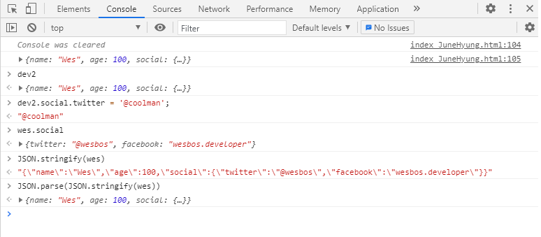

# 14. JavaScript References VS Copying

초기코드

```html
<!DOCTYPE html>
<html lang="ko">
<head>
  <meta charset="UTF-8">
  <title>JS Reference VS Copy</title>
</head>
<body>

  <script>
    // start with strings, numbers and booleans
    // 문자열, 숫자 및 부울로 시작

    // Let's say we have an array
    // 배열이 있다고 가정 해 봅시다.
    const players = ['Wes', 'Sarah', 'Ryan', 'Poppy'];

    // and we want to make a copy of it.
    // 복사본을 만들고 싶습니다.

    // You might think we can just do something like this:
    // 다음과 같이 할 수 있다고 생각할 수도 있습니다.

    // however what happens when we update that array?
    //

    // now here is the problem!
    // 이제 여기에 문제가 있습니다!

    // oh no - we have edited the original array too!
    // 아뇨-우리는 원래 배열도 편집했습니다!

    // Why? It's because that is an array reference, not an array copy. They both point to the same array!
    // 왜? 그것은 배열 복사가 아니라 배열 참조이기 때문입니다. 둘 다 동일한 배열을 가리 킵니다!

    // So, how do we fix this? We take a copy instead!
    // 그래서 어떻게 고칠까요? 대신 복사합니다!

    // one way

    // or create a new array and concat the old one in
    // 또는 새 배열을 만들고 이전 배열을

    // or use the new ES6 Spread
    // 또는 새로운 ES6 스프레드 사용

    // now when we update it, the original one isn't changed
    // 이제 업데이트 할 때 원본은 변경되지 않습니다

    // The same thing goes for objects, let's say we have a person object
    // 객체도 마찬가지입니다. 사람 객체가 있다고 가정 해 보겠습니다.

    // with Objects
    const person = {
      name: 'Wes Bos',
      age: 80
    };

    // and think we make a copy:
    // 사본을 만든다고 생각합니다.

    // how do we take a copy instead?
    // 대신 복사하는 방법은 무엇입니까?

    // We will hopefully soon see the object ...spread
    // 우리는 곧 그 object를 보게 될 것입니다 ...

    // Things to note - this is only 1 level deep - both for Arrays and Objects. lodash has a cloneDeep method, but you should think twice before using it.
    // 주목할 사항-이것은 배열과 객체 모두에 대해 1 레벨에 불과합니다. lodash에는 cloneDeep 메서드가 있지만 사용하기 전에 두 번 생각해야합니다.

  </script>

</body>
</html>

```


### 코드 분석

<strong>1. 문자열, 숫자열, 불린일 때 변수 선언 및 변경</strong>

```javascript
// start with strings, numbers and booleans
// 문자열, 숫자 및 부울로 시작

let age = 100;
let age2 = age;
console.log(age, age2);
age = 200;
console.log(age, age2);

let name = 'wes';
let name2 = name;
console.log(name, name2);
name = 'wesley';
console.log(name, name2);
```

문자열, 숫자열경우 변수에 다른값을 넣으면 변경되어 출력이됨.

<strong>결과</strong>

"


<strong>2. 배열일 때 변수 선언 및 변경</strong>

```javascript
// Let's say we have an array
// 배열이 있다고 가정 해 봅시다.
const players = ['Wes', 'Sarah', 'Ryan', 'Poppy'];

// and we want to make a copy of it.
// 복사본을 만들고 싶습니다.
const team = players;
console.log(players, team);

team[3] = 'Lux';
console.log(players, team);
```

team[3]으로 team의 배열만 바꾸고 싶었는데 결과는 players도 함꼐 바뀌게 된다.




**해결방법**

<strong>① slice()</strong>

```javascript
const team2 = players.slice();
```




<strong>② concat()</strong>

```javascript
const tema3 = [].concat(players);
```


<strong>③ spread operator[...]</strong>

```javascript
const team4 = [...players];
team4[3] = 'Heee Haaaa';
console.log(team4);
```


<strong>④ Array.from() </strong>

```javascript
const team5 = Array.from(players);
```



 위 4가지 방법으로 새로운 배열을 만들어 기존 배열의 변경 없이 따로 값을 변경할 수 있다.


<strong>3. 객체일 때 변수 선언 및 변경</strong>

```javascript
// with Objects
const person = {
    name: 'Wes Bos',
    age: 80
};

// and think we make a copy:
// 사본을 만든다고 생각합니다.
const captain = person;
captain.number = 99;
```

배열과 마찬가지로 원래의 객체 또한 변경이 된다.


<strong>① Object.assign( { }, 참조 객체, 추가할 값)</strong>

```javascript
 const capt2 = Object.assign({},person, {number: 99, age: 12});
console.log(capt2);
```


<strong>② spread </strong>

```javascript
const capt3 = {...person};
```


위 방법으로는 아래 코드에서 social안의 twitter내용을 변경할 수 없어 JSON을 아래와 같이 사용

```javascript
const wes = {
    name: 'Wes',
    age: 100,
    social:{
        twitter: '@wesbos',
        facebook: 'wesbos.developer'
    }
}
console.clear();
console.log(wes);

const dev = Object.assign({}, wes);

const dev2 = JSON.parse(JSON.stringify(wes));
```





