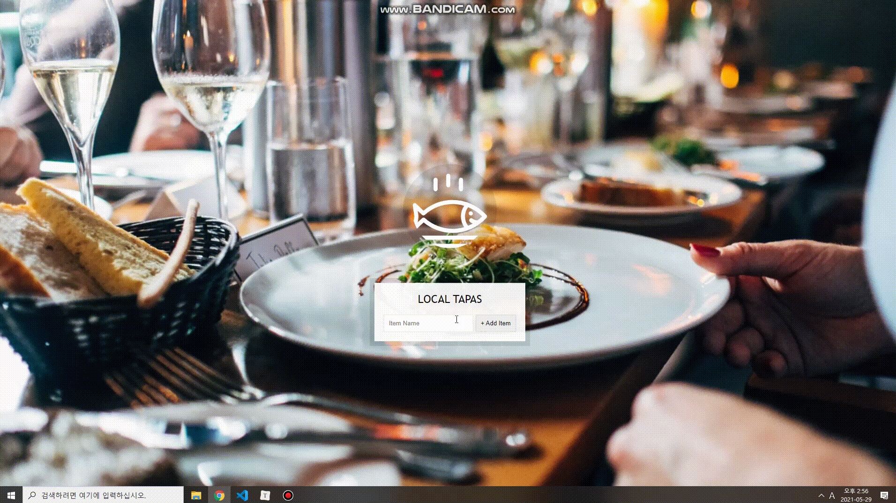
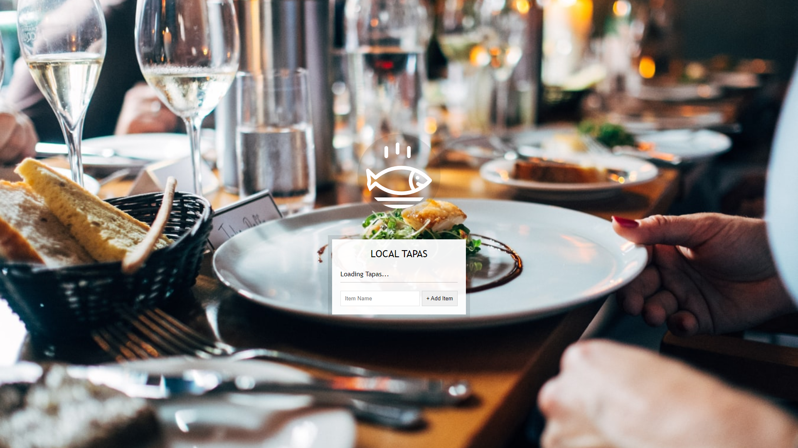
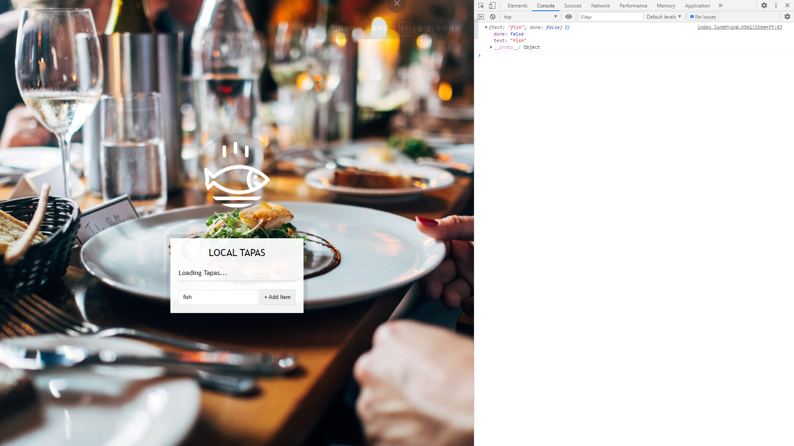
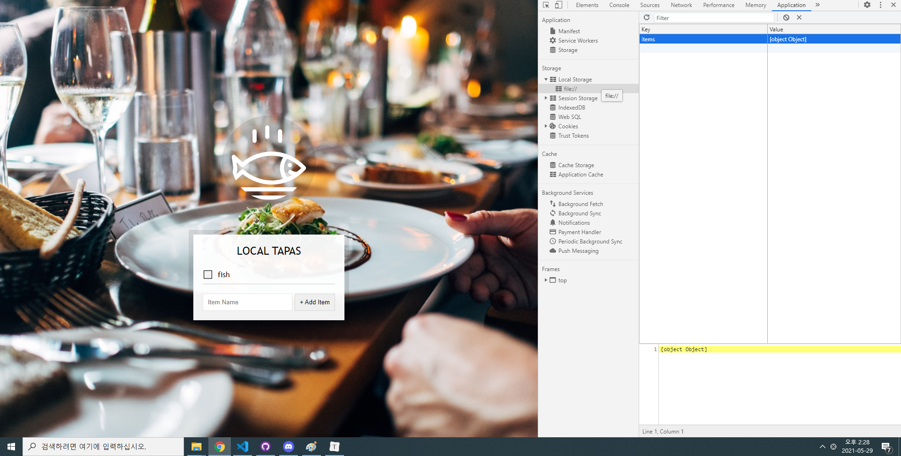
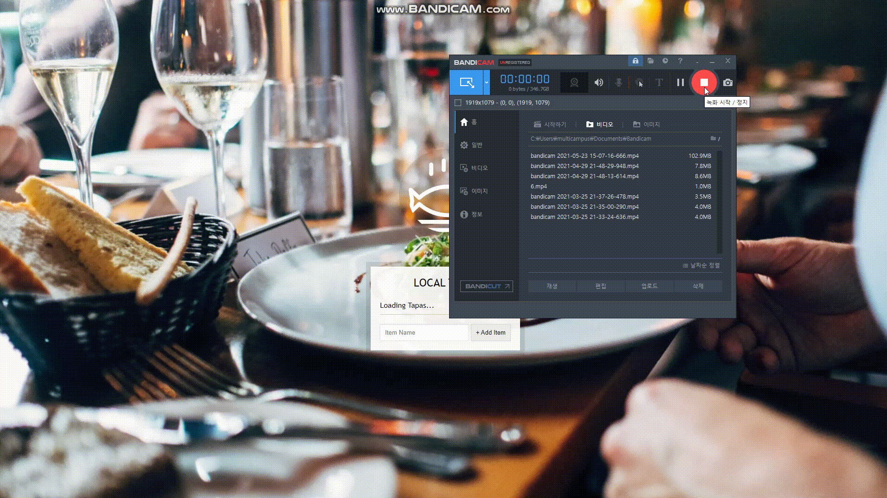

# 15. LocalStorage

리스트에 아이템을 추가하고, 로컬 스토리지에 저장하여 페이지에 출력하기


**실행화면**




**초기코드**

```html
<!DOCTYPE html>
<html lang="en">
<head>
  <meta charset="UTF-8">
  <title>LocalStorage</title>
  <link rel="stylesheet" href="style_JuneHyung.css">
</head>
<body>
  <!--
      Fish SVG Cred:
      https://thenounproject.com/search/?q=fish&i=589236
   -->

   <svg xmlns="http://www.w3.org/2000/svg" xmlns:xlink="http://www.w3.org/1999/xlink" version="1.1" x="0px" y="0px" viewBox="0 0 512 512" enable-background="new 0 0 512 512" xml:space="preserve"><g><path d="M495.9,425.3H16.1c-5.2,0-10.1,2.9-12.5,7.6c-2.4,4.7-2.1,10.3,0.9,14.6l39,56.4c2.6,3.8,7,6.1,11.6,6.1h401.7   c4.6,0,9-2.3,11.6-6.1l39-56.4c3-4.3,3.3-9.9,0.9-14.6C506,428.2,501.1,425.3,495.9,425.3z M449.4,481.8H62.6L43,453.6H469   L449.4,481.8z"/><path d="M158.3,122c7.8,0,14.1-6.3,14.1-14.1V43.4c0-7.8-6.3-14.1-14.1-14.1c-7.8,0-14.1,6.3-14.1,14.1v64.5   C144.2,115.7,150.5,122,158.3,122z"/><path d="M245.1,94.7c7.8,0,14.1-6.3,14.1-14.1V16.1c0-7.8-6.3-14.1-14.1-14.1C237.3,2,231,8.3,231,16.1v64.5   C231,88.4,237.3,94.7,245.1,94.7z"/><path d="M331.9,122c7.8,0,14.1-6.3,14.1-14.1V43.4c0-7.8-6.3-14.1-14.1-14.1s-14.1,6.3-14.1,14.1v64.5   C317.8,115.7,324.1,122,331.9,122z"/><path d="M9.6,385.2c5.3,2.8,11.8,1.9,16.2-2.2l50.6-47.7c56.7,46.5,126.6,71.9,198.3,71.9c0,0,0,0,0,0   c87.5,0,169.7-36.6,231.4-103.2c5-5.4,5-13.8,0-19.2c-61.8-66.5-144-103.2-231.4-103.2c-72,0-142.2,25.6-199,72.5l-50-47.1   c-4.4-4.1-10.9-5-16.2-2.2c-5.3,2.8-8.3,8.7-7.4,14.6l11.6,75L2.2,370.6C1.3,376.5,4.2,382.4,9.6,385.2z M380.9,230.8   c34.9,14.3,67.2,35.7,95.3,63.6c-10.1,10-20.8,19.2-31.9,27.5c-22.4-3.3-29.6-8.8-30.7-9.7c-4-5.7-11.8-7.7-18.1-4.4   c-6.9,3.6-9.5,12.2-5.9,19.1c1.9,3.5,7.3,10.3,22.4,16c-10.1,5.7-20.5,10.7-31.1,15.1C352.4,320.2,352.4,268.6,380.9,230.8z    M36.3,255.6l29.4,27.7c5.3,5,13.6,5.1,19.1,0.3c53.2-47.6,120.7-73.7,190-73.7c26.9,0,53.2,3.9,78.5,11.3   c-29.3,44.6-29.3,102,0,146.6c-25.3,7.4-51.6,11.3-78.5,11.3c-69,0-136.3-26-189.4-73.2c-2.7-2.4-13.4-6.3-19.1,0.3l-30.1,28.3   l5.7-40C42.2,293,36.3,255.6,36.3,255.6z"/><circle cx="398.8" cy="273.8" r="14.1"/></g></svg>

  <div class="wrapper">
    <h2>LOCAL TAPAS</h2>
    <p></p>
    <ul class="plates">
      <li>Loading Tapas...</li>
    </ul>
    <form class="add-items">
      <input type="text" name="item" placeholder="Item Name" required>
      <input type="submit" value="+ Add Item">
    </form>
  </div>

<script>
  const addItems = document.querySelector('.add-items');
  const itemsList = document.querySelector('.plates');
  const items = [];

</script>


</body>
</html>
```


**초기화면**




### 새로알게된것

**개발자도구 preserve log**

콘솔 창의 내용은 웹페이지가 다시 로드되거나 리프레시 되면 모두 사라지고 초기화되는데 
개발자도구의 **preserve log**를 체크해두면 페이지가 다시 로드해도 콘솔 창의 로그 내용은 그대로 유지되게 된다.

매번 페이지를 리로드 하면서 특정 조건을 달리해 로그를 비교해 볼 때 유용.

**참고 :** https://velog.io/@yeoj1n/Chrome-개발자-도구-설명서-NHN-FORWARD-2020


**e.preventDefault**

이벤트를 취소할 수 있는 경우, 이벤트의 전파를 막지않고 그 이벤트를 취소합니다.

이벤트를 취소하는 도중 preventDefault를 호출하면, 일반적으로는 브라우저의 구현에 의해 처리되는 기존의 액션이 동작하지 않게되고, 그 결과 이벤트가 발생하지 않게 됩니다.

preventDefault는 DOM을 통한 이벤트의 전파를 막지 않습니다. 전파를 막을때는 event.stopPropagation을 사용하세요.

**참고 :** https://developer.mozilla.org/ko/docs/Web/API/Event/preventDefault


**Array.prototype.map()**

map()메서드는 배열 내의 모든 요소 각각에 대해 주어진 함수를 호출한 결과를 모아 새로운 배열을 반환함.

이번 예제의 경우 li태그를 리스트에 넣는다.

**참고 :** https://developer.mozilla.org/ko/docs/Web/JavaScript/Reference/Global_Objects/Array/map


### 과정

**기본 변수**

```javascript
  const addItems = document.querySelector('.add-items');
  const itemsList = document.querySelector('.plates');
  const items = [];
```


<strong>1. 아이템을 추가하는 함수 생성</strong>

```javascript
 function addItem(e){
     e.preventDefault();
     // console.log('Hello');
     const text = (this.querySelector('[name=item]')).value;

     const item = {
         // text: text,
         text,
         done: false,
     }
     // console.log(item);
     items.push(item);
     populateList(items, itemsList);
     // localStorage.setItem('items', items);
     localStorage.setItem('items', JSON.stringify(items));
     // 후에 JSON.parse()하게되면 배열안의 객체 형태로 나옴.
     this.reset();
 }

addItems.addEventListener('submit', addItem);
```

* preventDefault()를 이용하여 이벤트를 취소할 수 있는 경우, 이벤트의 전파를 막지않고 그 이벤트를 취소함.

* text에 텍스트를 새로 입력을 해줬을때 name의 value값을 저장하고 `item` 객체에 위에서 만든 `text` 값을 담고, done속성에 false를 담는다



* localStorage에 items를 넣고, reset()시켜 text를 초기화한다.




<strong>toString과 stringify</strong>

toString을 하게되면 [object Object]로 보이지만, JSON.stringify()를 하게되면 텍스트로 들어가게 된다.

그래서 localStorage에 set할때는 JSON.stringify()로 넣고, 가져올 때 parse를 함.

items를 로컬스토리지에서 items를 가져와 parse하거나 빈배열로 둠.

```javascript
const items = JSON.parse(localStorage.getItem('items')) || [];
```


<strong>2. 추가한 아이템을 리스트로 보여주는 함수</strong>

```javascript
// input박스의 이모티콘은 css에 등록되있음.
function populateList(plates = [], platesList){
    platesList.innerHTML = plates.map((plate, i)=>{
        return `
            <li>
            	<input type="checkbox" data-index=${i} id="item${i}" ${plate.done ? 'checked' : ''}/>
            	<label for="item${i}">${plate.text}</label>
            </li>
`
    }).join('');
}
```


체크 시 마다 이모티콘을 변경함.

```css
.plates input + label:before {
    content: '⬜️';
    margin-right: 10px;
}

.plates input:checked + label:before {
    content: '🌮';
}
```





<strong>3. 체크 여부를 저장하는 함수</strong>

```javascript
function toggleDone(e){
    if(!e.target.matches('input')) return; // skip this unless it's an input;
    // console.log(e.target);
    const el = e.target;
    // console.log(el.dataset.index); // index 확인
    const index = el.dataset.index;
    items[index].done = !items[index].done;
    localStorage.setItem('items', JSON.stringify(items));
    populateList(items, itemsList);
}
```


이벤트가 발생한 input태그가 아닌겨우 그냥 넘긴다.

```javascript
if(!e.target.matches('input')) return; // skip this unless it's an input;
```


해당 타깃의 done상태를 변경하고, 다시 localStorage에 set함.

```javascript
items[index].done = !items[index].done;
localStorage.setItem('items', JSON.stringify(items));
populateList(items, itemsList);
```


로컬 스토리지에 저장 했기 때문에 새로고침에도 값이 유지가 된다.


<strong>4. 함수 실행</strong>

```javascript
addItems.addEventListener('submit', addItem);
itemsList.addEventListener('click', toggleDone);
populateList(items, itemsList);
```

