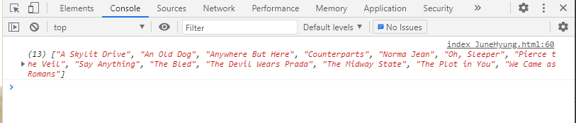
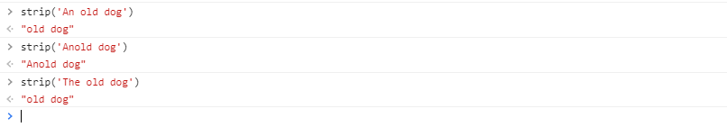
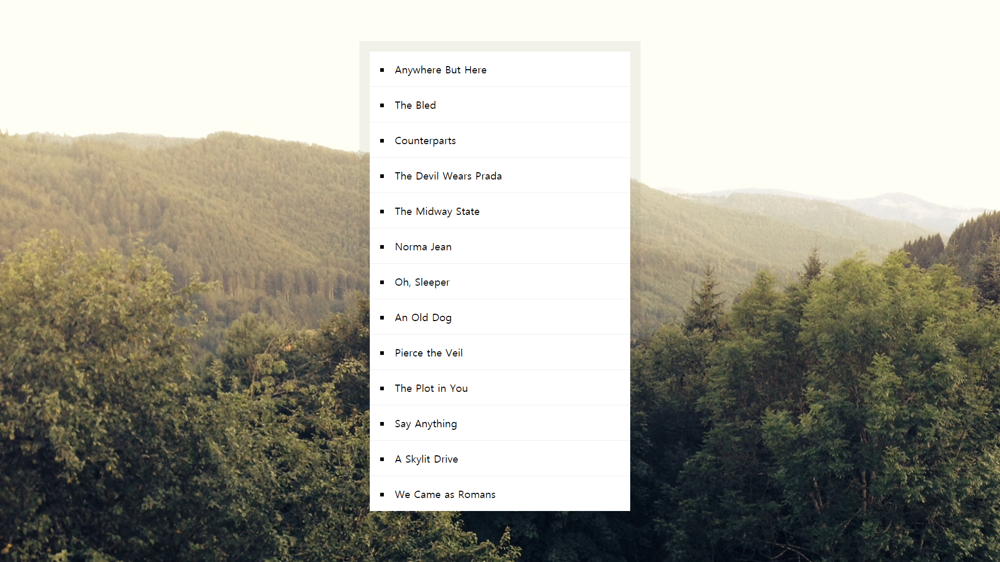

# 17. Sort Without Articles

배열의 내용에서 부사(a, the, an)을 제거 하고 알파벳 순으로 재배열.

**초기코드**

```html
<!DOCTYPE html>
<html lang="ko">
<head>
    <meta charset="UTF-8">
    <meta http-equiv="X-UA-Compatible" content="IE=edge">
    <meta name="viewport" content="width=device-width, initial-scale=1.0">
    <title>Sort Without Articles</title>
</head>
<body>
    
    <style>
        body {
        margin: 0;
        font-family: sans-serif;
        background: url("https://source.unsplash.com/nDqA4d5NL0k/2000x2000");
        background-size: cover;
        display: flex;
        align-items: center;
        min-height: 100vh;
        }

        #bands {
        list-style: inside square;
        font-size: 20px;
        background: white;
        width: 500px;
        margin: auto;
        padding: 0;
        box-shadow: 0 0 0 20px rgba(0, 0, 0, 0.05);
        }
        
        #bands li {
        border-bottom: 1px solid #efefef;
        padding: 20px;
        }
        
        #bands li:last-child {
        border-bottom: 0;
        }

        a {
        color: #ffc600;
        text-decoration: none;
        }

    </style>

    <ul id="bands"></ul>

<script>
const bands = ['The Plot in You', 'The Devil Wears Prada', 'Pierce the Veil', 'Norma Jean', 'The Bled', 'Say Anything', 'The Midway State', 'We Came as Romans', 'Counterparts', 'Oh, Sleeper', 'A Skylit Drive', 'Anywhere But Here', 'An Old Dog'];


</script>

</body>
</html>
```

**초기화면**


### 과정

<strong>1. 정렬 </strong>

```javascript
const sortedBands = bands.sort((a,b) => {
    if(strip(a) > strip(b)){
    	return 1;
    } else{
    	return -1;
    }
});
```



위 코드를 줄이기.

**① 3항연산자 사용.**

```javascript
const sortedBands = bands.sort((a,b)=>{
    return strip(a) > strip(b) ? 1 : -1;
})
```

**② ES6 Arrow function**

```javascript
const sortedBands = bands.sort((a,b) => strip(a) > strip(b) ? 1 : -1);
```


<strong> 2.  부사를 제거할 함수 생성</strong>

```javascript
function strip(bandName){
    return bandName.replace(/^(a |the |an )/i, '').trim();
}
```

a, the, an이 있으면 `''`로 변경 후 trim으로 잘라냄.




<strong>3. 문서에 매핑</strong>

```javascript
document.querySelector('#bands').innerHTML = sortedBands
    .map(band => `<li>${band}</li>`)
    .join('');
```

id가 band인 태그안에 map()안의 내용을 넣는다.



