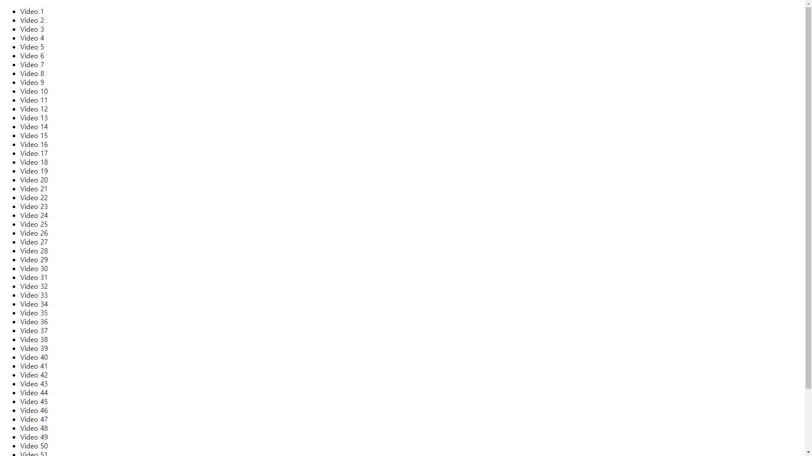
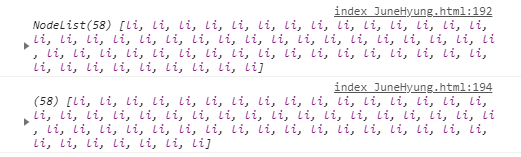

# 18. Adding Up Times with Reduce

li에 time값을 이용해 총 재생시간을 구하기.

**초기코드**

```html
<!DOCTYPE html>
<html lang="ko">
<head>
    <meta charset="UTF-8">
    <meta http-equiv="X-UA-Compatible" content="IE=edge">
    <meta name="viewport" content="width=device-width, initial-scale=1.0">
    <title>Videos</title>
</head>
<body>
    <ul class="videos">
        <li data-time="5:43">
            Video 1
        </li>
        <li data-time="2:33">
            Video 2
        </li>
        <li data-time="3:45">
            Video 3
        </li>
        <li data-time="0:47">
            Video 4
        </li>
        <li data-time="5:21">
            Video 5
        </li>
        <li data-time="6:56">
            Video 6
        </li>
        <li data-time="3:46">
            Video 7
        </li>
        <li data-time="5:25">
            Video 8
        </li>
        <li data-time="3:14">
            Video 9
        </li>
        <li data-time="3:31">
            Video 10
        </li>
        <li data-time="5:59">
            Video 11
        </li>
        <li data-time="3:07">
            Video 12
        </li>
        <li data-time="11:29">
            Video 13
        </li>
        <li data-time="8:57">
            Video 14
        </li>
        <li data-time="5:49">
            Video 15
        </li>
        <li data-time="5:52">
            Video 16
        </li>
        <li data-time="5:50">
            Video 17
        </li>
        <li data-time="9:13">
            Video 18
        </li>
        <li data-time="11:51">
            Video 19
        </li>
        <li data-time="7:58">
            Video 20
        </li>
        <li data-time="4:40">
            Video 21
        </li>
        <li data-time="4:45">
            Video 22
        </li>
        <li data-time="6:46">
            Video 23
        </li>
        <li data-time="7:24">
            Video 24
        </li>
        <li data-time="7:12">
            Video 25
        </li>
        <li data-time="5:23">
            Video 26
        </li>
        <li data-time="3:34">
            Video 27
        </li>
        <li data-time="8:22">
            Video 28
        </li>
        <li data-time="5:17">
            Video 29
        </li>
        <li data-time="3:10">
            Video 30
        </li>
        <li data-time="4:43">
            Video 31
        </li>
        <li data-time="19:43">
            Video 32
        </li>
        <li data-time="0:47">
            Video 33
        </li>
        <li data-time="0:47">
            Video 34
        </li>
        <li data-time="3:14">
            Video 35
        </li>
        <li data-time="3:59">
            Video 36
        </li>
        <li data-time="2:43">
            Video 37
        </li>
        <li data-time="4:17">
            Video 38
        </li>
        <li data-time="6:56">
            Video 39
        </li>
        <li data-time="3:05">
            Video 40
        </li>
        <li data-time="2:06">
            Video 41
        </li>
        <li data-time="1:59">
            Video 42
        </li>
        <li data-time="1:49">
            Video 43
        </li>
        <li data-time="3:36">
            Video 44
        </li>
        <li data-time="7:10">
            Video 45
        </li>
        <li data-time="3:44">
            Video 46
        </li>
        <li data-time="3:44">
            Video 47
        </li>
        <li data-time="4:36">
            Video 48
        </li>
        <li data-time="3:16">
            Video 49
        </li>
        <li data-time="1:10">
            Video 50
        </li>
        <li data-time="6:10">
            Video 51
        </li>
        <li data-time="2:14">
            Video 52
        </li>
        <li data-time="3:44">
            Video 53
        </li>
        <li data-time="5:05">
            Video 54
        </li>
        <li data-time="6:03">
            Video 55
        </li>
        <li data-time="12:39">
            Video 56
        </li>
        <li data-time="1:56">
            Video 57
        </li>
        <li data-time="4:04">
            Video 58
        </li>
    </ul>
<script>

</script>
</body>
</html>
```

**초기화면**



### 새로 알게된 것

**map()에서의 에러발생**

```javascript
const timeNodes = document.querySelectorAll('[data-time]');

const seconds = timeNodes.map(node => node.dataset.time);
```

위와 같이 실행하게 되면 

`Uncaught TypeError: timeNodes.map is not a function` Type에러가 발생.

영상에서 해결방법을 설명해주지만 발생한 이유는 외국어라 못 알아 들어서 찾아 보았다.


```javascript
// 1. 
const timeNodes = document.querySelectorAll('[data-time]');
// 2.
const timeNodes = Array.from(document.querySelectorAll('[data-time]'));
```


먼저, 에러발생하게한 구문과 해결방안을 출력해보면



1번의 경우 NodeList, 2번의 경우 Array로 나오게된다.

* 먼저, MDN에서 querySelectorAll()을 찾아보자. 
  **querySelectorAll()**은 지정된 셀렉터 그룹에 일치하는 다큐먼트의 엘리먼트 리스트를 나타내는 정적(살아 있지 않은) **NodeList를 반환**합니다

* MDN에서 map()을 찾아보면, `Array.prototype.map()`으로 나온다.
  **map()**은 **배열 내의** 모든 요소 각각에 대하여 주어진 함수를 호출한 결과를 모아 새로운 배열을 반환한다.

**즉, 배열이 아니라서 Type Error가 발생한 것이다.**


NodeList들을 배열로 바꿔주기 위해 `...`나 Array.from()을 사용해 배열로 만들어준다.

`Array.from()은 유사 배열 객체(array-like object)나반복 가능한 객체(iterable object)를 얕게 복사해 새로운 Array객체를 만듭니다.`

**참고 :**

① querySelectorAll() / ② map() / ③Array.from 

https://developer.mozilla.org/ko/docs/Web/API/Document/querySelectorAll

https://developer.mozilla.org/ko/docs/Web/JavaScript/Reference/Global_Objects/Array/map

https://developer.mozilla.org/ko/docs/Web/JavaScript/Reference/Global_Objects/Array/from 


### 과정

<strong>1. map()</strong>

먼저 tiemNode에 [data-time]을 가진 태그들을 배열로 담아준다.

```javascript
const timeNodes = document.querySelectorAll('[data-time]');

const seconds = timeNodes.map(node => node.dataset.time);
```

위와 같이 코드를 실행하게되면 

`Uncaught TypeError: timeNodes.map is not a function` Type에러가 발생.

**해결 방안**

```javascript
const timeNodes = Array.from(document.querySelectorAll('[data-time]'));
```

또는

```javascript
const timeNodes = [...(document.querySelectorAll('[data-time]'))];
```


<strong>2. 동영상들의 총 재생시간을 초단위로 구함.</strong>

```javascript
const seconds = timeNodes
    .map(node => node.dataset.time)
    .map(timeCode => {
    const [mins, secs] = timeCode.split(':').map(parseFloat);
    return (mins*60) + secs;
    // console.log(mins, secs);
	})
    .reduce((total, vidSeconds) => total + vidSeconds);
```

seconds에 배열의 값들의 재생시간을 담고,
재생시간을 :를 기준으로 분, 초로 나눈 후 초단위로 뽑아내 정수로 출력함.

[ex]
4:28의 경우 split(':')을 통해 4와 28이 나눠지게 되고,  4가 분이되니까 *60을 한 후 뒤의 28과 더해 총 초단위를 구한다.

그 후 total에 모든 동영상의 재생시간을 합한 값을 출력함.

**[복습]**
reduce가 누적해서 계산을 해주는데, 1,2,3,4,5를 reduce한다고하면, 0+1 => 1+2 => 3+ 3 ... 이런식으로 누적 계산을함.


<strong>3. 총 재생시간을 시, 분, 초로 나누기.</strong>

```javascript
let secondsLeft = seconds;
const hours = Math.floor(secondsLeft / 3600);
secondsLeft = secondsLeft % 3600;

const mins = Math.floor(secondsLeft / 60);
secondsLeft = secondsLeft % 60;

console.log(hours, mins, secondsLeft);
```

secondsLeft는 나누고 난 후 초를 저장할 변수인데, 처음에는 전체 총합인 seconds로 초기화함.

```javascript
const hours = Math.floor(secondsLeft / 3600);
secondsLeft = secondsLeft % 3600;
```

1시간은 60분이니까 60*60해서 3600초.
hours에는 전체(secondsLeft)에 3600을 나눈 몫을 저장하고, secondsLeft에 나머지를 저장함.


```javascript
const mins = Math.floor(secondsLeft / 60);
secondsLeft = secondsLeft % 60;
```

1분은 60초.

mins에 60으로 나눈 몫을 저장하고, secondsLeft에 나머지를 저장.

그러면 secondsLeft는 시간과 분으로나눈 나머지만 저장이 되고,
전체 재생시간의 시간, 분 초를 구하게 됨.


