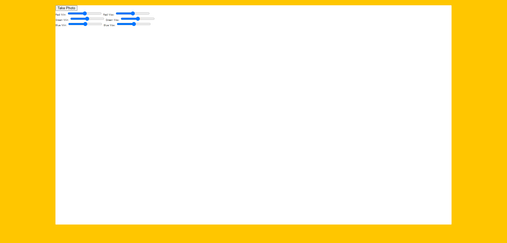
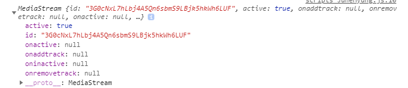
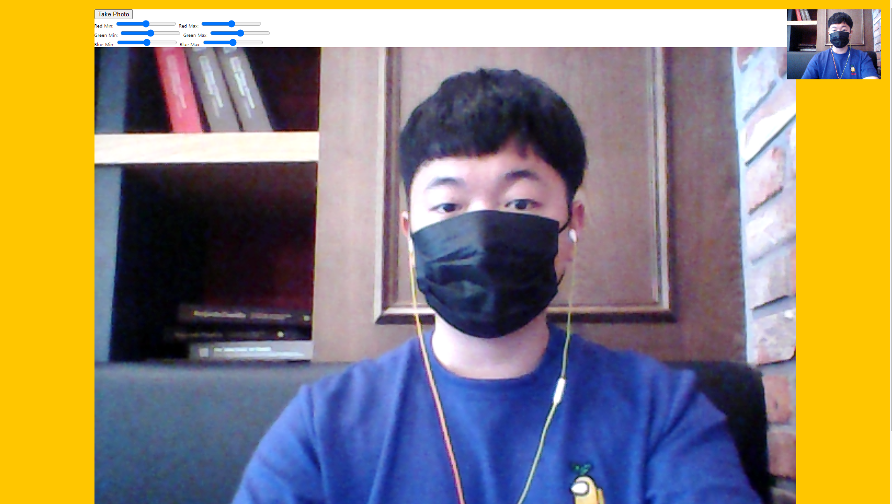
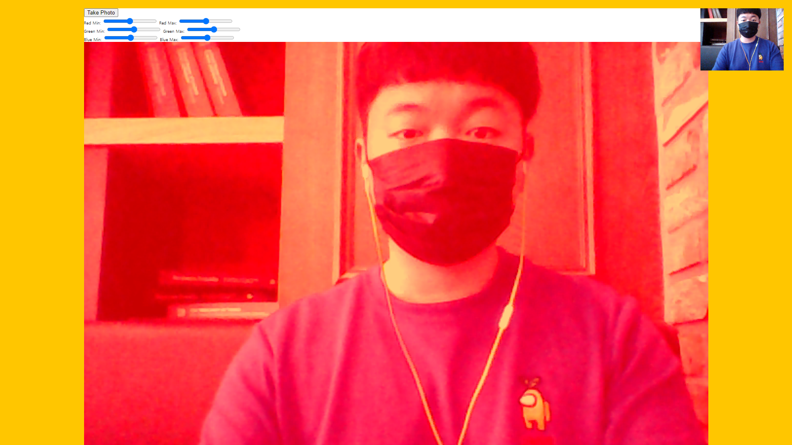
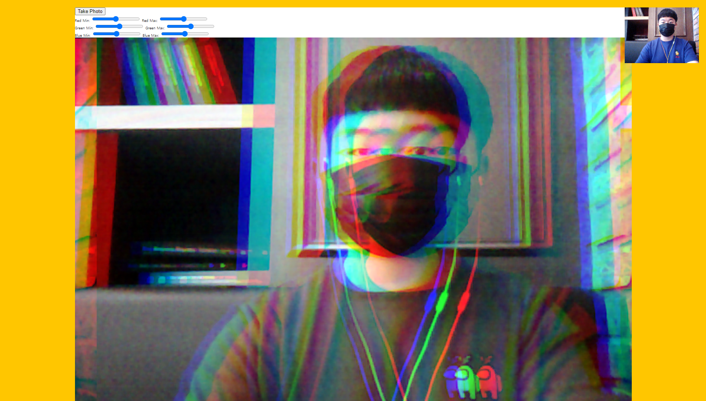

# 19. Unreal Webcam Fun

HTML Javascript를 이용해서 웹캠을 사용하고, 다양한 효과 적용해보기.

 


**초기코드**

```html
<!DOCTYPE html>
<html lang="ko">
<head>
  <meta charset="UTF-8">
  <title>Get User Media Code Along!</title>
  <link rel="stylesheet" href="style.css">
</head>
<body>

  <div class="photobooth">
    <div class="controls">
      <button onClick="takePhoto()">Take Photo</button>
		<div class="rgb">
        <label for="rmin">Red Min:</label>
        <input type="range" min=0 max=255 name="rmin">
        <label for="rmax">Red Max:</label>
        <input type="range" min=0 max=255 name="rmax">

        <br>

        <label for="gmin">Green Min:</label>
        <input type="range" min=0 max=255 name="gmin">
        <label for="gmax">Green Max:</label>
        <input type="range" min=0 max=255 name="gmax">

        <br>

        <label for="bmin">Blue Min:</label>
        <input type="range" min=0 max=255 name="bmin">
        <label for="bmax">Blue Max:</label>
        <input type="range" min=0 max=255 name="bmax">
      </div>
    </div>

    <canvas class="photo"></canvas>
    <video class="player"></video>
    <div class="strip"></div>
  </div>

  <audio class="snap" src="./snap.mp3" hidden></audio>

  <script src="scripts.js"></script>

</body>
</html>
```

```javascript
const video = document.querySelector('.player');
const canvas = document.querySelector('.photo');
const ctx = canvas.getContext('2d');
const strip = document.querySelector('.strip');
const snap = document.querySelector('.snap');
```


**초기 화면**



### 새로 알게 된 것

<strong>window.URL.createObjectURL 비추천</strong>

영상대로 따라 실행 했다가 계속 에러가 발생해 FINISHED 스크립트를 보니 **chrome과 fireFox**에서 비추천한다고 적혀있엇다.

MDN의 createObjectURL을 들어가 보니 미디어 스트림에 개체URL 사용 부분에서 

미디어 소스 사양의 이전 버전에서는 `<video>`요소에 스트림을 첨부 하려면 `MediaStream`요소에 스트림을 첨부 하려면 `MediaStream`요소에 스트림을 첨부 하려면 `MediaStream`요소에 스트림을 첨부 하려면 `MediaStream`. 이것은 더 이상 필요하지 않으며 브라우저는이를위한 지원을 제거하고 있습니다.

```
Important: If you still have code that relies on createObjectURL() to attach streams to media elements, you need to update your code to set srcObject to the MediaStream directly.
```

라고 적힌 것을 확인할 수 있다.

```javascript
video.srcObject = localMediaStream;
```

로 변경하면 동작하게 된다.

참고 : 

https://developer.mozilla.	org/en-US/docs/Web/API/URL/createObjectURL

https://developer.mozilla.org/en-US/docs/Web/API/HTMLMediaElement/srcObject


<strong>favicon.ico 404 Error</strong>

takePhoto()부분을 따라하다 보면 아레 발생하게 된다.

`GET http://localhost:3000/favicon.ico 404 (Not Found) error`

favicon.ico는 브라우저 탭부분에서 타이틀 맨 왼쪽에 아이콘을 말한다.

아이콘이 없거나 경로가 맞지않아 발생하는 오류라고 한다.


해결방법 : 

html head태그에서 link를 추가해줌.

```html
<html> 
    <head> 
        <link rel="shortcut icon" href="#"> 
    </head> 
</html>
```

참고 : 

https://cheonfamily.tistory.com/7 [천리길도 한 걸음부터]


<strong>download속성</strong>

다운로드 연결 시 download attribute 사용.
브라우저에서 열지 안혹 다운로드할 리소스에 연결하는 경우 다운로드 속성을 사용하여 기본 저장 파일 이름을 제공할 수 있다.

[EX] Firefox 39의 Windows 버전에 대한 다운로드 링크가 있는 예

```html
<a href="https://download.mozilla.org/?product=firefox-39.0-SSL&os=win&lang=en-US"
   download="firefox-39-installer.exe">
  Download Firefox 39 for Windows
</a>
```


참고 : 

https://developer.mozilla.org/ko/docs/Learn/HTML/Introduction_to_HTML/Creating_hyperlinks


### 과정

<strong>0. 변수 설정 (초기코드)</strong>

```javascript
const video = document.querySelector('.player');
const canvas = document.querySelector('.photo');
const ctx = canvas.getContext('2d');
const strip = document.querySelector('.strip');
const snap = document.querySelector('.snap');
```

video : 우측상단에 그려질 video영역

canvas : 화면 아래에 video영역을 복사해 출력할 부분.

ctx : canvas를 가져올 부분.

strip : 캡쳐 후 사진 부분이 나타날 영역

snap : 사진 찍을 때 찰칵 소리나게 재생.

<strong>1. NPM 설치 및 시작.</strong>

```bash
npm install
npm start
```

시작은 index.html이 시작됨.


<strong>2. getVideo()</strong>

```javascript
function getVideo() {
    navigator.mediaDevices.getUserMedia({ video: true, audio: false })
        .then(localMediaStream => {
            console.log(localMediaStream);
            // 크롬,firefox에서 비추천
            // video.src = window.URL.createObjectURL(localMediaStream);
            video.srcObject = localMediaStream;
            video.play();
        }).catch(error => console.error(`OH NO!!! ` ,error));
}
```

getVideo함수에 실시간으로 웹캠의 하면이 나올 수 있도록 내용을 작성.
에러 발생 시 OH NO!!와 에러메세지가 콘솔에 찍힘.

getMedia시 콘솔 출력결과.




<strong>3. paintToCanvas() </strong>

```javascript
function paintToCanvas() {
    const width = video.videoWidth;
    const height = video.videoHeight;
    // console.log(width, height);
    canvas.width = width;
    canvas.height = height;

    return setInterval(() => {
        ctx.drawImage(video, 0, 0, width, height)
        // take the pixels out
        let pixels = ctx.getImageData(0, 0, width, height);

        // mess with them - 효과 부분.
        // pixels = redEffect(pixels);
        // pixels = rgbSplit(pixels);
        // ctx.globalAlpha = 0.1;
        // pixels = greenScreen(pixels);

        // console.log(pixels);
        // put them bakc
        ctx.putImageData(pixels, 0, 0);
    }, 16);
}
```

캔버스의 영역을 지정하고, video를 그린다.




<strong>4. takePhoto()</strong>

사진을 찍는 메서드

```javascript
function takePhoto() {
    // played the sound
    snap.currentTime = 0;
    snap.play();

    // take the date out of the canvas
    const data = canvas.toDataURL('image/jpeg');
    const link = document.createElement('a');
    link.href = data;
    link.setAttribute('download', 'handsome');
    // link.textContent = 'Download Image';
    link.innerHTML = ``;
    strip.insertBefore(link, strip.firstChild);
    console.log(data);
}
```

snap을 재생시키기 때문에 이 메서드 실행 시 사진소리가 재생된다.

download속성을 추가하여 캡쳐 시 이미지를 저장함.


생성된 링크 이미지들을 아래 strip영역에 추가한다.


<strong>5. 다양한 효과들 </strong>

* <strong>redEffect()</strong>

```javascript
function redEffect(pixels) {
    for (let i = 0; i < pixels.data.length; i += 4) {
        pixels.data[i + 0] = pixels.data[i + 0] + 200; // RED
        pixels.data[i + 1] = pixels.data[i + 1] - 50; // GREEN
        pixels.data[i + 2] = pixels.data[i + 2] * 0.5; // BLUE
    }
    return pixels;
}
```

pixels의 data에 red부분의 값을 붉게 만들어 붉은 스크린이 나타나게 만듬.




* <strong>rgbSplit()</strong>

색상별로 나눠져서 보이게 함.

```javascript
function rgbSplit(pixels) {
    for (let i = 0; i < pixels.data.length; i += 4) {
        pixels.data[i - 150] = pixels.data[i + 0]; // RED
        pixels.data[i + 100] = pixels.data[i + 1]; // GREEN
        pixels.data[i + 150] = pixels.data[i + 2]; // BLUE
    }
    return pixels;
}
```




* <strong>greenScreen()</strong>

```javascript
function greenScreen(pixels) {
    const levels = {};

    document.querySelectorAll('.rgb input').forEach((input) => {
        levels[input.name] = input.value;
    });

    // console.log(levels);

    for (i = 0; i < pixels.data.length; i = i + 4) {
        red = pixels.data[i + 0];
        green = pixels.data[i + 1];
        blue = pixels.data[i + 2];
        alpha = pixels.data[i + 3];
    
        if (red >= levels.rmin
        && green >= levels.gmin
        && blue >= levels.bmin
        && red <= levels.rmax
        && green <= levels.gmax
        && blue <= levels.bmax) {
        // take it out!
        pixels.data[i + 3] = 0;
        }
    }
    
    return pixels;
}
```

rgb 값의 제한을 둠.


* <strong>globalAlpha</strong>

context에 globalAlpha값을 주어 잔상효과가 나타나게됨.

```javascript
return setInterval(() => {
        ctx.drawImage(video, 0, 0, width, height)
        // take the pixels out
        let pixels = ctx.getImageData(0, 0, width, height);

        // mess with them
        // pixels = redEffect(pixels);
        // pixels = rgbSplit(pixels);
        ctx.globalAlpha = 0.1;
        pixels = greenScreen(pixels);

        // console.log(pixels);
        // put them bakc
        ctx.putImageData(pixels, 0, 0);
    }, 16);
```


* <strong>효과적용</strong>

paintToCanvas()에서 setInterval부분에서 캔버스를 계속그리는데
이 때 pixels에 효과를 지정해준다.

```javascript
return setInterval(() => {
        ctx.drawImage(video, 0, 0, width, height)
        // take the pixels out
        let pixels = ctx.getImageData(0, 0, width, height);

        // mess with them
        // pixels = redEffect(pixels);
        // pixels = rgbSplit(pixels);
        // ctx.globalAlpha = 0.1;
        pixels = greenScreen(pixels);

        // console.log(pixels);
        // put them bakc
        ctx.putImageData(pixels, 0, 0);
    }, 16);
```


<strong>6.이벤트 실행. </strong>

```javascript
getVideo();

video.addEventListener('canplay', paintToCanvas);
```


