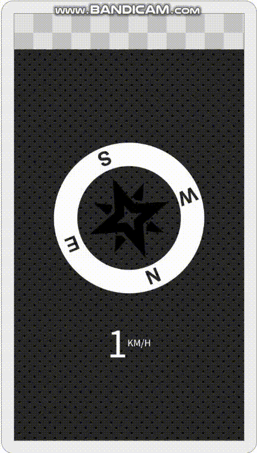
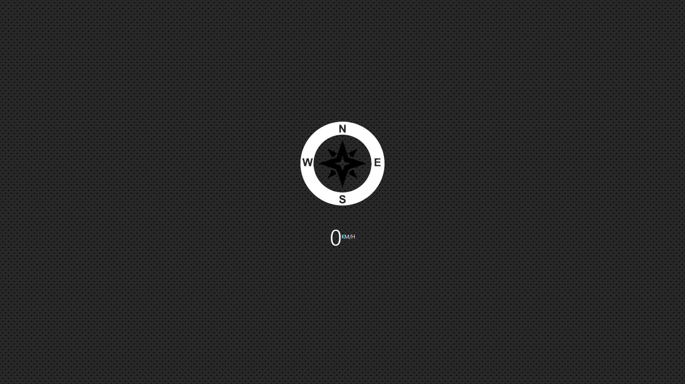
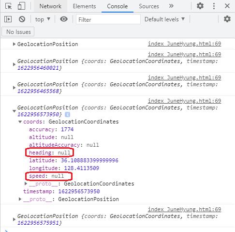

# 21. GeoLocation



<strong>초기 코드</strong>

```javascript
<!DOCTYPE html>
<html lang="ko">
<head>
    <meta charset="UTF-8">
    <meta http-equiv="X-UA-Compatible" content="IE=edge">
    <meta name="viewport" content="width=device-width, initial-scale=1.0">
    <title>Document</title>
</head>
<body>
    <svg class="arrow" xmlns="http://www.w3.org/2000/svg" xmlns:xlink="http://www.w3.org/1999/xlink" version="1.1" x="0px" y="0px" viewBox="0 0 64 64" enable-background="new 0 0 64 64" xml:space="preserve"><g><path fill="#ffffff" d="M32,1.824C15.361,1.824,1.825,15.361,1.825,32c0,16.639,13.537,30.176,30.175,30.176   S62.175,48.639,62.175,32C62.175,15.361,48.639,1.824,32,1.824z M29.715,3.988h1.12l2.333,3.807V3.988h1.069v5.701h-1.155  ~ 중략 ~"/></g></g></svg>


    <h1 class="speed">
        <span class="speed-value">0</span>
        <span class="units">KM/H</span>
    </h1>
    <style>
        html {
        font-size: 100px;
        }
        
        body {
        margin: 0;
        font-family: sans-serif;
        min-height: 100vh;
        display: flex;
        justify-content: center;
        align-items: center;
        flex-direction: column;
        background:
            radial-gradient(black 15%, transparent 16%) 0 0,
            radial-gradient(black 15%, transparent 16%) 8px 8px,
            radial-gradient(rgba(255,255,255,.1) 15%, transparent 20%) 0 1px,
            radial-gradient(rgba(255,255,255,.1) 15%, transparent 20%) 8px 9px;
        background-color: #282828;
        background-size: 16px 16px;
        background-attachment: fixed;
        }

        .arrow {
        width: 250px;
        overflow: hidden;
        transition: all 0.2s;
        transform: rotate(0deg);
        display: inline-block;
        }

        h1 {
        color: white;
        font-weight: 100;
        font-size: 60px;
        display: flex;
        align-items: center;
        }

        .units {
        font-size: 15px;
        }
        /*Compass: https://thenounproject.com/search/?q=compass&i=592352*/
    </style>
</body>
</html>
```


<strong>초기 화면</strong>




### 새로 알게 된 것

**GeoLocation API**

사용자가 원할 경우 웹 애플리케이션에 위치 정보를 제공할 수 있는 API


**watchPosition()**

장치의 위치가 바뀔 때 마다 자동으로 호출할 함수를 등록할 때 사용.
선택적으로 오류 발생 시 사용할 함수도 지정 가능

```javascript
navigator.geolocation.watchPosition(success[, error[, options]])
```


**GeolocationCoordinates에서 얻을 수 있는 정보**

* `latitude` : 위도
* `longitude` : 경도
* `altitude` : 고도
* `accuracy` : 위도, 경도 정확도
* `altitudeAccuracy` : 고도 정확도
* `heading` : 이동 방향
* `speed` : 장치 속도


**참고 :**

* https://developer.mozilla.org/ko/docs/Web/API/Geolocation_API
* https://developer.mozilla.org/ko/docs/Web/API/Geolocation/watchPosition
* https://developer.mozilla.org/en-US/docs/Web/API/GeolocationCoordinates


### 과정

<strong>0. 실행환경 세팅</strong>

**npm install**하여 npm start를 함.

이 때 강의에서는 mac환경에서 simulator를 이용하지만, window환경이기 때문에 휴대폰으로 실행.

확장프로그램이나 window 시뮬레이터 같은게 있나 찾아보다가 휴대폰에서 실행 하였다하여,  휴대폰으로 실행.

콘솔창 확인을 위해 아래 링크를 통해 휴대폰에서 실행한 것을 브라우저에서 확인함.

https://backstreet-programmer.tistory.com/30

휴대폰 접속 시 external 링크로 접속!


<strong> 1.  변수 선언</strong>

```javascript
const arrow = document.querySelector('.arrow');
const speed = document.querySelector('.speed-value');
```

arrow와 speed에 요소들을 선택.


<strong>2. 현재 위치, 속도 값 얻는 함수 생성 및 출력.</strong>

```javascript
navigator.geolocation.watchPosition((data)=>{
    console.log(data);
    speed.textContent = Math.round(data.coords.speed*100);
    arrow.style.transform = `rotate(${data.coords.heading}deg)`;
}, (err)=>{
    console.err(err); 
    alert('Hey! YOU GOTTA ALLOW THAT TO HAPPEN!!!');
});
```


**watchPosition()**

콘솔에 넘어오는 데이터를 찍어보면, 



이 사진의 heading과 speed부분이 속도와 방향이 된다.
(처음엔 그냥 시뮬레이터 방법을 찾다가 인터넷으로 켜서 어떤 데이터가 넘어오는지만 확인해서 null이 출력됨.)


data의 coords안에 정보들이 담겨 있다.
강의에서는 값이 잘나오지만, 내 폰으로 실행 했을 때 0.xxxxxx값이 나와 *100을 하여 일단 값이 표시되는 지 확인.

백틱(``)을 이용하여 넘어 온 값들을 이용해 속도를 출력하고, heading만큼 rotate를 이용해 돌린다.

