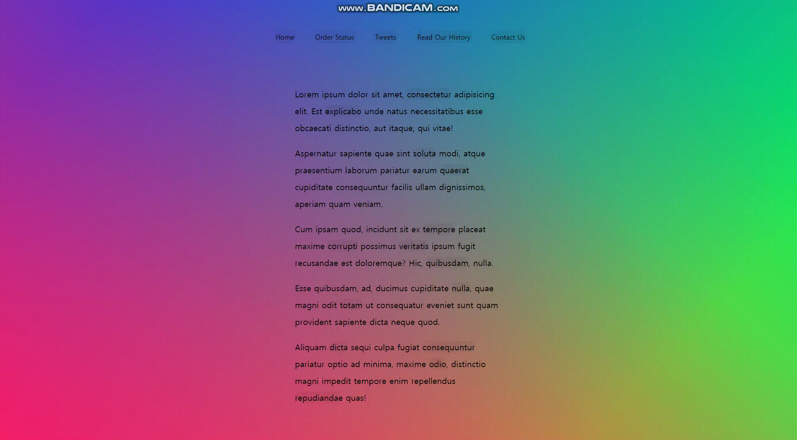
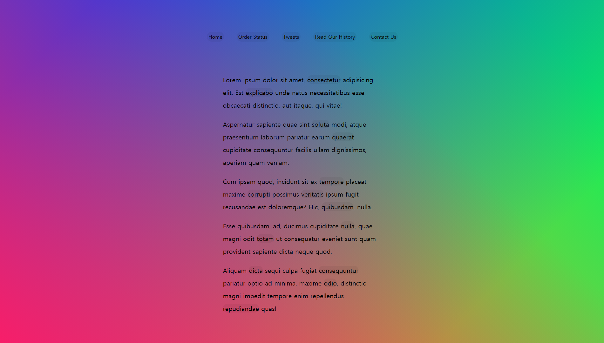
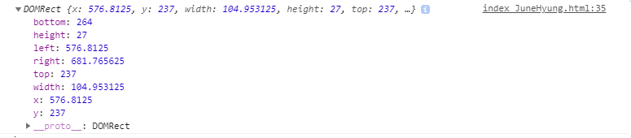

# 22. Follow Along Link Highlighter

표시 되있는 링크에 마우스를 올리면 효과를 주는 방법.



**초기화면**

```html
<!DOCTYPE html>
<html lang="ko">
<head>
    <meta charset="UTF-8">
    <meta http-equiv="X-UA-Compatible" content="IE=edge">
    <meta name="viewport" content="width=device-width, initial-scale=1.0">
    <title>👀👀👀Follow Along Nav</title>
    <link rel="stylesheet" href="style_JuneHyung.css">
</head>
<body>
    <nav>
        <ul class="menu">
            <li><a href="">Home</a></li>
            <li><a href="">Order Status</a></li>
            <li><a href="">Tweets</a></li>
            <li><a href="">Read Our History</a></li>
            <li><a href="">Contact Us</a></li>
        </ul>
    </nav>
    <div class="wrapper">
        <p>Lorem ipsum dolor sit amet, <a href="">consectetur</a> adipisicing elit. Est <a href="">explicabo</a> unde natus necessitatibus esse obcaecati distinctio, aut itaque, qui vitae!</p>
        <p>Aspernatur sapiente quae sint <a href="">soluta</a> modi, atque praesentium laborum pariatur earum <a href="">quaerat</a> cupiditate consequuntur facilis ullam dignissimos, aperiam quam veniam.</p>
        <p>Cum ipsam quod, incidunt sit ex <a href="">tempore</a> placeat maxime <a href="">corrupti</a> possimus <a href="">veritatis</a> ipsum fugit recusandae est doloremque? Hic, <a href="">quibusdam</a>, nulla.</p>
        <p>Esse quibusdam, ad, ducimus cupiditate <a href="">nulla</a>, quae magni odit <a href="">totam</a> ut consequatur eveniet sunt quam provident sapiente dicta neque quod.</p>
        <p>Aliquam <a href="">dicta</a> sequi culpa fugiat <a href="">consequuntur</a> pariatur optio ad minima, maxime <a href="">odio</a>, distinctio magni impedit tempore enim repellendus <a href="">repudiandae</a> quas!</p>
    </div>

    <script>
      // 👀👀👀👀👀👀👀👀👀👀👀👀👀👀👀
    </script>
</body>
</html>
```


**초기코드**




### 새로 알게 된 것

**getBoundingClientRect()**

요소의 크기와 뷰포트에 대한 위치에 대한 정보를 제공하는 DOMRect 개체를 반환합니다.

**참고 :**

 https://developer.mozilla.org/en-US/docs/Web/API/Element/getBoundingClientRect


### 과정

<strong>1. 상수 생성</strong>

```javascript
const triggers = document.querySelectorAll('a');
const highlight = document.createElement('span');
highlight.classList.add('highlight');
document.body.append(highlight);
```

a태그와 span태그를 만들어 highlight클래스를 추가함.


<strong>2. 효과적용 함수</strong>

```javascript
function highlightLink(){
    // console.log(this);
    const linkCoords = this.getBoundingClientRect();
    console.log(linkCoords);

    const coords = {
        width: linkCoords.width,
        height: linkCoords.height,
        top: linkCoords.top + window.scrollY,
        left: linkCoords.left + window.scrollX
    };

    highlight.style.width = `${coords.width}px`;
    highlight.style.height = `${coords.height}px`;
    highlight.style.transform = `translate(${coords.left}px, ${coords.top}px)`;

}
```

linkCoords를 console로 찍으면 아래 사진처럼 나온다.




highlight의 width와 height를 linkCoords의 width, height로 지정하고, top,left를 설정하면 scroll Down시 이상현상이 발생한다.

이상현상 해결을 위해 스크롤 시 top과 left에 scrollY, X값을 더해 위치를 수정함.