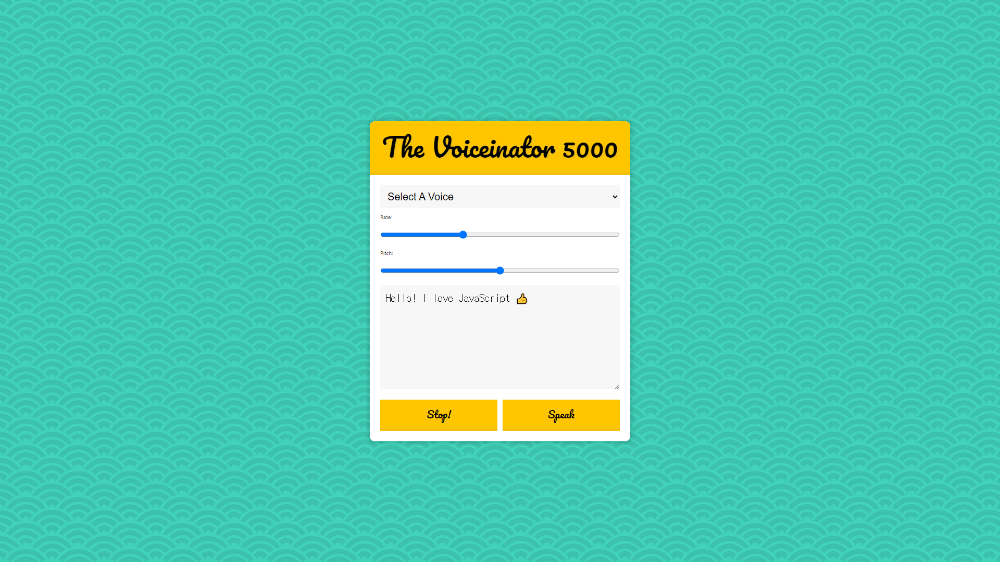
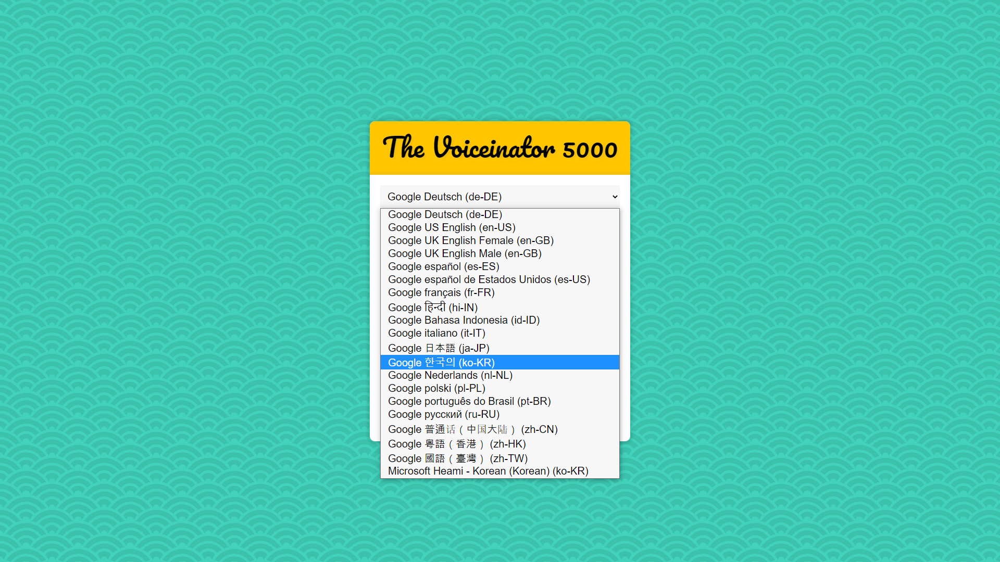

# 23.Speech Synthesis

자바스크립트로 글을 읽어주는 도구 구현

<strong>초기코드</strong>

```html
<!DOCTYPE html>
<html lang="ko">
<head>
    <meta charset="UTF-8">
    <meta http-equiv="X-UA-Compatible" content="IE=edge">
    <meta name="viewport" content="width=device-width, initial-scale=1.0">
    <title>Speech Synthesis</title>
    <link href='https://fonts.googleapis.com/css?family=Pacifico' rel='stylesheet' type='text/css'>
    <link rel="stylesheet" href="style_JuneHyung.css">
</head>
<body>
    <div class="voiceinator">

    <h1>The Voiceinator 5000</h1>

    <select name="voice" id="voices">
        <option value="">Select A Voice</option>
    </select>

    <label for="rate">Rate:</label>
    <input name="rate" type="range" min="0" max="3" value="1" step="0.1">

    <label for="pitch">Pitch:</label>

    <input name="pitch" type="range" min="0" max="2" step="0.1">
    <textarea name="text">Hello! I love JavaScript 👍</textarea>
    <button id="stop">Stop!</button>
    <button id="speak">Speak</button>

    </div>

<script>
  const msg = new SpeechSynthesisUtterance();
  let voices = [];
  const voicesDropdown = document.querySelector('[name="voice"]');
  const options = document.querySelectorAll('[type="range"], [name="text"]');
  const speakButton = document.querySelector('#speak');
  const stopButton = document.querySelector('#stop');
</script>

</body>
</html>
```


<strong>초기화면</strong>




### 새로 알게 된 것

**SpeechSynthesisUtterance**

Web Speech API의 SpeechSynthesis Utterance 인터페이스는 음성 요청을 나타냅니다. 
여기에는 음성 서비스가 읽어야 할 내용과 읽는 방법에 대한 정보(예: 언어, 음조 및 볼륨)가 포함되어 있습니다.

* **속성**

SpeechSynthesisUtterance**.lan**g : 말하는 언어를 가져오고 설정.

SpeechSynthesisUtterance**.pitch**

SpeechSynthesisUtterance**.rate** : 말하는 속도

SpeechSynthesisUtterance**.text** : 말할 때 텍스트

SpeechSynthesisUtterance**.voice** : 말할 때 목소리

SpeechSynthesisUtterance**.volume** : 말할 볼륨을 가져옴.


### 과정

<strong>0. 사용할 변수 선언</strong>

```javascript
const msg = new SpeechSynthesisUtterance();
let voices = [];
const voicesDropdown = document.querySelector('[name="voice"]');
const options = document.querySelectorAll('[type="range"], [name="text"]');
const speakButton = document.querySelector('#speak');
const stopButton = document.querySelector('#stop');
```


<strong>1. 목소리 리스트 출력</strong>

```javascript
msg.text = document.querySelector('[name="text"]').value;

function populateVoices(){
    voices = this.getVoices();
    // console.log(voices);

    voicesDropdown.innerHTML = voices
        .filter(voice => voice.lang.includes('ko'))
        .map(voice => `<option value="${voice.name}">${voice.name} (${voice.lang})				</option>`)
        .join('');
}
```

voices에 사용 가능한 목소리 목록을 담고, filter로 ko인 목소리만 걸러 출려한다.




<strong>2. 재생 및 정지</strong>

```javascript
// 선택한 voice로 speak함.
function setVoices(){
    // console.log('Changing voice');
    msg.voice = voices.find(voice => voice.name === this.value);
    toggle();
}
    
// 말하는중에 언어변경 시 말을 끊고 새 목소리로 다시 재생 
function toggle(startOver = true){
    speechSynthesis.cancel();
    if(startOver){
        speechSynthesis.speak(msg);
    }
}
```

메세지의 목소리를 선택해서 이름에 따라서 선택할 수 있게 함.

선택 후 toggle()을 통해 재생.

toggle로 메세지를 재생 혹은 정지 시킴.


<strong>3. 옵션설정</strong>

```javascript
function setOption(){
    console.log(this.name, this.value);
    msg[this.name] = this.value;
    toggle();
}
```

 레이더로 변화된 값을 세팅하고, 목소리를 재생시킴.


<strong>4. 메서드적용 </strong>

```javascript
speechSynthesis.addEventListener('voiceschanged', populateVoices);
voicesDropdown.addEventListener('change', setVoices);
options.forEach(option => option.addEventListener('change', setOption));

speakButton.addEventListener('click', toggle);
stopButton.addEventListener('click', ()=> toggle(false));
```


