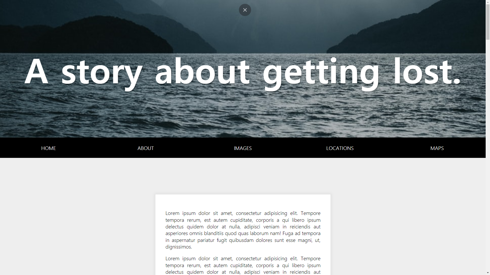
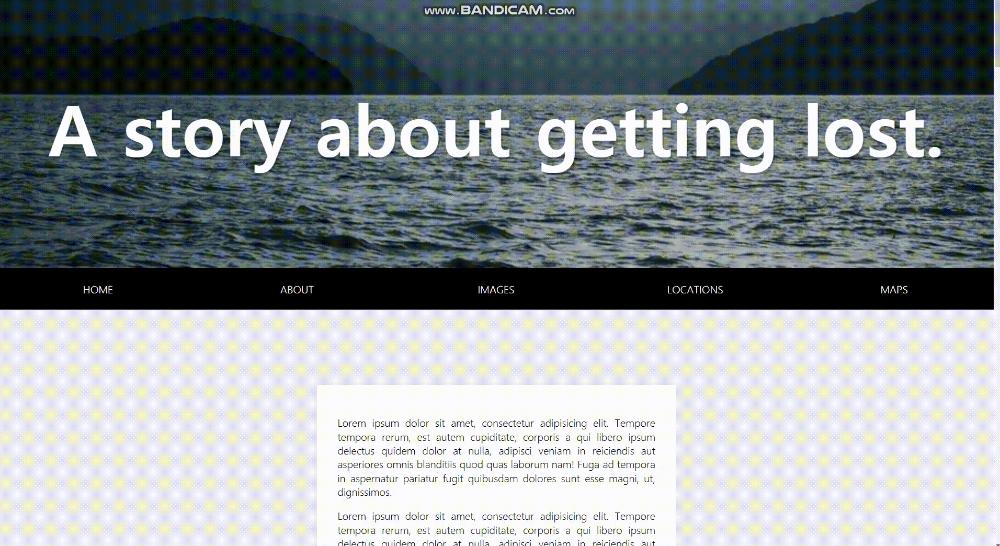

# 24. Sticky Nav

스크롤 되면 고정되는 메뉴.


<strong>초기 코드</strong>

```javascript
<!DOCTYPE html>
<html lang="ko">
<head>
    <meta charset="UTF-8">
    <meta http-equiv="X-UA-Compatible" content="IE=edge">
    <meta name="viewport" content="width=device-width, initial-scale=1.0">
    <title>Sticky Nav</title>
    <link rel="stylesheet" href="style_JuneHyung.css">
</head>
<body>
    <header>
        <h1>A story about getting lost.</h1>
    </header>

    <nav id="main">
        <ul>
            <li class="logo"><a href="#">LOST</a></li>
            <li><a href="#">Home</a></li>
            <li><a href="#">About</a></li>
            <li><a href="#">Images</a></li>
            <li><a href="#">Locations</a></li>
            <li><a href="#">Maps</a></li>
        </ul>
    </nav>

    <div class="site-wrap">
        
   <p>Lorem ipsum dolor sit amet, consectetur adipisicing elit. Tempore tempora rerum, est autem cupiditate~~</p>
    <p>Lorem ipsum dolor sit amet, consectetur adipisicing elit. Tempore tempora rerum, est autem cupiditate~~~</p>
   <p>Lorem ipsum dolor sit amet, consectetur adipisicing elit. Tempore tempora rerum, est autem cupiditate~~~</p>
    <p>Lorem ipsum dolor sit amet, consectetur adipisicing elit. Tempore tempora rerum, est autem cupiditate~~~</p>
    <p>Lorem ipsum dolor sit amet, consectetur adipisicing elit. Tempore tempora rerum, est autem cupiditate~~~</p>
    <p>Lorem ipsum dolor sit amet, consectetur adipisicing elit. Tempore tempora rerum, est autem cupiditate~~~</p>
    <p>Lorem ipsum dolor sit amet, consectetur adipisicing elit. Tempore tempora rerum, est autem cupiditate~~~</p>
   <p>Lorem ipsum dolor sit amet, consectetur adipisicing elit. Tempore tempora rerum, est autem cupiditate~~~</p>
    <p>Lorem ipsum dolor sit amet, consectetur adipisicing elit. Tempore tempora rerum, est autem cupiditate~~~</p>
   <p>Lorem ipsum dolor sit amet, consectetur adipisicing elit. Tempore tempora rerum, est autem cupiditate~~~</p>

    

   <p>Lorem ipsum dolor sit amet, consectetur adipisicing elit. Tempore tempora rerum, est autem cupiditate~~~</p>

    

   <p>Lorem ipsum dolor sit amet, consectetur adipisicing elit. Tempore tempora rerum, est autem cupiditate~~~</p>


   <p>Lorem ipsum dolor sit amet, consectetur adipisicing elit. Tempore tempora rerum, est autem cupiditate~~~</p>

    

   <p>Lorem ipsum dolor sit amet, consectetur adipisicing elit. Tempore tempora rerum, est autem cupiditate~~~</p>
   <p>Lorem ipsum dolor sit amet, consectetur adipisicing elit. Tempore tempora rerum, est autem cupiditate~~~</p>
    </div>
    <script>
        
    </script>
</body>
</html>
```


<strong>초기화면</strong>




### 과정

<strong>1. 상수, 변수 생성</strong>

```javascript
const nav = document.querySelector('#main');
const topOfNav = nav.offsetTop;
```

메뉴 영역과 메뉴의 상단 좌표값을 저장해둠.


<strong>2. 스크롤시 메뉴를 fixed시킨다.</strong>

```javascript
function fixNav(){
    // console.log(topOfNav, window.scrollY);
    if(window.scrollY >= topOfNav){
        document.body.style.paddingTop = nav.offsetHeight + 'px';
        document.body.classList.add('fixed-nav');
    }else{
        document.body.style.paddingTop = 0;
        document.body.classList.remove('fixed-nav');
    }
}
```


<strong>css 추가내용 </strong>

fixed-nav에 대한 css를 추가 작성.

```css
.fixed-nav nav{
    position: fixed;
    box-shadow: 0 5px rgba(0,0,0,0.1);
}

.fixed-nav li.logo{
    max-width:500px;
}
```

메뉴의 최상단이 스크롤의 상단값보다 작을 때 : 즉, <strong>스크롤이 내려갔을 때 </strong>

`fixed-nav`라는 클래스를 **추가**해준다.

아닌경우에 `fixed-nav 삭제`




로고의 경우 기존의 logo넓이가 0이라 fixed됐을 때 넓이를 조절해준다.

