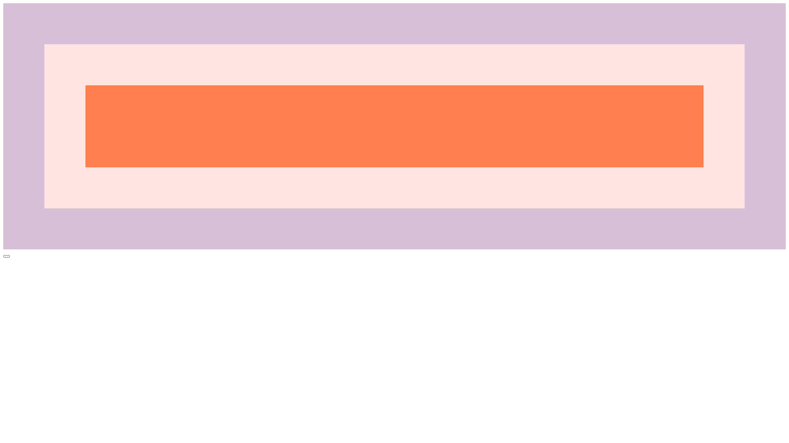
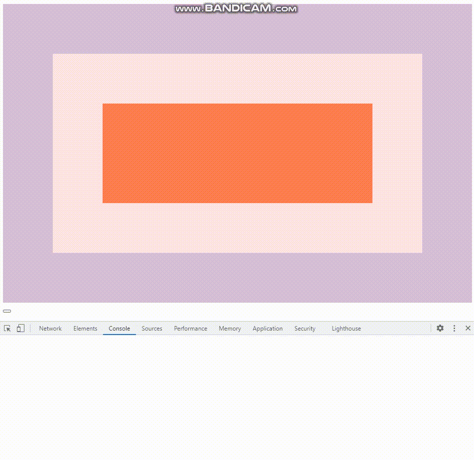
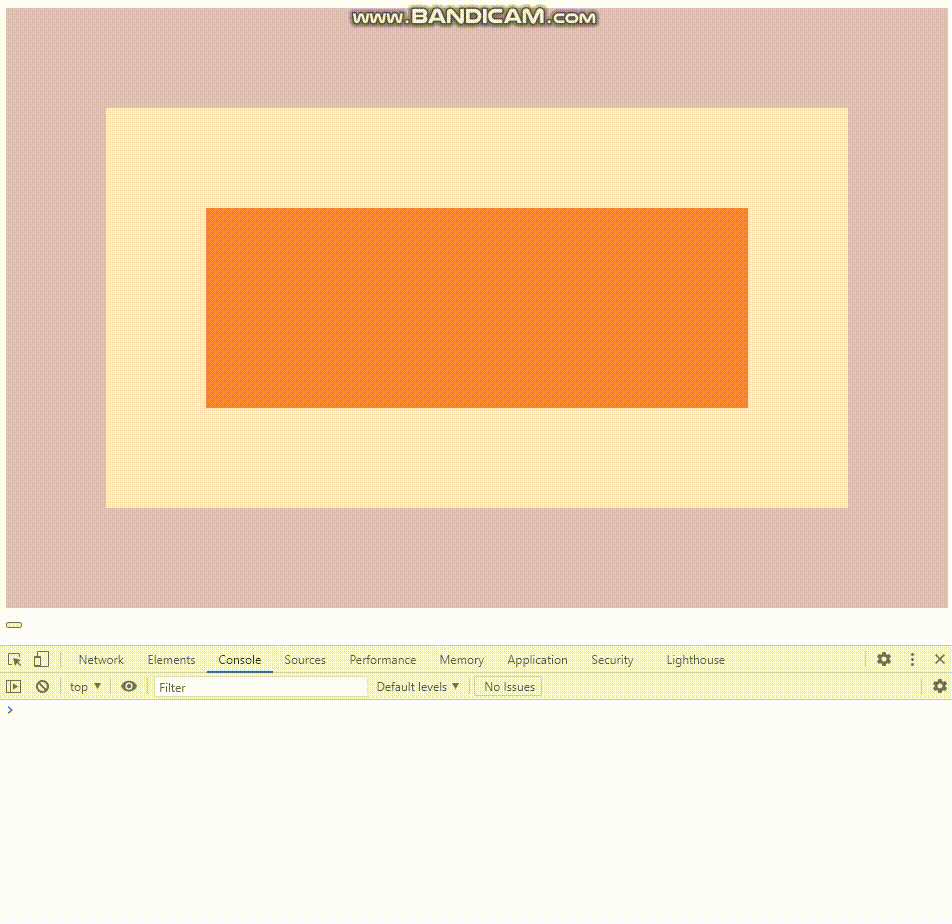

# 25. Event Capture, Propagation, Bubbling and Once

Event Capture, Propagation, Event Bubbling, Once에 대해 알아보자.

<strong>초기 코드</strong>

```html
<!DOCTYPE html>
<html lang="ko">
<head>
    <meta charset="UTF-8">
    <meta http-equiv="X-UA-Compatible" content="IE=edge">
    <meta name="viewport" content="width=device-width, initial-scale=1.0">
    <title>Understanding JavaScript's Capture</title>
</head>
<body class="bod">
    <div class="one">
        <div class="two">
            <div class="three">
                
            </div>
        </div>
    </div>
    <style>
        html{
            box-sizing:border-box;
        }
        *, *:before, *:after{
            box-sizing:inherit;
        }
        div{
            width: 100%;
            padding:100px;
        }
        .one {
            background: thistle;
        }
    
        .two {
            background: mistyrose;
        }
    
        .three {
            background: coral;
        }
    </style>
    <button></button>
    <script>s</script>
</body>
</html>
```


<strong>초기 화면</strong>



### 새로 알게 된 것

**Event Bubbling과 Event Captureing**

이벤트는 타겟 엘리먼트를 포함한 부모 요소에도 영향을 미치기 때문에 자식요소를 포함하는 부모요소에 이벤트리스너를 지정하여 관리한다.

즉, 부모 요소에 위임을 한다.
이벤트를 관리하는 방법으로 아래 두가지 방법이 있다.

Event Bubbling : 자식 이벤트가 부모에게 전파되는 것

Event Capturing : 부모 이벤트가 자식에게 전파되는 것.


**Propagation(중단)**

이벤트의 버블링을 막기 위해 사용. `event.stopPropagation()`


**Once(1회 실행)**

이벤트를 1회만 실행 시킴.


### 과정

``` javascript
const divs = document.querySelectorAll('div');
const button = document.querySelectorAll('button');
function logText(e){
    console.log(this.classList.value);
    // e.stopPropagation(); // stop Bubbling!

    // console.log(this);
}

// document.body.addEventListener('click',logText);

divs.forEach(div => div.addEventListener('click', logText,{
    capture: false,
    once: true
}));

button.addEventListener('click',()=>{
    console.log('Click!!');
},{
	once:true
})
```


<strong>1. Bubbling</strong>

```javascript
const divs = document.querySelectorAll('div');

function logText(e){
    console.log(this.classList.value);
}
```


<strong>2. Capture</strong>

```javascript
divs.forEach(div => div.addEventListener('click', logText,{
    capture: true,
}));
```



<strong>3. Stop Bubbling</strong>

버블링을 stopPropagation을 통해 멈춘다.

```javascript
function logText(e){
    console.log(this.classList.value);
   	e.stopPropagation(); // stop Bubbling!

    // console.log(this);
}
```




<strong>4. Once</strong>

한번만 동작시킴.

```javascript
divs.forEach(div => div.addEventListener('click', logText,{
    capture: false,
    once: true
}));
```

