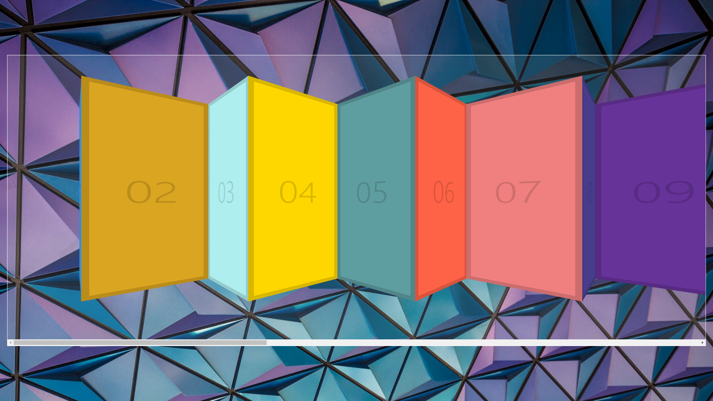

# 27. Click and Drag

**초기화면**




**초기코드**

```html
<!DOCTYPE html>
<html lang="ko">
<head>
    <meta charset="UTF-8">
    <meta http-equiv="X-UA-Compatible" content="IE=edge">
    <meta name="viewport" content="width=device-width, initial-scale=1.0">
    <title>Click and Drag</title>
    <link rel="stylesheet" href="style_JuneHyung.css">
</head>
<body>
    <div class="items">
        <div class="item item1">01</div>
        <div class="item item2">02</div>
        <div class="item item3">03</div>
        <div class="item item4">04</div>
        <div class="item item5">05</div>
        <div class="item item6">06</div>
        <div class="item item7">07</div>
        <div class="item item8">08</div>
        <div class="item item9">09</div>
        <div class="item item10">10</div>
        <div class="item item11">11</div>
        <div class="item item12">12</div>
        <div class="item item13">13</div>
        <div class="item item14">14</div>
        <div class="item item15">15</div>
        <div class="item item16">16</div>
        <div class="item item17">17</div>
        <div class="item item18">18</div>
        <div class="item item19">19</div>
        <div class="item item20">20</div>
        <div class="item item21">21</div>
        <div class="item item22">22</div>
        <div class="item item23">23</div>
        <div class="item item24">24</div>
        <div class="item item25">25</div>
    </div>

<script>
</script>

</body>
</html>

```

### 복습

**event.preventDefault**

이벤트를 취소할 수 있는 경우, 이벤트의 전파를 막지 않고, 그 이벤트를 취소합니다.


### 과정

<strong>1. 변수 및 상수 선언</strong>

```javascript
const slider = document.querySelector('.items');
let isDown = false;
let startX;
let scrollLeft;
```


<strong>1.mouseevent추가</strong>

```javascript
slider.addEventListener('mousedown', ()=>{
       
    });
    slider.addEventListener('mouseleave', ()=>{
        
    });
    slider.addEventListener('mouseup', ()=>{
        
    });
    slider.addEventListener('mousemove', ()=>{
       
    });
```


<strong>2.active추가</strong>

```javascript
slider.addEventListener('mousedown', (e)=>{
    isDown = true;
    slider.classList.add('active');
});
slider.addEventListener('mouseleave', ()=>{
    isDown = false;
    slider.classList.remove('active');
});
slider.addEventListener('mouseup', ()=>{
    isDown = false;
    slider.classList.remove('active');
});
slider.addEventListener('mousemove', (e)=>{
    if(!isDown) return; // stop the fn from running
    console.log(isDown);
});
```

mousedown()을 했을 때 active class를 추가하여 드래그 할 때 줄 효과를 줍니다.

mouse이동시 isDown이 false면 아무것도 리턴하지않고, isDown인경우 이동시킬 예정.


<strong>3.startX수정</strong>

```javascript
slider.addEventListener('mousedown', (e)=>{
   isDown = true;
   slider.classList.add('active');
   startX = e.pageX - slider.offsetLeft;
   scrollLeft = slider.scrollLeft;
});
slider.addEventListener('mouseleave', ()=>{
    isDown = false;
    slider.classList.remove('active');
});
slider.addEventListener('mouseup', ()=>{
    isDown = false;
    slider.classList.remove('active');
});
slider.addEventListener('mousemove', (e)=>{
    if(!isDown) return; // stop the fn from running
    if(!isDown) return; // stop the fn from running
    e.preventDefault();
    const x = e.pageX - slider.offsetLeft;

    // const walk = (x - startX)*5;
    const walk = (x - startX);
    // cnosole.log(walk);
    slider.scrollLeft = walk;
});
```

마우스의 이동 시 위치를 다시 조정한다.

움직이기는 하나 정상적으로 움직이진 않음.


<strong>4. 좌표조정</strong>

```javascript
slider.addEventListener('mousedown', (e)=>{
    isDown = true;
    slider.classList.add('active');
    startX = e.pageX - slider.offsetLeft;
    scrollLeft = slider.scrollLeft;
});

slider.addEventListener('mousemove', (e)=>{
    if(!isDown) return; // stop the fn from running
    e.preventDefault();
    const x = e.pageX - slider.offsetLeft;

    // const walk = (x - startX)*5;
    const walk = (x - startX);
    // cnosole.log(walk);
    slider.scrollLeft = scrollLeft - walk;
});
```

기존 scrollLeft에 walk값을 뺀값을 저장.

좀 더 빠르게 이동을 원한다면 walk값에 *를 해주면 더 빨리 움직임.


