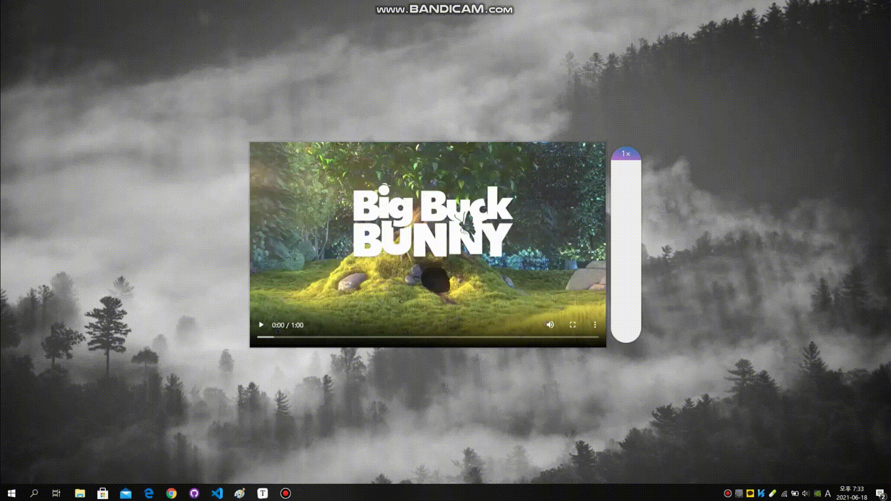
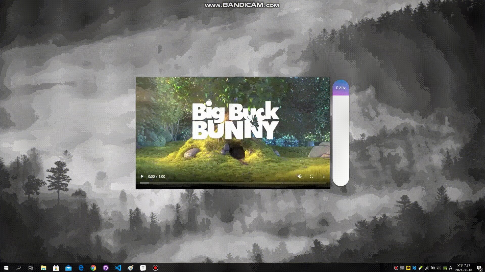

# 28. Video Speed Controller UI

마우스이동에 따른 영상 재생속도 조절


<strong>초기 코드</strong>

```html
<!DOCTYPE html>
<html lang="ko">
<head>
    <meta charset="UTF-8">
    <meta http-equiv="X-UA-Compatible" content="IE=edge">
    <meta name="viewport" content="width=device-width, initial-scale=1.0">
    <title>Video Speed Scrubber</title>
    <link rel="stylesheet" href="style_JuneHyung.css">
</head>
<body>
    <div class="wrapper">
        <video class="flex" width="765" height="430" src="http://clips.vorwaerts-gmbh.de/VfE_html5.mp4" loop controls></video>
        <div class="speed">
          <div class="speed-bar">1×</div>
        </div>
      </div>
</body>
</html>
```


<strong>초기 화면</strong>


### 새로 알게 된 것

**HTMLMediaElement.playbackRate**

미디어가 재생되는 속도를 설정합니다.
빨리 감기, 슬로우 모션 등에 대한 사용자 컨트롤을 구현하는 데 사용됩니다. 
정상 재생 속도에이 값을 곱하여 현재 속도를 얻습니다. 1.0 값은 정상 속도를 나타냅니다.

**참고 :**

https://developer.mozilla.org/en-US/docs/Web/API/HTMLMediaElement/playbackRate


### 과정

<strong>1. 변수선언</strong>

```javascript
const speed = document.querySelector('.speed');
const bar = speed.querySelector('.speed-bar');
const video = document.querySelector('.flex');
```


<strong>2. 높이조절</strong>

height 를 %로 조절

```javascript
const speed = document.querySelector('.speed');
const bar = speed.querySelector('.speed-bar');
const video = document.querySelector('.flex');

speed.addEventListener('mousemove', function(e){
    // console.log(e);
    const y = e.pageY - this.offsetTop;
    const percent = y / this.offsetHeight;
    const min = 0.4;
    const max = 4;

    const height = Math.round(percent * 100) + '%';
    console.log(height);

    bar.style.height = height;
    // console.log(y);
    // console.log(percent);
});
```




<strong>3. 비율조절</strong>

미디어가 재생되는 속도 계산.

```javascript
const speed = document.querySelector('.speed');
const bar = speed.querySelector('.speed-bar');
const video = document.querySelector('.flex');

speed.addEventListener('mousemove', function(e){
    // console.log(e);
    const y = e.pageY - this.offsetTop;
    const percent = y / this.offsetHeight;
    const min = 0.4;
    const max = 4;

    const height = Math.round(percent * 100) + '%';
    const playbackRate = percent * (max - min) + min;
    console.log(height);

    bar.style.height = height;
    bar.textContent = playbackRate.toFixed(2) + 'x';
    // console.log(y);
    // console.log(percent);
});
```




<strong>4. video적용 및 method분리</strong>

video의 playbackRate값을 계산한 값으로 설정.

```javascript
video.playbackRate = playbackRate;
```

메소드 분리.

```javascript
const speed = document.querySelector('.speed');
const bar = speed.querySelector('.speed-bar');
const video = document.querySelector('.flex');

function handleMove(e){
    const y = e.pageY - this.offsetTop;
    const percent = y / this.offsetHeight;
    const min = 0.4;
    const max = 4;

    const height = Math.round(percent * 100) + '%';
    const playbackRate = percent * (max - min) + min;

    bar.style.height = height;
    bar.textContent = playbackRate.toFixed(2) + 'x';
    video.playbackRate = playbackRate;
}

speed.addEventListener('mousemove', handleMove);
```

