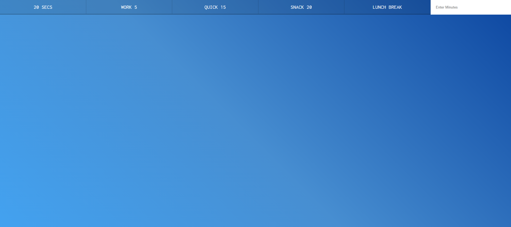
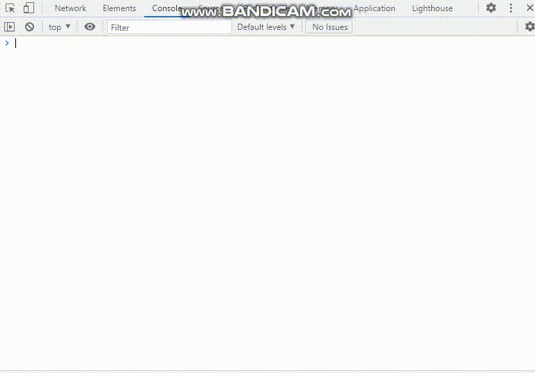
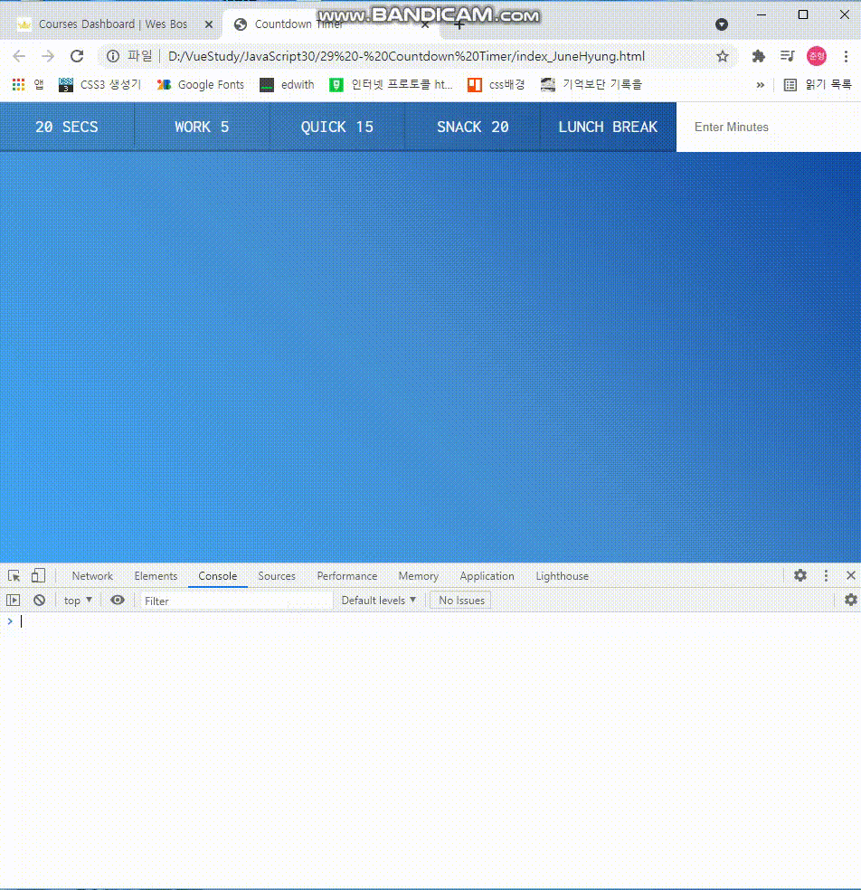
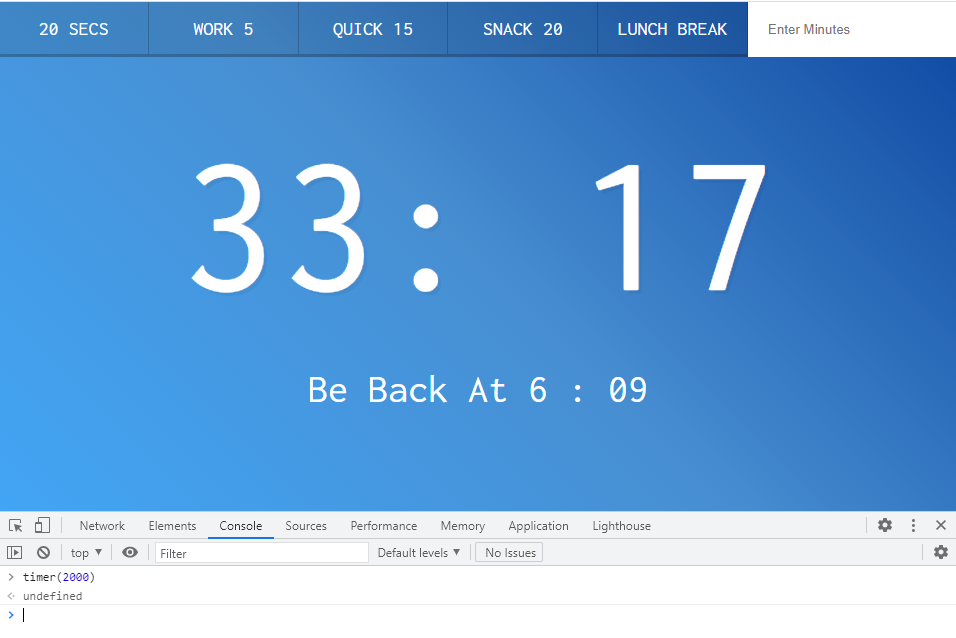
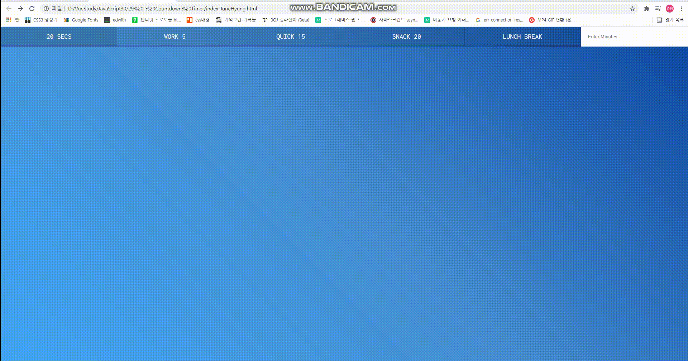

# 29. Countdown Timer


<strong>초기코드</strong>

```html
<!DOCTYPE html>
<html lang="ko">
<head>
    <meta charset="UTF-8">
    <meta http-equiv="X-UA-Compatible" content="IE=edge">
    <meta name="viewport" content="width=device-width, initial-scale=1.0">
    <title>Countdown Timer</title>
    <link href='https://fonts.googleapis.com/css?family=Inconsolata' rel='stylesheet' type='text/css'>
    <link rel="stylesheet" href="style_JuneHyung.css">
</head>
<body>
    <div class="timer">
        <div class="timer__controls">
            <button data-time="20" class="timer__button">20 Secs</button>
            <button data-time="300" class="timer__button">Work 5</button>
            <button data-time="900" class="timer__button">Quick 15</button>
            <button data-time="1200" class="timer__button">Snack 20</button>
            <button data-time="3600" class="timer__button">Lunch Break</button>
            <form name="customForm" id="custom">
                <input type="text" name="minutes" placeholder="Enter Minutes">
            </form>
        </div>
        <div class="display">
            <h1 class="display__time-left"></h1>
            <p class="display__end-time"></p>
        </div>
    </div>
    
    <script src="scripts_JuneHyung.js"></script>
</body>
</html>
```

<strong>초기화면</strong>




### 과정

<strong>1. Timer()</strong>

```javascript
function timer(seconds) {
    const now = Date.now();
    const then = now + seconds * 1000;
    // console.log({ now, then });
    displayTimeLeft(seconds);

    setInterval(() => {
        const secondsLeft = Math.round((then - Date.now()) / 1000);
        //check if we should stop it!
        if (secondsLeft <= 0) {
            clearInterval(countdown);
            return;
        }

        // display it
        displayTimeLeft(secondsLeft);
    }, 1000);
}

function displayTimeLeft(seconds) {
    console.log(seconds);
}
```

* then은 현재시간에  입력한 시간을 더한 값.
* secondsLeft는 남은 시간.
* 남은 시간이 0이되면 countdown을 멈추고, 그렇지않다면 1초마다 화면에 출력하고, 카운트를 함.




<strong>2. displayTimeLeft()</strong>

* 남은 시간, 초를 보여준다.

* 초를 받아서 알맞게 계산하는데, 10보다 작으면 앞에 0을 붙여 출력한다.

  ex) 01

* 탭의 타이틀(document.title)도 남은시간이 뜨도록 설정함.

```javascript
function displayTimeLeft(seconds) {
    const minutes = Math.floor(seconds / 60);
    const remainderSeconds = seconds % 60;
    const display = `${minutes}: ${remainderSeconds < 10 ? '0' : ''}${remainderSeconds}`;
    document.title = display;
    timerDisplay.textContent = display;
    // console.log(minutes);
}
```





<strong>3. displayEndTime()</strong>

* 출력되는 시간 밑에 끝나는 시간을 보여준다.
* displayTimeLeft()와 비슷함.
* 여기도 분이 10보다 작으면 앞에 0을 붙인다. 

```javascript
function displayEndTime(timestamp) {
    const end = new Date(timestamp);
    const hour = end.getHours();
    const adjustedHour = hour > 12 ? hour - 12 : hour;
    const minutes = end.getMinutes();
    endTime.textContent = `Be Back At ${adjustedHour} : ${minutes < 10 ? '0' : ''}${minutes}`
}
```




<strong>4. quickStart()</strong>

메뉴바 클릭을 통해 자동입력

dataset에 있는 값을 받아 설정하고, 버튼이벤트를 등록.

```javascript
const buttons = document.querySelectorAll('[data-time]');


function timer(seconds) {
    // clear any existing timer
    clearInterval(countdown);

    ~~ 중략 ~~
}


function startTimer() {
    // console.log(this.dataset.time);
    const seconds = parseInt(this.dataset.time);
    timer(seconds);

}

buttons.forEach(button => button.addEventListener('click', startTimer));
  
```




<strong>5. 시간입력</strong>

```javascript
document.customForm.addEventListener('submit', function(e) {
    e.preventDefault();
    const mins = this.minutes.value;
    console.log(mins);
    timer(mins * 60);
    this.reset();
});
```


