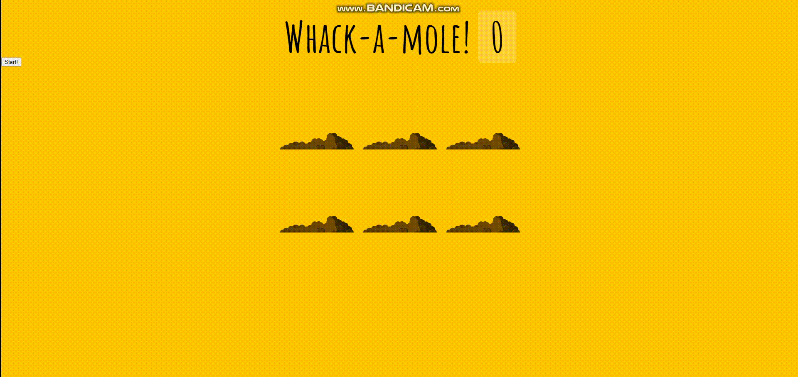
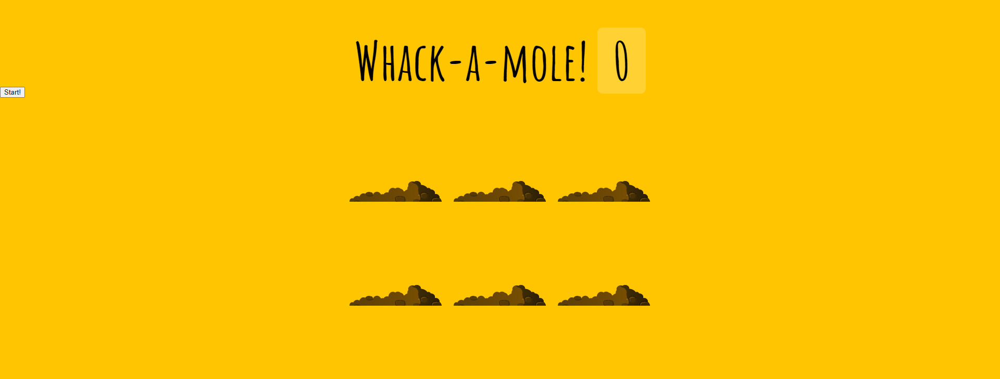
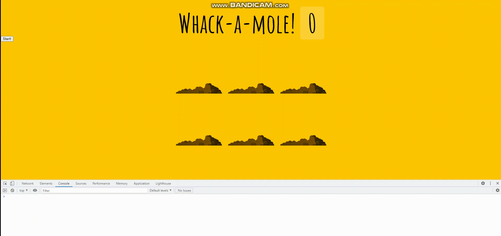

# 30. Whake A Mole

두더지 잡기 게임




**초기코드**

```javascript
<!DOCTYPE html>
<html lang="ko">
<head>
    <meta charset="UTF-8">
    <meta http-equiv="X-UA-Compatible" content="IE=edge">
    <meta name="viewport" content="width=device-width, initial-scale=1.0">
    <title>Whack A Mole!</title>
    <link href='https://fonts.googleapis.com/css?family=Amatic+SC:400,700' rel='stylesheet' type='text/css'>
    <link rel="stylesheet" href="style_JuneHyung.css">
</head>
<body>
    <h1>Whack-a-mole! <span class="score">0</span></h1>
    <button onClick="startGame()">Start!</button>

    <div class="game">
        <div class="hole hole1">
            <div class="mole"></div>
        </div>
        <div class="hole hole2">
            <div class="mole"></div>
        </div>
        <div class="hole hole3">
            <div class="mole"></div>
        </div>
        <div class="hole hole4">
            <div class="mole"></div>
        </div>
        <div class="hole hole5">
            <div class="mole"></div>
        </div>
        <div class="hole hole6">
            <div class="mole"></div>
        </div>
    </div>
    <script>
        const holes =document.querySelectorAll('.hole');
        const scoreBoard = document.querySelector('.score');
        const moles = document.querySelectorAll('.mole');
    </script>
</body>
</html>
```


<strong>초기화면</strong>




### 과정

<strong> 0. 변수 선언</strong>

```javascript
const holes =document.querySelectorAll('.hole');
const scoreBoard = document.querySelector('.score');
const moles = document.querySelectorAll('.mole');
let lastHole;
let score = 0;
```


<strong>1. randomTime()</strong>

두더지가 나왔다 들어갈 랜덤시간.
최소 min ~ max

```javascript
function randomTime(min,max){
    return Math.round(Math.random()*(max - min) + min);
}
```


<strong>2. randomHole()</strong>

두더지가 나올 구멍을 랜덤하게 고른다.

```javascript
function randomHole(holes){
    // console.log(holes.length);
    const idx = Math.floor(Math.random()*holes.length);
    const hole = holes[idx];
    if(hole === lastHole){
        console.log('Ah nah thats the same one bud');
        return randomHole(holes);
    }

    // console.log(hole);

    lastHole = hole;
    return hole;
}
```

만약 마지막에 고른 hole이랑 뽑은 hole이 같다면 다시 구멍을 고른다.

즉, 이미 나와있는애가 다시 골라지면 다시 고른다는 뜻.


<strong>3. peep()</strong>

실제로 두더지를 나오게하는 함수

```javascript
function peep(){
    const time = randomTime(200, 1000);
    const hole = randomHole(holes);
    // console.log(time, hole);
    hole.classList.add('up'); // top:0
    setTimeout(()=>{
        hole.classList.remove('up');
        if(!timeUp) peep();
    }, time);
}
```

randomHole에서 골라지는 div(구멍)에 class up을 추가하고 지움.
up클래스는 top을 0으로 설정하는 클래스.

만약 timeUp이 되지 않았다면 다시 peep()을 동작.


<strong>4. startGame()</strong>

game을 시작하는 함수.

```javascript
function startGame(){
    scoreBoard.textContent = 0;
    timeUp = false;
    score = 0;
    peep();
    setTimeout(()=>timeUp=true, 10000);
}
```

scoreBoard의 점수, 시간등 초기화시키고, 10초후에 timeUp을 true로 바꿔 정지시킨다.


<strong>5. bonk</strong>

클릭했을 때 점수를 증가시키는 함수

up클래스를 지워서 다시 들어가게함.

scoreBoard의 점수를 증가시킨다.

마지막에 모든 mole들에 bonk함수를 클릭이벤트로 추가시킨다.

```javascript
function bonk(e){
    // console.log(e);
    if(!e.isTrusted) return; //cheater!;
    score++;
    this.classList.remove('up');
    scoreBoard.textContent = score;
}
moles.forEach(mole => mole.addEventListener('click', bonk));
```


ㅋ